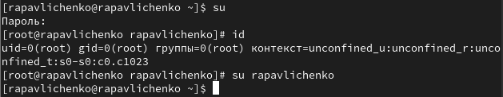
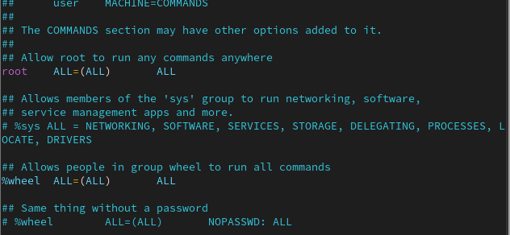
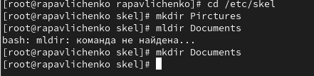
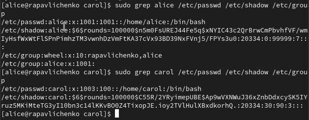
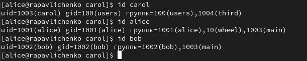

---
# Preamble

author:
  name: Павличенко Родион Андреевич
  degrees: DSc
  orcid: 0000-0002-0877-7063
  email: 1132246838@pfur.ru
  affiliation:
    - name: Российский университет дружбы народов
      country: Российская Федерация
      postal-code: 117198
      city: Москва
      address: ул. Миклухо-Маклая, д. 6

title: Лабораторная работа № 2 
subtitle: Управление пользователями и группами
license: CC BY
date: 06.09.2025

lang: ru-RU
crossref:
  lof-title: Список иллюстраций
  lot-title: Список таблиц
  lol-title: Листинги

format:
  beamer:
    pdf-engine: xelatex
    mainfont: "DejaVu Serif"
    sansfont: "DejaVu Sans"
    monofont: "DejaVu Sans Mono"
    toc: true
    toc-title: Содержание
    number-sections: true
    colorlinks: false
    toc-depth: 2
    slide_level: 2
    aspectratio: 169
    section-titles: true
    theme: metropolis
    themeoptions: progressbar=frametitle,sectionpage=progressbar,numbering=fraction
    babel-lang: russian
    babel-otherlangs: english
  revealjs:
    transition: slide
    margin: 0.2
    smaller: false
    output-ext: html
    theme: beige
    logo: _resources/image/logo_rudn.png
---

# Информация

## Докладчик

:::::::::::::: {.columns align=center}
::: {.column width="70%"}

  * Павличенко Родион Андреевич
  * Cтудент
  * Группа НПИбд-02-24
  * Российский университет дружбы народов им. П. Лумумбы
  * [1132246838@pfur.ru](mailto:1132246838@pfur.ru)

:::
::: {.column width="30%"}

:::
::::::::::::::

# Выполнение лабораторной работы

## Выполняем команду   и получаем более подробную информацию и нашей учетной записи, используя команду id. Основная группа моего пользователя gid=1000(rapavlichenko), также есть второстепенная группа wheel

{width=100%}

##  Переключились на учетную запись root при помощи команды su, набрали команду id, вернулись к своей учетной записи командой su rapavlichenko . Получены сведения: uid=0(root) — идентификатор пользователя root (всегда 0), gid=0(root) — идентификатор основной группы root (также 0). группы=0(root) — пользователь root входит в группу root.

{width=100%}
 
## При помощи команды sudo -I visudo открыли файл и убедились, что в текущем файле есть строка %wheel ALL=(ALL) ALL

{width=100%}
 
## Создали пользователя alice и убедились, что пользователь alice добавлен в группу wheel, задали пароль для пользователя alice 

{width=100%}

## Перешли в учетную запись alice командой su alice, создали пользователя bob и задали для него пароль, просмотрели командой id в какие группы он входит

{width=100%}
 
## Переключились на учетную запись пользователя root и открыли файл

{width=100%}
 
## Изменили параметры CREATE_HOME и USERGROUPS_ENAB

{width=100%}
 
## Перешли в каталог /etc/skel и создали два каталога Documents и Pictures

{width=100%}
 
## При помощи nano открываем файл .bashrc и добавляем строку export EDITOD=/usr/bin/vim

##  Создали пользователя carol, задали для него пароль

{width=100%}
 
## Просмотрели информацию о пользователе carol , его id  1003, для него не создается отдельная группа, он находится в users, каталоги для него были созданы

{width=100%}
 
## Просмотрели данные о пароле пользователя carol , увидели пароль в зашифрованном виде и время через которое пароль станет недействительным

{width=100%}
 
## Меняем параметры пароля и просматриваем изменения

{width=100%}
 
## Проверили, что идентификатор alice и carol существует во всех трех файлах

{width=100%}
 
## Создаем две группы – main и third, туда добавляем пользователей alice, bob и carol

{width=100%}
 
## Убедились, что bob правильно добавлен в группу users, также он входит в группу third. Bob имеет основную группу gid=1002(bob), а также вторичная группа main. Alice имеет основную группу gid=1001(alice), а также вторичные группы main и wheel

{width=100%}
