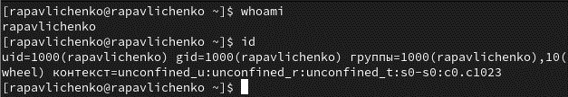
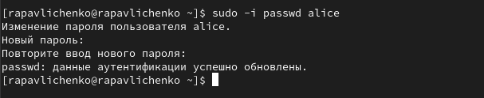
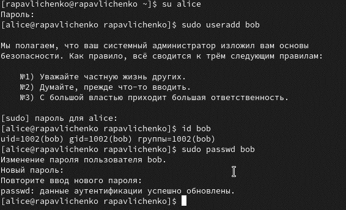
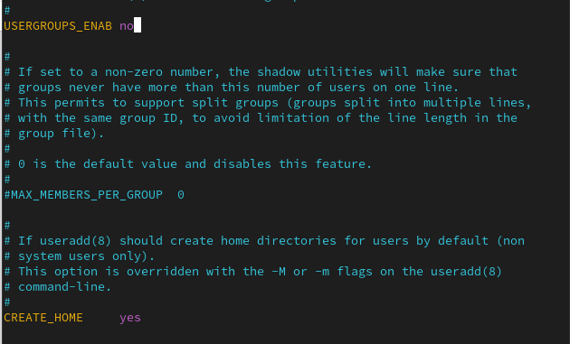
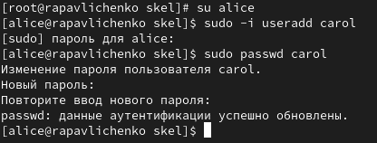
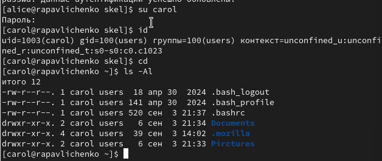
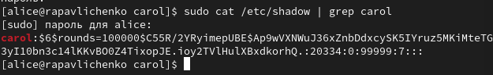
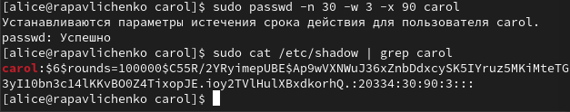

---
# Preamble

## Author
author:
  name: Павличенко Родион Андреевич
  degrees: DSc
  orcid: 0000-0002-0877-7063
  email: kulyabov-ds@rudn.ru
  affiliation:
    - name: Российский университет дружбы народов
      country: Российская Федерация
      postal-code: 117198
      city: Москва
      address: ул. Миклухо-Маклая, д. 623456789
## Title
title: "Лабораторная работа № 2"
subtitle: "Управление пользователями и группами"
license: "CC BY"
## Generic options
lang: ru-RU
number-sections: true
toc: true
toc-title: "Содержание"
toc-depth: 2
## Crossref customization
crossref:
  lof-title: "Список иллюстраций"
  lot-title: "Список таблиц"
  lol-title: "Листинги"
## Bibliography
bibliography:
  - bib/cite.bib
csl: _resources/csl/gost-r-7-0-5-2008-numeric.csl
## Formats
format:
### Pdf output format
  pdf:
    toc: true
    number-sections: true
    colorlinks: false
    toc-depth: 2
    lof: true # List of figures
    lot: true # List of tables
#### Document
    documentclass: scrreprt
    papersize: a4
    fontsize: 12pt
    linestretch: 1.5
#### Language
    babel-lang: russian
    babel-otherlangs: english
#### Biblatex
    cite-method: biblatex
    biblio-style: gost-numeric
    biblatexoptions:
      - backend=biber
      - langhook=extras
      - autolang=other*
#### Misc options
    csquotes: true
    indent: true
    header-includes: |
      \usepackage{indentfirst}
      \usepackage{float}
      \floatplacement{figure}{H}
      \usepackage[math,RM={Scale=0.94},SS={Scale=0.94},SScon={Scale=0.94},TT={Scale=MatchLowercase,FakeStretch=0.9},DefaultFeatures={Ligatures=Common}]{plex-otf}
### Docx output format
  docx:
    toc: true
    number-sections: true
    toc-depth: 2
---

# Цель работы

Получить представление о работе с учётными записями пользователей и группами пользователей в операционной системе типа Linux

# Выполнение лабораторной работы

Выполняем команду   и получаем более подробную информацию и нашей учетной записи, используя команду id. Основная группа моего пользователя gid=1000(rapavlichenko), также есть второстепенная группа wheel

{#fig-001 width=70%}

Переключились на учетную запись root при помощи команды su, набрали команду id, вернулись к своей учетной записи командой su rapavlichenko . Получены сведения: uid=0(root) — идентификатор пользователя root (всегда 0), gid=0(root) — идентификатор основной группы root (также 0). группы=0(root) — пользователь root входит в группу root.

{#fig-001 width=70%}

При помощи команды sudo -I visudo открыли файл и убедились, что в текущем файле есть строка %wheel ALL=(ALL) ALL

{#fig-001 width=70%}

Создали пользователя alice и убедились, что пользователь alice добавлен в группу wheel, задали пароль для пользователя alice

{#fig-001 width=70%}

Перешли в учетную запись alice командой su alice, создали пользователя bob и задали для него пароль, просмотрели командой id в какие группы он входит

{#fig-001 width=70%}

Переключились на учетную запись пользователя root и открыли файл через vim

{#fig-001 width=70%}

Изменили параметры CREATE_HOME и USERGROUPS_ENAB

{#fig-001 width=70%}

Перешли в каталог /etc/skel и создали два каталога Documents и Pictures

{#fig-001 width=70%}

При помощи nano открываем файл .bashrc и добавляем строку export EDITOD=/usr/bin/vim

Создали пользователя carol, задали для него пароль

{#fig-001 width=70%}

Просмотрели информацию о пользователе carol , его id  1003, для него не создается отдельная группа, он находится в users, каталоги для него были созданы

{#fig-001 width=70%}

Просмотрели данные о пароле пользователя carol , увидели пароль в зашифрованном виде и время через которое пароль станет недействительным

{#fig-001 width=70%}

Меняем параметры пароля и просматриваем изменения

{#fig-001 width=70%}

Проверили, что идентификатор alice и carol существует во всех трех файлах

{#fig-001 width=70%}

Создаем две группы – main и third, туда добавляем пользователей alice, bob и carol

{#fig-001 width=70%}

Убедились, что bob правильно добавлен в группу users, также он входит в группу third. Bob имеет основную группу gid=1002(bob), а также вторичная группа main. Alice имеет основную группу gid=1001(alice), а также вторичные группы main и wheel

{#fig-001 width=70%}

# Контрольные вопросы

1. Для получения информации можно использовать команды:
Id, id -u username, id -Gn username , groups username

2. Пользователь root всегда имеет UID = 0. Узнать UID: id -u username

3. su — переключает на другого пользователя (по умолчанию root), требует пароль этого пользователя. sudo — запускает отдельную команду от имени root, требует пароль текущего пользователя (если он включён в sudoers).

4. Конфигурационный файл: /etc/sudoers

5. Использовать команду: visudo

6. В CentOS/RHEL — группы wheel. В Debian/Ubuntu — группы sudo.

7.  /etc/default/useradd — значения по умолчанию. /etc/login.defs — UID диапазон, политика паролей. /etc/skel/ — шаблонные файлы для домашних каталогов пользователей.

8. Oсновная группа хранится в файле /etc/passwd. Дополнительные группы — в файле /etc/group.
Пример:
/etc/passwd: alice:x:1001:1001:Alice:/home/alice:/bin/bash
/etc/group: developers:x:1002:alice,ivan

9. passwd username        # смена пароля
chage -l username      # просмотр информации о пароле
chage -M 90 username   # срок действия пароля 90 дней

10. Использовать команду: vigr Причина: эта команда блокирует файл и проверяет синтаксис, что предотвращает ошибки и повреждение /etc/group.

# Выводы

Получили представление о работе с учётными записями пользователей и группами пользователей в операционной системе типа Linux

# Список литературы{.unnumbered}

::: {#refs}
:::
