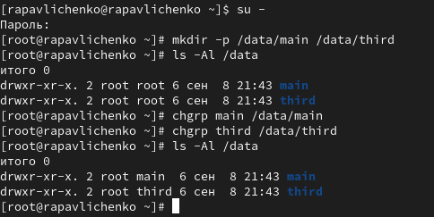
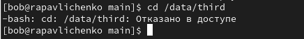
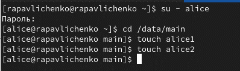
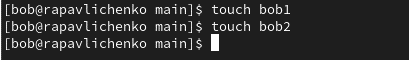
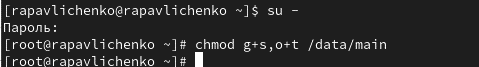
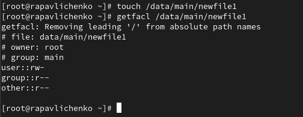
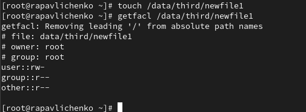
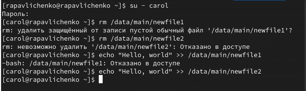

---
# Preamble

author:
  name: Павличенко Родион Андреевич
  degrees: DSc
  orcid: 0000-0002-0877-7063
  email: 1132246838@pfur.ru
  affiliation:
    - name: Российский университет дружбы народов
      country: Российская Федерация
      postal-code: 117198
      city: Москва
      address: ул. Миклухо-Маклая, д. 6

title: Лабораторная работа № 3
subtitle: Настройка прав доступа
license: CC BY
date: 08.09.2025

lang: ru-RU
crossref:
  lof-title: Список иллюстраций
  lot-title: Список таблиц
  lol-title: Листинги

format:
  beamer:
    pdf-engine: xelatex
    mainfont: "DejaVu Serif"
    sansfont: "DejaVu Sans"
    monofont: "DejaVu Sans Mono"
    toc: true
    toc-title: Содержание
    number-sections: true
    colorlinks: false
    toc-depth: 2
    slide_level: 2
    aspectratio: 169
    section-titles: true
    theme: metropolis
    themeoptions: progressbar=frametitle,sectionpage=progressbar,numbering=fraction
    babel-lang: russian
    babel-otherlangs: english
  revealjs:
    transition: slide
    margin: 0.2
    smaller: false
    output-ext: html
    theme: beige
    logo: _resources/image/logo_rudn.png
---

# Информация

## Докладчик

:::::::::::::: {.columns align=center}
::: {.column width="70%"}

  * Павличенко Родион Андреевич
  * Cтудент
  * Группа НПИбд-02-24
  * Российский университет дружбы народов им. П. Лумумбы
  * [1132246838@pfur.ru](mailto:1132246838@pfur.ru)

:::
::: {.column width="30%"}

:::
::::::::::::::

# Выполнение лабораторной работы

## Открыли терминал с учётной записью root, в корневом каталоге создали каталоги /data/main и /data/third.
{#fig-001 width=70%}

Посмотрели, кто теперь является владельцем этих каталогов

## Установили разрешения

# Позволяющие владельцам каталогов записывать файлы в эти
каталоги

{#fig-001 width=70%}

## Перешли под учётную запись пользователя bob.

{#fig-001 width=70%}

# Группа bob является основной для нашего пользователя, поэтому и является владельцем

## Под пользователем bob попробуйте перешли в каталог /data/mainб, однако нам было отказано в доступе, так как bob не входит в группу third, а входит в группу main

{#fig-001 width=70%}

## Открыли новый терминал под пользователем alice, перешли в каталог /data/main, создали два файла, владельцем которых является alice

{#fig-001 width=70%}

## В другом терминале перейдите под учётную запись пользователя bob, перешли в каталог /data/main, и в этом каталоге ввели: ls -l. Удалили файлы, принадлежащие пользователю alice, убедились, что файлы были удалены пользователем bob

{#fig-001 width=70%}

## Создали два файла, которые принадлежат пользователю bob

{#fig-001 width=70%}

## В терминале под пользователем root установили для каталога /data/main бит идентификатора группы, а также stiky-бит для разделяемого (общего) каталога группы

{#fig-001 width=70%}

## В терминале под пользователем alice создали в каталоге /data/main файлы alice3 и alice4, в терминале под пользователем alice попробовали удалить файлы, принадлежащие пользователю bob

{#fig-001 width=70%}

## Открыли терминал с учётной записью root, установили права на чтение и выполнение в каталоге /data/main для группы third и права на чтение и выполнение для группы main в каталоге /data/third, использовали команду getfacl, чтобы убедиться в правильности установки разрешений

{#fig-001 width=70%}

## Создали новый файл с именем newfile1 в каталоге /data/main, использовали getfacl /data/main/newfile1 для проверки текущих назначений полномочий, у user права на чтение и запись, у группы только на чтение, у остальных также только на чтение

{#fig-001 width=70%}

## Выполните аналогичные действия для каталога /data/third, файла принадлежит user, он имеет права доступа на чтение и запись, группа только на чтение, остальные только на чтение

{#fig-001 width=70%}

## Установили ACL по умолчанию для каталога /data/main, добавили ACL по умолчанию для каталога /data/third, убедились, что настройки ACL работают, добавив новый файл в каталог /data/main, использовали getfacl /data/main/newfile2 для проверки текущих назначений полномочий. Выполнили аналогичные действия для каталога /data/third

{#fig-001 width=70%}

## Для проверки полномочий группы third в каталоге /data/third вошли в другом терминале под учётной записью члена группы third, проверили операции с файлами: rm /data/main/newfile1 rm /data/main/newfile2 Проверили возможно ли осуществить запись в файл. Не смогли удалить файл newfile 2, но смогли в него записать текс

{#fig-001 width=70%}
