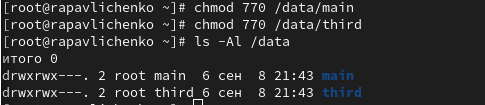
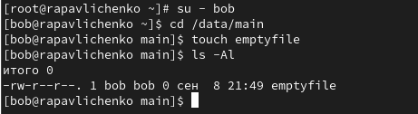
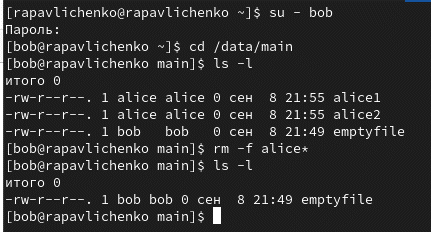
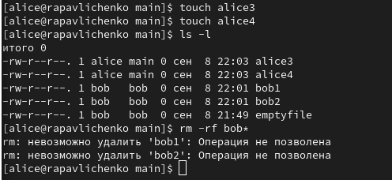
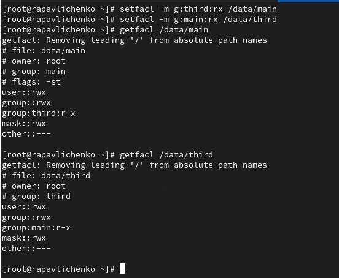
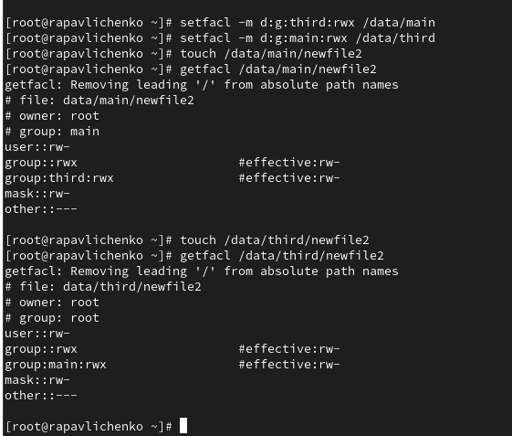

---
# Preamble

## Author
author:
  name: Павличенко Родион Андреевич
  degrees: DSc
  orcid: 0000-0002-0877-7063
  email: kulyabov-ds@rudn.ru
  affiliation:
    - name: Российский университет дружбы народов
      country: Российская Федерация
      postal-code: 117198
      city: Москва
      address: ул. Миклухо-Маклая, д. 623456789
## Title
title: "Лабораторная работа № 3"
subtitle: "Настройка прав доступа"
license: "CC BY"
## Generic options
lang: ru-RU
number-sections: true
toc: true
toc-title: "Содержание"
toc-depth: 2
## Crossref customization
crossref:
  lof-title: "Список иллюстраций"
  lot-title: "Список таблиц"
  lol-title: "Листинги"
## Bibliography
bibliography:
  - bib/cite.bib
csl: _resources/csl/gost-r-7-0-5-2008-numeric.csl
## Formats
format:
### Pdf output format
  pdf:
    toc: true
    number-sections: true
    colorlinks: false
    toc-depth: 2
    lof: true # List of figures
    lot: true # List of tables
#### Document
    documentclass: scrreprt
    papersize: a4
    fontsize: 12pt
    linestretch: 1.5
#### Language
    babel-lang: russian
    babel-otherlangs: english
#### Biblatex
    cite-method: biblatex
    biblio-style: gost-numeric
    biblatexoptions:
      - backend=biber
      - langhook=extras
      - autolang=other*
#### Misc options
    csquotes: true
    indent: true
    header-includes: |
      \usepackage{indentfirst}
      \usepackage{float}
      \floatplacement{figure}{H}
      \usepackage[math,RM={Scale=0.94},SS={Scale=0.94},SScon={Scale=0.94},TT={Scale=MatchLowercase,FakeStretch=0.9},DefaultFeatures={Ligatures=Common}]{plex-otf}
### Docx output format
  docx:
    toc: true
    number-sections: true
    toc-depth: 2
---

# Цель работы

Получение навыков настройки базовых и специальных прав доступа для групп пользователей в операционной системе типа Linux

# Выполнение лабораторной работы

Открыли терминал с учётной записью root, в корневом каталоге создали каталоги /data/main и /data/third, посмотрели, кто является владельцем этих каталогов. Изменили владельцев этих каталогов с root на main и third соответственно. Посмотрели, кто теперь является владельцем этих каталогов 

{#fig-001 width=70%}

Установили разрешения, позволяющие владельцам каталогов записывать файлы в эти
каталоги и запрещающие доступ к содержимому каталогов всем другим пользователям
и группам, проверили установленные права доступа

{#fig-001 width=70%}

Перешли под учётную запись пользователя bob. Под пользователем bob перешли в каталог /data/main и создали файл emptyfile в этом каталоге. Файл emptyfile имеет владельца bob, группа bob является основной для нашего пользователя, поэтому и является владельцем

{#fig-001 width=70%}

Под пользователем bob попробуйте перешли в каталог /data/mainб, однако нам было отказано в доступе, так как bob не входит в группу third, а входит в группу main

{#fig-001 width=70%}

Открыли новый терминал под пользователем alice, перешли в каталог /data/main, создали два файла, владельцем которых является alice

{#fig-001 width=70%}

В другом терминале перейдите под учётную запись пользователя bob, перешли в каталог /data/main, и в этом каталоге ввели: ls -l. Удалили файлы, принадлежащие пользователю alice, убедились, что файлы были удалены пользователем bob

{#fig-001 width=70%}

Создали два файла, которые принадлежат пользователю bob

{#fig-001 width=70%}

В терминале под пользователем root установили для каталога /data/main бит идентификатора группы, а также stiky-бит для разделяемого (общего) каталога группы

{#fig-001 width=70%}

В терминале под пользователем alice создали в каталоге /data/main файлы alice3 и alice4, в терминале под пользователем alice попробовали удалить файлы, принадлежащие пользователю bob

{#fig-001 width=70%}

Открыли терминал с учётной записью root, установили права на чтение и выполнение в каталоге /data/main для группы third и права на чтение и выполнение для группы main в каталоге /data/third, использовали команду getfacl, чтобы убедиться в правильности установки разрешений

{#fig-001 width=70%}

Создали новый файл с именем newfile1 в каталоге /data/main, использовали getfacl /data/main/newfile1 для проверки текущих назначений полномочий, у user права на чтение и запись, у группы только на чтение, у остальных также только на чтение

{#fig-001 width=70%}

Выполните аналогичные действия для каталога /data/third, файла принадлежит user, он имеет права доступа на чтение и запись, группа только на чтение, остальные только на чтение

{#fig-001 width=70%}

Установили ACL по умолчанию для каталога /data/main, добавили ACL по умолчанию для каталога /data/third, убедились, что настройки ACL работают, добавив новый файл в каталог /data/main, использовали getfacl /data/main/newfile2 для проверки текущих назначений полномочий. Выполнили аналогичные действия для каталога /data/third

{#fig-001 width=70%}

Для проверки полномочий группы third в каталоге /data/third вошли в другом терминале под учётной записью члена группы third, проверили операции с файлами: rm /data/main/newfile1 rm /data/main/newfile2 Проверили возможно ли осуществить запись в файл. Не смогли удалить файл newfile 2, но смогли в него записать текс

{#fig-001 width=70%}

# Контрольные вопросы

Чтобы изменить владельца группы для файла, используй команду chown с синтаксисом :группа. Например: chown :developers file.txt - установит группу developers для file.txt.
 
Найти все файлы, принадлежащие конкретному пользователю можно командой find: find / -user username 2>/dev/null - найдет все файлы пользователя username в системе.
 
Для установки прав чтение-запись-выполнение для пользователя и группы в каталоге /data используй: chmod -R ug=rwx /data && chmod -R o= /data - рекурсивно установит полные права для владельца и группы, уберет все права для остальных.
 
Чтобы добавить разрешение на выполнение для файла, используй: chmod +x filename - сделает файл исполняемым.
 
Для наследования групповых прав новых файлов установи бит SGID на каталог: chmod g+s /directory - все новые файлы будут получать группу каталога.
 
Чтобы пользователи могли удалять только свои файлы, установи sticky bit на каталог: chmod +t /shared_directory - в каталоге можно удалять только свои файлы.
 
Для добавления ACL на чтение для группы используй: setfacl -m g:groupname:r * - даст права чтения группе groupname на все файлы в текущем каталоге.
 
Для гарантии прав чтения группы рекурсивно и на будущие файлы: setfacl -R -m g:groupname:r . && setfacl -R -d -m g:groupname:r . - установит права чтения для группы на все файлы и подкаталоги.
 
Чтобы другие пользователи не получали права на новые файлы, установи umask 007: umask 007 - новые файлы будут иметь права 660 (rw-rw----), каталоги 770 (rwxrwx---).
 
Чтобы защитить файл от случайного удаления, установи атрибут неизменяемости: chattr +i myfile - файл нельзя будет удалить или изменить без снятия атрибута.

# Выводы

Получили навыки настройки базовых и специальных прав доступа для групп пользователей в операционной системе типа Linux

# Список литературы{.unnumbered}

::: {#refs}
:::
