---
# Preamble

author:
  name: Павличенко Родион Андреевич
  degrees: DSc
  orcid: 0000-0002-0877-7063
  email: 1132246838@pfur.ru
  affiliation:
    - name: Российский университет дружбы народов
      country: Российская Федерация
      postal-code: 117198
      city: Москва
      address: ул. Миклухо-Маклая, д. 6

title: Лабораторная работа № 4
subtitle: Работа с программными пакетами
license: CC BY
date: 09.09.2025

lang: ru-RU
crossref:
  lof-title: Список иллюстраций
  lot-title: Список таблиц
  lol-title: Листинги

format:
  beamer:
    pdf-engine: xelatex
    mainfont: "DejaVu Serif"
    sansfont: "DejaVu Sans"
    monofont: "DejaVu Sans Mono"
    toc: true
    toc-title: Содержание
    number-sections: true
    colorlinks: false
    toc-depth: 2
    slide_level: 2
    aspectratio: 169
    section-titles: true
    theme: metropolis
    themeoptions: progressbar=frametitle,sectionpage=progressbar,numbering=fraction
    babel-lang: russian
    babel-otherlangs: english
  revealjs:
    transition: slide
    margin: 0.2
    smaller: false
    output-ext: html
    theme: beige
    logo: _resources/image/logo_rudn.png
---

# Информация

## Докладчик

:::::::::::::: {.columns align=center}
::: {.column width="70%"}

  * Павличенко Родион Андреевич
  * Cтудент
  * Группа НПИбд-02-24
  * Российский университет дружбы народов им. П. Лумумбы
  * [1132246838@pfur.ru](mailto:1132246838@pfur.ru)

:::
::: {.column width="30%"}

:::
::::::::::::::

# Выполнение лабораторной работы

## В консоли перешли в режим работы суперпользователя (используйте команду su -).  Перешли в каталог /etc/yum.repos.d и изучили содержание каталога и файлов репозиториев
 
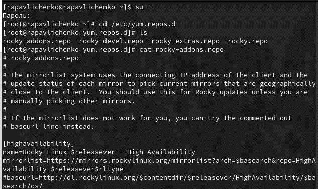{width=100%}

## Выведите на экран список репозиториев. Увидели три репозитория, appstream хранятся приложения и утилиты, в baseos хранятся компоненты системы и в extras всё остальное. Вывели на экран список пакетов, в названии или описании которых есть слово user
 
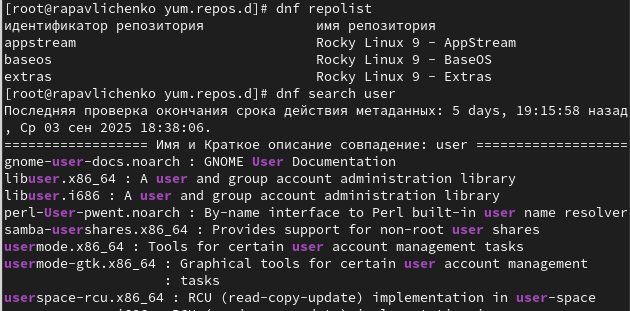{width=100%}

## Установите nmap, предварительно изучив информацию по имеющимся пакетам, при команде и dnf install nmap\* вывело, что пакеты уже были установлены
 
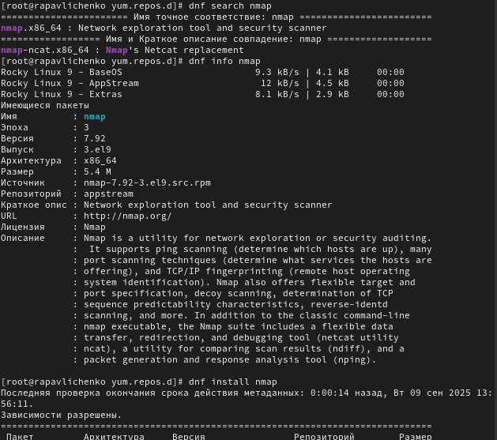{width=100%}

## Удалили nmap
 
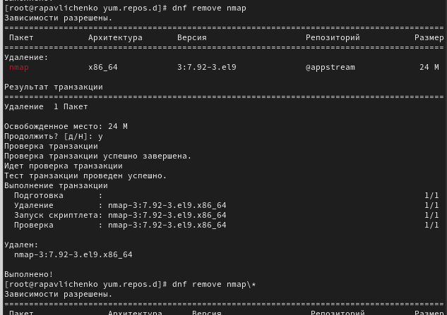{width=100%}

## Получили список имеющихся групп пакетов, затем установили группу пакетов RPM Development Tools, для удаления группы пакетов RPM Development Tools воспользовались командой dnf groupremove "RPM Development Tools"

## Посмотрели историю использования команды dnf и отменили последнее, шестое по счёту, действие
 
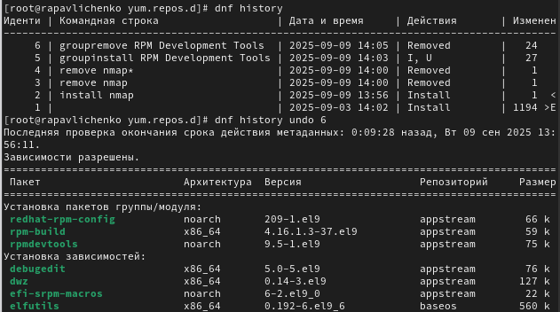{width=100%}

## Скачали rpm-пакет lynx
 
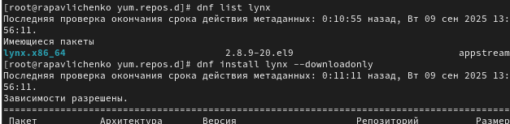{width=100%}

## Нашли каталог, в который был помещён пакет после загрузки, перешли в этот каталог и затем установили rpm-пакет, определили расположение исполняемого файла
 
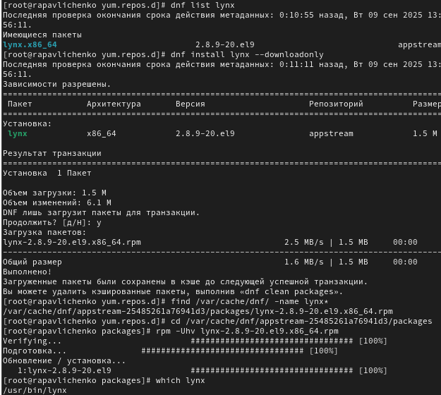{width=100%}

##  Используя rpm, определите по имени файла, к какому пакету принадлежит lynx  и получили дополнительную информацию о содержимом пакета, введя: rpm -qi lynx. Получили список всех файлов в пакете, используя:rpm -ql lynx, а также вывелиперечень файлов с документацией пакета, введя: rpm -qd lynx. Посмотрели файлы документации, применив команду man lynx.

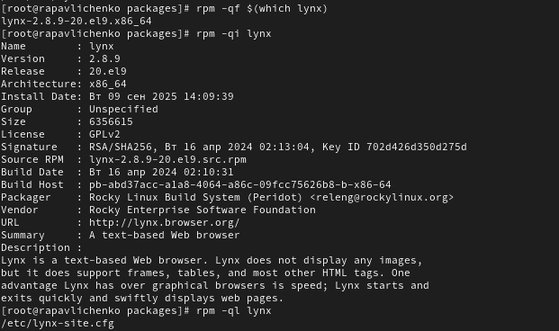{width=100%}

## Вывели на экран перечень и месторасположение конфигурационных файлов пакета. Вывели на экран расположение и содержание скриптов, выполняемых при установке пакета (ничего не вывелось)
 
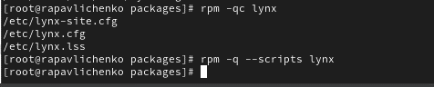{width=100%}

## В отдельном терминале под своей учётной записью запустили текстовый браузер lynx, чтобы проверить корректность установки пакета. Пакеты установлены корректно, все запустилось.
 
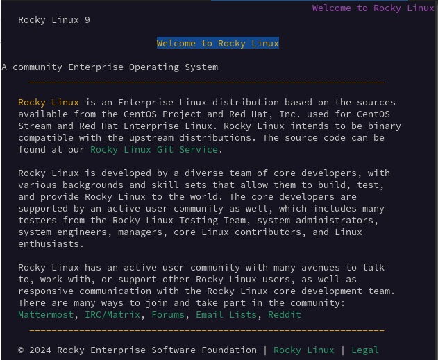{width=100%}

## Вернулись в терминал с учётной записью root и удалили пакет
 
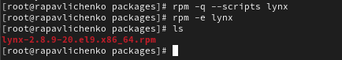{width=100%}

## Установили пакет dnsmasq  и определили расположение исполняемого файла. Определили по имени файла, к какому пакету принадлежит dnsmasq и получили дополнительную информацию о содержимом пакета
 
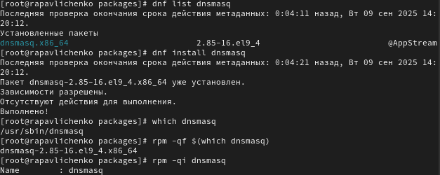{width=100%}

## Получили список всех файлов в пакете, а также вывели перечень файлов с документацией пакета
 
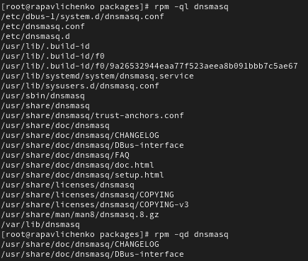{width=100%}

## Вывели на экран перечень и месторасположение конфигурационных файлов пакета. Вывели на экран расположение и содержание скриптов, выполняемых при установке  пакета. Вернулись в терминал с учётной записью root и удалили пакет
 
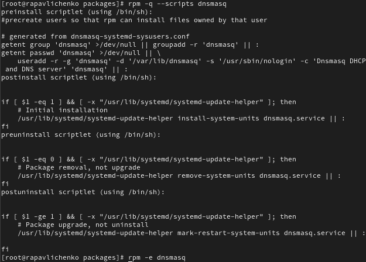{width=100%}

