---
# Preamble

author:
  name: Павличенко Родион Андреевич
  degrees: DSc
  orcid: 0000-0002-0877-7063
  email: 1132246838@pfur.ru
  affiliation:
    - name: Российский университет дружбы народов
      country: Российская Федерация
      postal-code: 117198
      city: Москва
      address: ул. Миклухо-Маклая, д. 6

title: Лабораторная работа № 5
subtitle: Управление системными службами
license: CC BY
date: 11.09.2025

lang: ru-RU
crossref:
  lof-title: Список иллюстраций
  lot-title: Список таблиц
  lol-title: Листинги

format:
  beamer:
    pdf-engine: xelatex
    mainfont: "DejaVu Serif"
    sansfont: "DejaVu Sans"
    monofont: "DejaVu Sans Mono"
    toc: true
    toc-title: Содержание
    number-sections: true
    colorlinks: false
    toc-depth: 2
    slide_level: 2
    aspectratio: 169
    section-titles: true
    theme: metropolis
    themeoptions: progressbar=frametitle,sectionpage=progressbar,numbering=fraction
    babel-lang: russian
    babel-otherlangs: english
  revealjs:
    transition: slide
    margin: 0.2
    smaller: false
    output-ext: html
    theme: beige
    logo: _resources/image/logo_rudn.png
---

# Информация

## Докладчик

:::::::::::::: {.columns align=center}
::: {.column width="70%"}

  * Павличенко Родион Андреевич
  * Cтудент
  * Группа НПИбд-02-24
  * Российский университет дружбы народов им. П. Лумумбы
  * [1132246838@pfur.ru](mailto:1132246838@pfur.ru)

:::
::: {.column width="30%"}

:::
::::::::::::::

# Выполнение лабораторной работы

## Получили полномочия администратора, проверили статус службы Very Secure FTP. Установили службу Very Secure FTP.

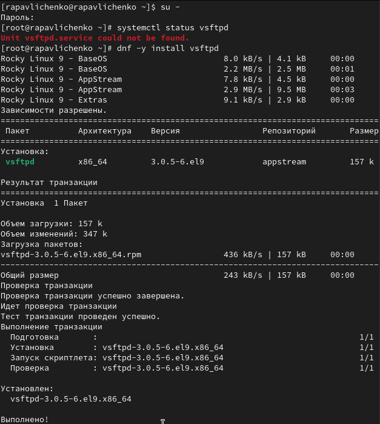{#fig-001 width=70%}

## Запустили службу Very Secure FTP. Проверили статус службы Very Secure FTP. Вывод команды должен показал, что служба в настоящее время работает, но не будет активирована при перезапуске операционной системы

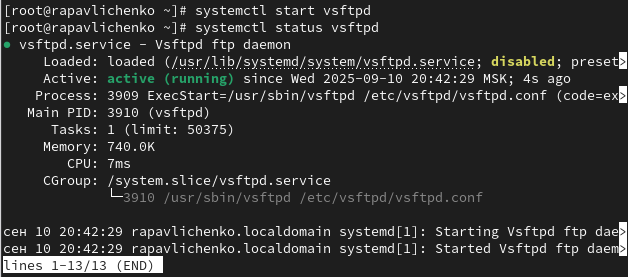{#fig-001 width=70%}

## Добавили службу Very Secure FTP в автозапуск при загрузке операционной системы, используя команду systemctl enable. Затем проверили статус службы. Удалили службу из автозапуска, используя команду systemctl disable, и снова проверили её статус.

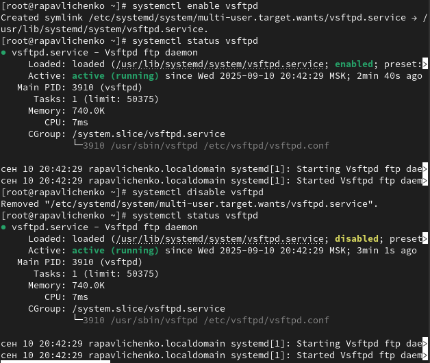{#fig-001 width=70%}

## Вывели на экран символические ссылки, ответственные за запуск различных сервисов. Отобразилось, что ссылка на vsftpd.service не существует. Снова добавили службу Very Secure FTP в автозапуск: systemctl enable vsftpd и вывели на экран символические ссылки, ответственные за запуск различных сервисов. Вывод команды показал, что создана символическая ссылка для файла /usr/lib/systemd/system/vsftpd.service в каталоге /etc/systemd/system/multi-user.target.want

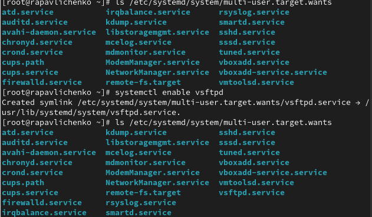{#fig-001 width=70%}

## Снова проверили статус службы Very Secure FTP: командой systemctl status vsftpd Теперь мы увидили, что для файла юнита состояние изменено с disabled на enabled.  Вывели на экран список зависимостей юнита

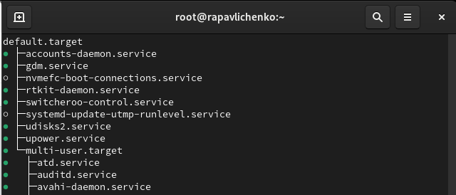{#fig-001 width=70%}

## Вывели на экран список юнитов, которые зависят от данного юнита

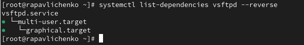{#fig-001 width=70%}

## Получили полномочия администратора. Установили iptables

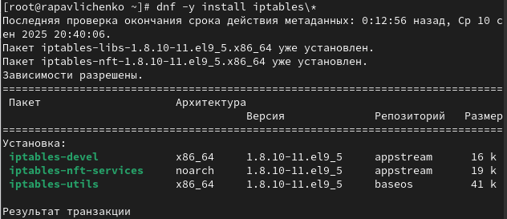{#fig-001 width=70%}

## Проверили статус firewalld и iptables

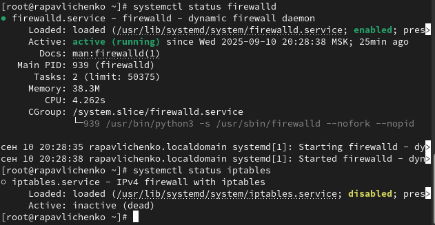{#fig-001 width=70%}

## Попробовали запустить firewalld и iptables. Мы увидели, что при запуске одной службы вторая дезактивируется или не запускается

{#fig-001 width=70%}

## Ввели cat /usr/lib/systemd/system/firewalld.service и заметили, что в разделе conflicts присутствует iptables. Такую же команду выполнили для iptables, но конфликты там не были указаны.

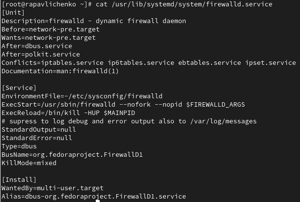{#fig-001 width=70%}

## Выгрузили службу iptables (на всякий случай, чтобы убедиться, что данная служба не загружена в систему) и загрузили службу firewalld. Заблокировали запуск iptables, введя: systemctl mask iptables. Попробовали запустить iptables, появилось сообщение об ошибке, указывающее, что служба замаскирована и по этой причине не может быть запущена. Попробовали добавить iptables в автозапуск, сервис был неактивен, а статус загрузки отобразился как замаскированный

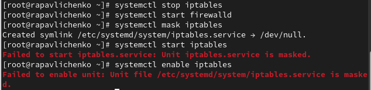{#fig-001 width=70%}

## Получили полномочия администратора. Перешли в каталог systemd и нашли список всех целей, которые можно изолировать

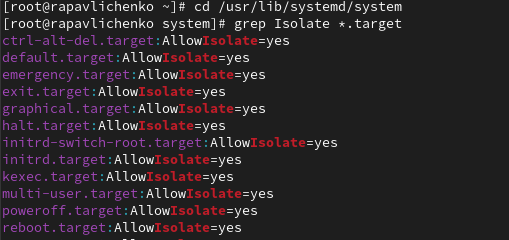{#fig-001 width=70%}

## Переключили операционную систему в режим восстановления

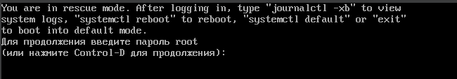{#fig-001 width=70%}

## Получили полномочия администратора. Вывели на экран цель, установленную по умолчанию, для запуска по умолчанию текстового режима, ввели systemctl set-default multi-user.target Перезагрузили систему командой reboot

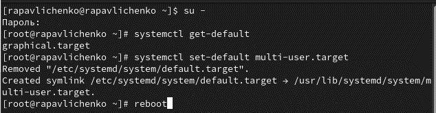{#fig-001 width=70%}

## Получили полномочия администратора. Для запуска по умолчанию графического режима введите systemctl set-default graphical.target Вновь перегрузили систему командой reboot. Убедились, что система загрузилась в графическом режиме

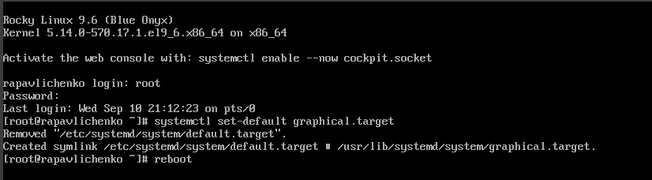{#fig-001 width=70%}
 

