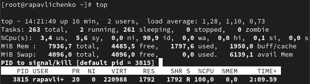
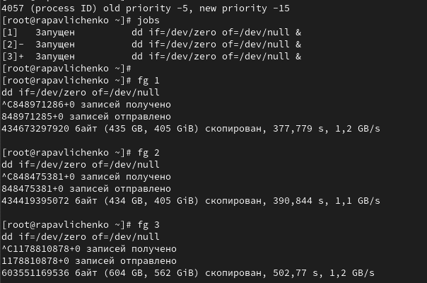
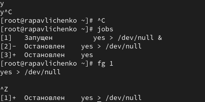
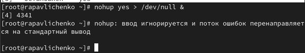
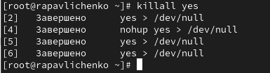

---
# Preamble

author:
  name: Павличенко Родион Андреевич
  degrees: DSc
  orcid: 0000-0002-0877-7063
  email: 1132246838@pfur.ru
  affiliation:
    - name: Российский университет дружбы народов
      country: Российская Федерация
      postal-code: 117198
      city: Москва
      address: ул. Миклухо-Маклая, д. 6

title: Лабораторная работа № 6
subtitle: Управление процессами
license: CC BY
date: 13.09.2025

lang: ru-RU
crossref:
  lof-title: Список иллюстраций
  lot-title: Список таблиц
  lol-title: Листинги

format:
  beamer:
    pdf-engine: xelatex
    mainfont: "DejaVu Serif"
    sansfont: "DejaVu Sans"
    monofont: "DejaVu Sans Mono"
    toc: true
    toc-title: Содержание
    number-sections: true
    colorlinks: false
    toc-depth: 2
    slide_level: 2
    aspectratio: 169
    section-titles: true
    theme: metropolis
    themeoptions: progressbar=frametitle,sectionpage=progressbar,numbering=fraction
    babel-lang: russian
    babel-otherlangs: english
  revealjs:
    transition: slide
    margin: 0.2
    smaller: false
    output-ext: html
    theme: beige
    logo: _resources/image/logo_rudn.png
---

# Информация

## Докладчик

:::::::::::::: {.columns align=center}
::: {.column width="70%"}

  * Павличенко Родион Андреевич
  * Cтудент
  * Группа НПИбд-02-24
  * Российский университет дружбы народов им. П. Лумумбы
  * [1132246838@pfur.ru](mailto:1132246838@pfur.ru)

:::
::: {.column width="30%"}

:::
::::::::::::::

# Выполнение лабораторной работы

## Получили полномочия администратора.Ввели следующие команды: sleep 3600 &; dd if=/dev/zero of=/dev/null &; sleep 7200. Ввели Ctrl + z , чтобы остановить процесс. Ввели jobs. Мы увидили три задания, которые мы только что запустили. Первые два имеют состояние Running, а последнее задание в настоящее время находится в состоянии Stopped. Для продолжения выполнения задания 3 в фоновом режиме ввели bg 3. С помощью команды jobs посмотрели изменения в статусе заданий.

{#fig-001 width=70%}

## Для перемещения задания 1 на передний план ввели fg 1. Ввели Ctrl + c , чтобы отменить задание 1. С помощью команды jobs посмотрели изменения в статусе заданий. Проделали то же самое для отмены заданий 2 и 3.

{#fig-001 width=70%}

## Открыли второй терминал и под учётной записью своего пользователя ввели в нём: dd if=/dev/zero of=/dev/null & 10. Ввели exit, чтобы закрыть второй терминал.

{#fig-001 width=70%}

## На другом терминале под учётной записью своего пользователя запустили top. Мы увидили, что задание dd всё ещё запущено. Для выхода из top использовали q .Вновь запустили top и в нём использовали k , чтобы убить задание dd. После этого вышли из top

{#fig-001 width=70%}

## Получили полномочия администратора su - Ввели следующие команды: dd if=/dev/zero of=/dev/null &; dd if=/dev/zero of=/dev/null &; dd if=/dev/zero of=/dev/null &

{#fig-001 width=70%}

## Ввели ps aux | grep dd. Это показало все строки, в которых есть буквы dd. Использовали PID одного из процессов dd, чтобы изменить приоритет. Ввели ps fax | grep -B5 dd

{#fig-001 width=70%}

## Нашли PID корневой оболочки, из которой были запущены процессы dd, и ввели kill -9 (заменив на значение PID оболочки). Мы увидели, что наша корневая оболочка закрылась, а вместе с ней и все процессы dd

{#fig-001 width=70%}

## Запустили команду dd if=/dev/zero of=/dev/null трижды как фоновое задание. Увеличили приоритет одной из этих команд, используя значение приоритета  -5

{#fig-001 width=70%}

## Изменили приоритет того же процесса ещё раз, но использовали на этот раз значение −15. Завершили все процессы dd, которые мы запустили.

{#fig-001 width=70%}

## Запустили программу yes в фоновом режиме с подавлением потока вывода. Запустили программу yes на переднем плане с подавлением потока вывода. Приостановили выполнение программы. Заново запустили программу yes с теми же параметрами, затем завершили её выполнение.  Запустили программу yes на переднем плане без подавления потока вывода. Приостановили выполнение программы.

{#fig-001 width=70%}

## Проверили состояния заданий, воспользовавшись командой jobs. Перевели процесс, который у нас выполнялся в фоновом режиме, на передний план, затем остановили его.

{#fig-001 width=70%}

## Запустили процесс в фоновом режиме таким образом, чтобы он продолжил свою работу даже после отключения от терминала. Закрыли окно и заново запустили консоль. Убедились что процесс продолжил свою работу.

{#fig-001 width=70%}

## Получили информацию о запущенных в операционной системе процессах с помощью утилиты top. Запустили ещё три программы yes в фоновом режиме с подавлением потока вывода

{#fig-001 width=70%}

## Запустили ещё три программы yes в фоновом режиме с подавлением потока вывода. Убили два процесса: для одного использовали его PID, а для другого — его идентификатор конкретного задания. Попробовали послать сигнал 1 (SIGHUP) процессу, запущенному с помощью nohup, и обычному процессу. Запустили ещё несколько программ yes в фоновом режиме с подавлением потока вывода. Завершили их работу одновременно, используя команду killall

{#fig-001 width=70%}

## Запустили программу yes в фоновом режиме с подавлением потока вывода. Используя утилиту nice, запустили программу yes с теми же параметрами и с приоритетом, большим на 5. Сравнили абсолютные и относительные приоритеты у этих двух процессов. Используя утилиту renice, изменили приоритет у одного из потоков yes таким образом, чтобы у обоих потоков приоритеты были равны.

{#fig-001 width=70%}
 

