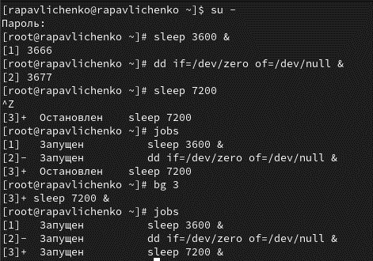
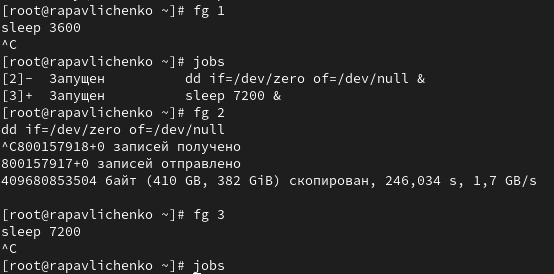
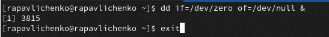
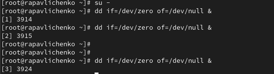
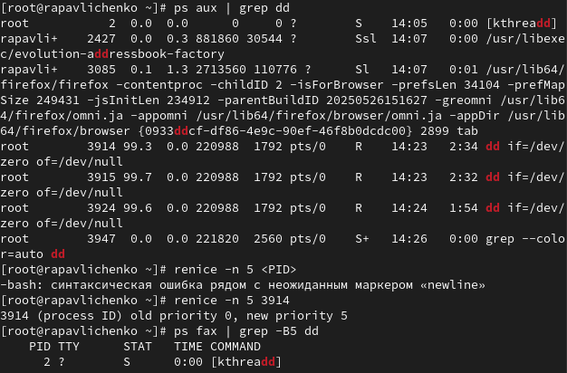
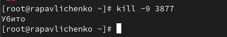
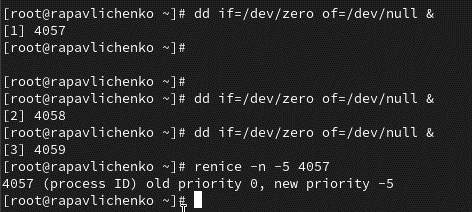
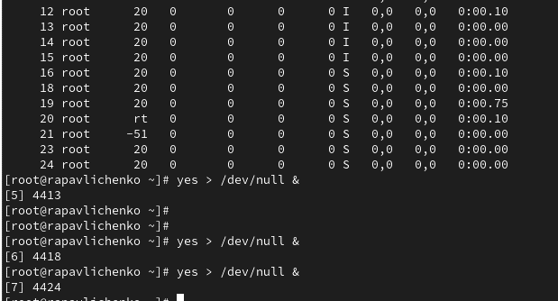
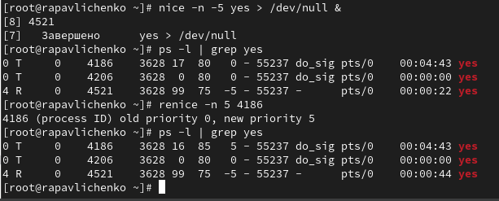

---
# Preamble

## Author
author:
  name: Павличенко Родион Андреевич
  degrees: DSc
  orcid: 0000-0002-0877-7063
  email: kulyabov-ds@rudn.ru
  affiliation:
    - name: Российский университет дружбы народов
      country: Российская Федерация
      postal-code: 117198
      city: Москва
      address: ул. Миклухо-Маклая, д. 623456789
## Title
title: "Лабораторная работа № 6"
subtitle: "Управление процессами"
license: "CC BY"
## Generic options
lang: ru-RU
number-sections: true
toc: true
toc-title: "Содержание"
toc-depth: 2
## Crossref customization
crossref:
  lof-title: "Список иллюстраций"
  lot-title: "Список таблиц"
  lol-title: "Листинги"
## Bibliography
bibliography:
  - bib/cite.bib
csl: _resources/csl/gost-r-7-0-5-2008-numeric.csl
## Formats
format:
### Pdf output format
  pdf:
    toc: true
    number-sections: true
    colorlinks: false
    toc-depth: 2
    lof: true # List of figures
    lot: true # List of tables
#### Document
    documentclass: scrreprt
    papersize: a4
    fontsize: 12pt
    linestretch: 1.5
#### Language
    babel-lang: russian
    babel-otherlangs: english
#### Biblatex
    cite-method: biblatex
    biblio-style: gost-numeric
    biblatexoptions:
      - backend=biber
      - langhook=extras
      - autolang=other*
#### Misc options
    csquotes: true
    indent: true
    header-includes: |
      \usepackage{indentfirst}
      \usepackage{float}
      \floatplacement{figure}{H}
      \usepackage[math,RM={Scale=0.94},SS={Scale=0.94},SScon={Scale=0.94},TT={Scale=MatchLowercase,FakeStretch=0.9},DefaultFeatures={Ligatures=Common}]{plex-otf}
### Docx output format
  docx:
    toc: true
    number-sections: true
    toc-depth: 2
---

# Цель работы

Получить навыки управления процессами операционной системы.

# Выполнение лабораторной работы

Получили полномочия администратора.Ввели следующие команды: sleep 3600 &; dd if=/dev/zero of=/dev/null &; sleep 7200. Ввели Ctrl + z , чтобы остановить процесс. Ввели jobs. Мы увидили три задания, которые мы только что запустили. Первые два имеют состояние Running, а последнее задание в настоящее время находится в состоянии Stopped. Для продолжения выполнения задания 3 в фоновом режиме ввели bg 3. С помощью команды jobs посмотрели изменения в статусе заданий.

{#fig-001 width=70%}

Для перемещения задания 1 на передний план ввели fg 1. Ввели Ctrl + c , чтобы отменить задание 1. С помощью команды jobs посмотрели изменения в статусе заданий. Проделали то же самое для отмены заданий 2 и 3.

{#fig-001 width=70%}

Открыли второй терминал и под учётной записью своего пользователя ввели в нём: dd if=/dev/zero of=/dev/null & 10. Ввели exit, чтобы закрыть второй терминал.

{#fig-001 width=70%}

На другом терминале под учётной записью своего пользователя запустили top. Мы увидили, что задание dd всё ещё запущено. Для выхода из top использовали q .Вновь запустили top и в нём использовали k , чтобы убить задание dd. После этого вышли из top

{#fig-001 width=70%}

Получили полномочия администратора su - Ввели следующие команды: dd if=/dev/zero of=/dev/null &; dd if=/dev/zero of=/dev/null &; dd if=/dev/zero of=/dev/null &

{#fig-001 width=70%}

Ввели ps aux | grep dd. Это показало все строки, в которых есть буквы dd. Использовали PID одного из процессов dd, чтобы изменить приоритет. Ввели ps fax | grep -B5 dd

{#fig-001 width=70%}

Нашли PID корневой оболочки, из которой были запущены процессы dd, и ввели kill -9 (заменив на значение PID оболочки). Мы увидели, что наша корневая оболочка закрылась, а вместе с ней и все процессы dd

{#fig-001 width=70%}

Запустили команду dd if=/dev/zero of=/dev/null трижды как фоновое задание. Увеличили приоритет одной из этих команд, используя значение приоритета  -5

{#fig-001 width=70%}

Изменили приоритет того же процесса ещё раз, но использовали на этот раз значение −15. Завершили все процессы dd, которые мы запустили.

{#fig-001 width=70%}

Запустили программу yes в фоновом режиме с подавлением потока вывода. Запустили программу yes на переднем плане с подавлением потока вывода. Приостановили выполнение программы. Заново запустили программу yes с теми же параметрами, затем завершили её выполнение.  Запустили программу yes на переднем плане без подавления потока вывода. Приостановили выполнение программы.

{#fig-001 width=70%}

Проверили состояния заданий, воспользовавшись командой jobs. Перевели процесс, который у нас выполнялся в фоновом режиме, на передний план, затем остановили его.

{#fig-001 width=70%}

Запустили процесс в фоновом режиме таким образом, чтобы он продолжил свою работу даже после отключения от терминала. Закрыли окно и заново запустили консоль. Убедились что процесс продолжил свою работу.

{#fig-001 width=70%}

Получили информацию о запущенных в операционной системе процессах с помощью утилиты top. Запустили ещё три программы yes в фоновом режиме с подавлением потока вывода

{#fig-001 width=70%}

Запустили ещё три программы yes в фоновом режиме с подавлением потока вывода. Убили два процесса: для одного использовали его PID, а для другого — его идентификатор конкретного задания. Попробовали послать сигнал 1 (SIGHUP) процессу, запущенному с помощью nohup, и обычному процессу. Запустили ещё несколько программ yes в фоновом режиме с подавлением потока вывода. Завершили их работу одновременно, используя команду killall

{#fig-001 width=70%}

Запустили программу yes в фоновом режиме с подавлением потока вывода. Используя утилиту nice, запустили программу yes с теми же параметрами и с приоритетом, большим на 5. Сравнили абсолютные и относительные приоритеты у этих двух процессов. Используя утилиту renice, изменили приоритет у одного из потоков yes таким образом, чтобы у обоих потоков приоритеты были равны.

{#fig-001 width=70%}

# Контрольные вопросы

1.Команда jobs дает обзор всех текущих заданий оболочки.

2.Остановить текущее задание, чтобы продолжить его в фоне, можно комбинацией клавиш Ctrl+Z, а затем командой bg для его запуска в фоновом режиме.

3.Комбинация клавиш Ctrl+C используется для отмены (прерывания) текущего задания оболочки.

4.Чтобы отменить задание без доступа к оболочке, нужно найти его PID с помощью ps aux | grep [имя_задания] и завершить командой kill -9 <PID>.

5.Команда pstree отображает отношения между родительскими и дочерними процессами в виде дерева.

6.Чтобы повысить приоритет процесса с PID 1234, используется команда renice -n <приоритет> -p 1234 (чем меньше число, тем выше приоритет).

7.Все процессы dd проще всего остановить командой pkill dd или killall dd.

8.Остановить команду с именем mycommand можно командой pkill mycommand.

9.В утилите top для завершения процесса используется клавиша k, затем вводится PID процесса.

10. Чтобы запустить команду с высоким приоритетом без риска для других процессов, используйте nice -n <приоритет> [команда] (чем больше число, тем ниже приоритет, по умолчанию 10). Для уже запущенного процесса — renice.

# Выводы

Получили навыки управления процессами операционной системы.

# Список литературы{.unnumbered}

::: {#refs}
:::
