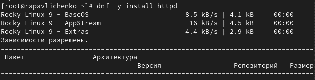
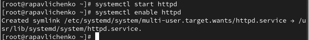
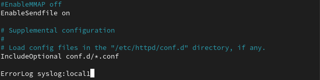
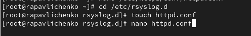
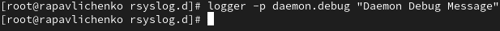
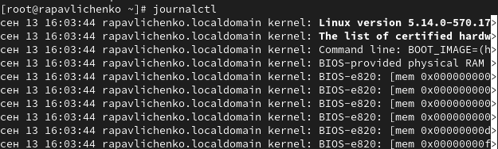
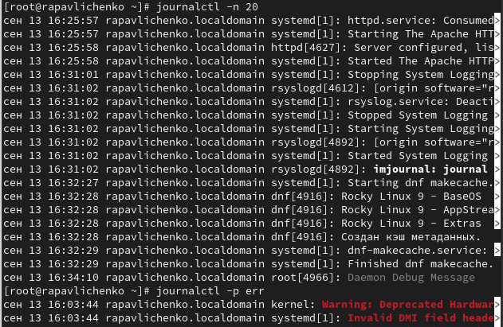

---
# Preamble

author:
  name: Павличенко Родион Андреевич
  degrees: DSc
  orcid: 0000-0002-0877-7063
  email: 1132246838@pfur.ru
  affiliation:
    - name: Российский университет дружбы народов
      country: Российская Федерация
      postal-code: 117198
      city: Москва
      address: ул. Миклухо-Маклая, д. 6

title: Лабораторная работа № 7
subtitle: Управление журналами событий в системе
license: CC BY
date: 14.09.2025

lang: ru-RU
crossref:
  lof-title: Список иллюстраций
  lot-title: Список таблиц
  lol-title: Листинги

format:
  beamer:
    pdf-engine: xelatex
    mainfont: "DejaVu Serif"
    sansfont: "DejaVu Sans"
    monofont: "DejaVu Sans Mono"
    toc: true
    toc-title: Содержание
    number-sections: true
    colorlinks: false
    toc-depth: 2
    slide_level: 2
    aspectratio: 169
    section-titles: true
    theme: metropolis
    themeoptions: progressbar=frametitle,sectionpage=progressbar,numbering=fraction
    babel-lang: russian
    babel-otherlangs: english
  revealjs:
    transition: slide
    margin: 0.2
    smaller: false
    output-ext: html
    theme: beige
    logo: _resources/image/logo_rudn.png
---

# Информация

## Докладчик

:::::::::::::: {.columns align=center}
::: {.column width="70%"}

  * Павличенко Родион Андреевич
  * Cтудент
  * Группа НПИбд-02-24
  * Российский университет дружбы народов им. П. Лумумбы
  * [1132246838@pfur.ru](mailto:1132246838@pfur.ru)

:::
::: {.column width="30%"}

:::
::::::::::::::

# Выполнение лабораторной работы

## Запустили три вкладки терминала и в каждом из них получите полномочия администратора. На второй вкладке терминала запустили мониторинг системных событий в реальном времени

{#fig-001 width=70%}

## В третьей вкладке терминала вернулись к учётной записи своего пользователя (достаточно нажать Ctrl + d ) и попробовали получить полномочия администратора, но ввели неправильный пароль. В третьей вкладке терминала из оболочки пользователя ввели logger hello Во второй вкладке терминала мы увидели сообщение. Во второй вкладке терминала с мониторингом остановили трассировку файла сообщений мониторинга реального времени, используя Ctrl + c . Затем запустили мониторинг сообщений безопасности (последние 20 строк соответствующего файла логов)

{#fig-001 width=70%}

## В первой вкладке терминала установили Apache

{#fig-001 width=70%}

## После окончания процесса установки запустили веб-службу

{#fig-001 width=70%}

## Во второй вкладке терминала посмотрели журнал сообщений об ошибках веб-службы. Чтобы закрыть трассировку файла журнала, использовали Ctrl + c 

{#fig-001 width=70%}

В третьей вкладке терминала получили полномочия администратора и в файле конфигурации /etc/httpd/conf/httpd.conf в конце добавили следующую строку: ErrorLog syslog:local1

{#fig-001 width=70%}

## В каталоге /etc/rsyslog.d создали  файл мониторинга событий веб-службы: cd /etc/rsyslog.d touch httpd.conf Открыв его на редактирование, прописали в нём local1.* -/var/log/httpd-error.log

{#fig-001 width=70%}

## Перешли в первую вкладку терминала и перезагрузили конфигурацию rsyslogd и веб-службу

{#fig-001 width=70%}

## В третьей вкладке терминала создали отдельный файл конфигурации для мониторинга отладочной информации: cd /etc/rsyslog.d touch debug.conf . В этом же терминале ввели echo "*.debug /var/log/messages-debug" > /etc/rsyslog.d/debug.conf.

{#fig-001 width=70%}

## В первой вкладке терминала снова перезапустили rsyslogd

{#fig-001 width=70%}

Во второй вкладке терминала запустили мониторинг отладочной информации. В третьей вкладке терминала ввели: logger -p daemon.debug "Daemon Debug Message"

{#fig-001 width=70%}

## Во второй вкладке терминала посмотрели содержимое журнала с событиями с момента последнего запуска системы

{#fig-001 width=70%}

## Просмотрели содержимого журнала без использования пейджера, а также в режиме просмотра журнала в реальном времени. Использовали Ctrl + c для прерывания просмотра

{#fig-001 width=70%}

## Просмотрели события для UID0: journalctl _UID=0. Для отображения последних 20 строк журнала ввели journalctl -n 20. Для просмотра только сообщений об ошибках ввели journalctl -p err

{#fig-001 width=70%}

## Вывели все сообщения с ошибкой приоритета, которые были зафиксированы со вчерашнего дня, командой journalctl --since yesterday -p err. Для детальной информации использовали journalctl -o verbose. Для просмотра дополнительной информации о модуле sshd ввели journalctl _SYSTEMD_UNIT=sshd.service

{#fig-001 width=70%}

## Запустили терминал и получите полномочия администратора. Создали каталог для хранения записей журнала. Скорректировали права доступа для каталога /var/log/journal, чтобы journald смог записывать в него информацию. Использовали команду: killall -USR1 systemd-journald Журнал systemd стал теперь постоянным. Вывели все сообщения журнала с момента последней перезагрузки, используя: journalctl 

{#fig-001 width=70%}

