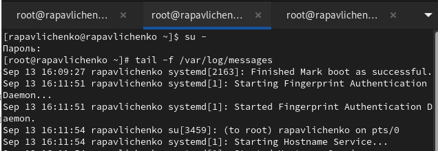
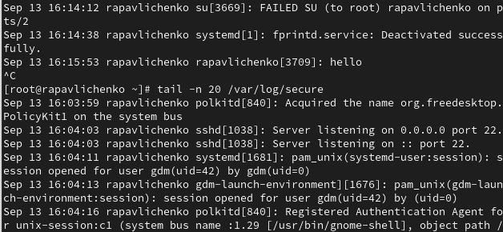
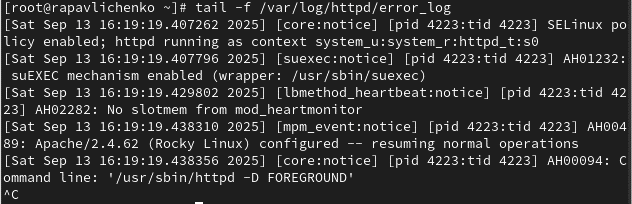
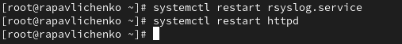
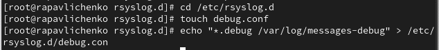
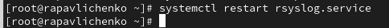
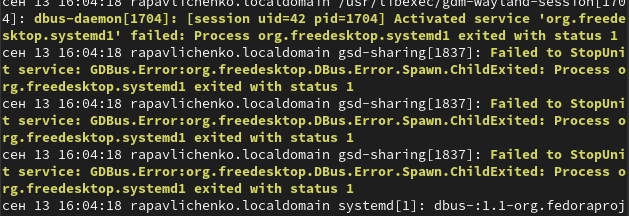
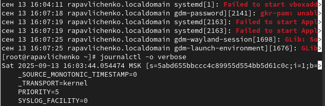
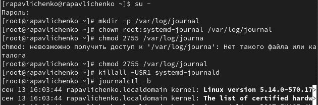

---
# Preamble

## Author
author:
  name: Павличенко Родион Андреевич
  degrees: DSc
  orcid: 0000-0002-0877-7063
  email: kulyabov-ds@rudn.ru
  affiliation:
    - name: Российский университет дружбы народов
      country: Российская Федерация
      postal-code: 117198
      city: Москва
      address: ул. Миклухо-Маклая, д. 623456789
## Title
title: "Лабораторная работа № 7"
subtitle: "Управление журналами событий в системе"
license: "CC BY"
## Generic options
lang: ru-RU
number-sections: true
toc: true
toc-title: "Содержание"
toc-depth: 2
## Crossref customization
crossref:
  lof-title: "Список иллюстраций"
  lot-title: "Список таблиц"
  lol-title: "Листинги"
## Bibliography
bibliography:
  - bib/cite.bib
csl: _resources/csl/gost-r-7-0-5-2008-numeric.csl
## Formats
format:
### Pdf output format
  pdf:
    toc: true
    number-sections: true
    colorlinks: false
    toc-depth: 2
    lof: true # List of figures
    lot: true # List of tables
#### Document
    documentclass: scrreprt
    papersize: a4
    fontsize: 12pt
    linestretch: 1.5
#### Language
    babel-lang: russian
    babel-otherlangs: english
#### Biblatex
    cite-method: biblatex
    biblio-style: gost-numeric
    biblatexoptions:
      - backend=biber
      - langhook=extras
      - autolang=other*
#### Misc options
    csquotes: true
    indent: true
    header-includes: |
      \usepackage{indentfirst}
      \usepackage{float}
      \floatplacement{figure}{H}
      \usepackage[math,RM={Scale=0.94},SS={Scale=0.94},SScon={Scale=0.94},TT={Scale=MatchLowercase,FakeStretch=0.9},DefaultFeatures={Ligatures=Common}]{plex-otf}
### Docx output format
  docx:
    toc: true
    number-sections: true
    toc-depth: 2
---

# Цель работы

Получить навыки работы с журналами мониторинга различных событий в системе

# Выполнение лабораторной работы

Запустили три вкладки терминала и в каждом из них получите полномочия администратора. На второй вкладке терминала запустили мониторинг системных событий в реальном времени

{#fig-001 width=70%}

В третьей вкладке терминала вернулись к учётной записи своего пользователя (достаточно нажать Ctrl + d ) и попробовали получить полномочия администратора, но ввели неправильный пароль. В третьей вкладке терминала из оболочки пользователя ввели logger hello Во второй вкладке терминала мы увидели сообщение. Во второй вкладке терминала с мониторингом остановили трассировку файла сообщений мониторинга реального времени, используя Ctrl + c . Затем запустили мониторинг сообщений безопасности (последние 20 строк соответствующего файла логов)

{#fig-001 width=70%}

В первой вкладке терминала установили Apache

{#fig-001 width=70%}

После окончания процесса установки запустили веб-службу

{#fig-001 width=70%}

Во второй вкладке терминала посмотрели журнал сообщений об ошибках веб-службы. Чтобы закрыть трассировку файла журнала, использовали Ctrl + c 

{#fig-001 width=70%}

В третьей вкладке терминала получили полномочия администратора и в файле конфигурации /etc/httpd/conf/httpd.conf в конце добавили следующую строку: ErrorLog syslog:local1

{#fig-001 width=70%}

В каталоге /etc/rsyslog.d создали  файл мониторинга событий веб-службы: cd /etc/rsyslog.d touch httpd.conf Открыв его на редактирование, прописали в нём local1.* -/var/log/httpd-error.log

{#fig-001 width=70%}

Перешли в первую вкладку терминала и перезагрузили конфигурацию rsyslogd и веб-службу

{#fig-001 width=70%}

В третьей вкладке терминала создали отдельный файл конфигурации для мониторинга отладочной информации: cd /etc/rsyslog.d touch debug.conf . В этом же терминале ввели echo "*.debug /var/log/messages-debug" > /etc/rsyslog.d/debug.conf.

{#fig-001 width=70%}

В первой вкладке терминала снова перезапустили rsyslogd

{#fig-001 width=70%}

Во второй вкладке терминала запустили мониторинг отладочной информации. В третьей вкладке терминала ввели: logger -p daemon.debug "Daemon Debug Message"

{#fig-001 width=70%}

Во второй вкладке терминала посмотрели содержимое журнала с событиями с момента последнего запуска системы

{#fig-001 width=70%}

Просмотрели содержимого журнала без использования пейджера, а также в режиме просмотра журнала в реальном времени. Использовали Ctrl + c для прерывания просмотра

{#fig-001 width=70%}

Просмотрели события для UID0: journalctl _UID=0. Для отображения последних 20 строк журнала ввели journalctl -n 20. Для просмотра только сообщений об ошибках ввели journalctl -p err

{#fig-001 width=70%}

Вывели все сообщения с ошибкой приоритета, которые были зафиксированы со вчерашнего дня, командой journalctl --since yesterday -p err. Для детальной информации использовали journalctl -o verbose. Для просмотра дополнительной информации о модуле sshd ввели journalctl _SYSTEMD_UNIT=sshd.service

{#fig-001 width=70%}

Запустили терминал и получите полномочия администратора. Создали каталог для хранения записей журнала. Скорректировали права доступа для каталога /var/log/journal, чтобы journald смог записывать в него информацию. Использовали команду: killall -USR1 systemd-journald Журнал systemd стал теперь постоянным. Вывели все сообщения журнала с момента последней перезагрузки, используя: journalctl 

{#fig-001 width=70%}

# Контрольные вопросы

1) Для настройки rsyslogd используется файл /etc/rsyslog.conf, а также конфигурационные файлы в директории /etc/rsyslog.d/.

2) Сообщения, связанные с аутентификацией, обычно содержатся в файле /var/log/auth.log (в дистрибутивах на основе Debian) или /var/log/secure (в дистрибутивах на основе Red Hat).

3) Если ничего не настраивать, ротация файлов журналов выполняется еженедельно утилитой logrotate, как указано в конфигурации по умолчанию (/etc/logrotate.conf и файлы в /etc/logrotate.d/).

4) Чтобы записывать все сообщения с приоритетом info в файл /var/log/messages.info, нужно добавить строку: *.info /var/log/messages.info.

5) Видеть сообщения журнала в реальном времени позволяет команда tail -f /var/log/syslog (или для конкретного файла журнала) или journalctl -f для systemd-journald.

6) Чтобы увидеть все сообщения журнала для PID 1 между 9:00 и 15:00, можно использовать команду: journalctl _PID=1 --since="09:00" --until="15:00".

7) Команда journalctl -b показывает сообщения journald после последней перезагрузки системы. Для предыдущих загрузок используйте journalctl -b -1, -b -2 и т.д.

8) Чтобы сделать журнал journald постоянным, нужно: Создать директорию /var/log/journal/ (если её нет):sudo mkdir -p /var/log/journal/ Перезапустить journald: sudo systemctl restart systemd-journald. Это позволит journald сохранять журналы в /var/log/journal/ после перезагрузки.

# Выводы

Получить навыки работы с журналами мониторинга различных событий в системе

# Список литературы{.unnumbered}

::: {#refs}
:::
