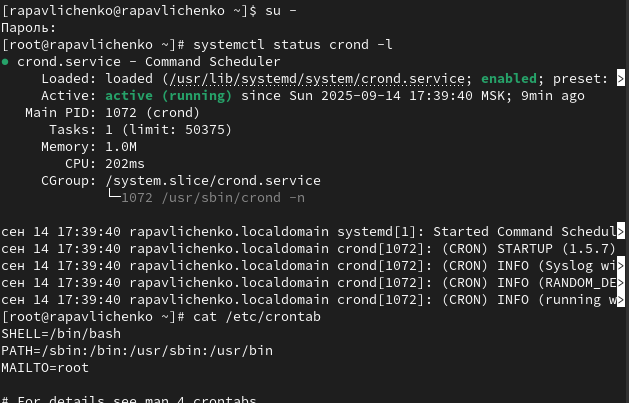
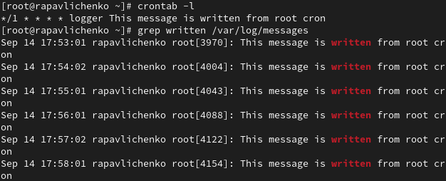
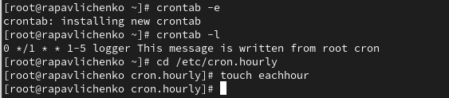
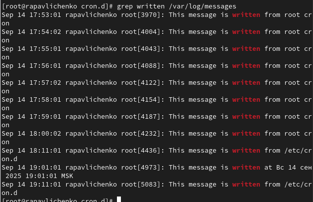
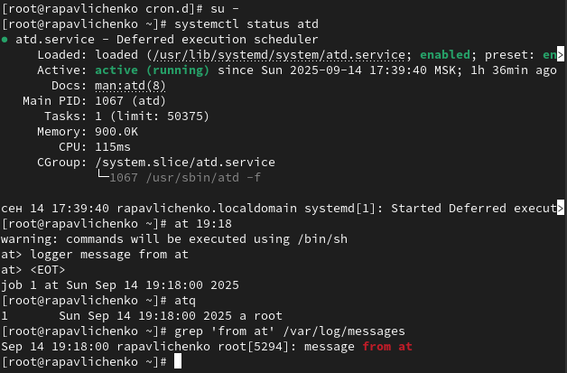

---
# Preamble

author:
  name: Павличенко Родион Андреевич
  degrees: DSc
  orcid: 0000-0002-0877-7063
  email: 1132246838@pfur.ru
  affiliation:
    - name: Российский университет дружбы народов
      country: Российская Федерация
      postal-code: 117198
      city: Москва
      address: ул. Миклухо-Маклая, д. 6

title: Лабораторная работа № 8
subtitle: Планировщики событий
license: CC BY
date: 06.09.2025

lang: ru-RU
crossref:
  lof-title: Список иллюстраций
  lot-title: Список таблиц
  lol-title: Листинги

format:
  beamer:
    pdf-engine: xelatex
    mainfont: "DejaVu Serif"
    sansfont: "DejaVu Sans"
    monofont: "DejaVu Sans Mono"
    toc: true
    toc-title: Содержание
    number-sections: true
    colorlinks: false
    toc-depth: 2
    slide_level: 2
    aspectratio: 169
    section-titles: true
    theme: metropolis
    themeoptions: progressbar=frametitle,sectionpage=progressbar,numbering=fraction
    babel-lang: russian
    babel-otherlangs: english
  revealjs:
    transition: slide
    margin: 0.2
    smaller: false
    output-ext: html
    theme: beige
    logo: _resources/image/logo_rudn.png
---

# Информация

## Докладчик

:::::::::::::: {.columns align=center}
::: {.column width="70%"}

  * Павличенко Родион Андреевич
  * Cтудент
  * Группа НПИбд-02-24
  * Российский университет дружбы народов им. П. Лумумбы
  * [1132246838@pfur.ru](mailto:1132246838@pfur.ru)

:::
::: {.column width="30%"}

:::
::::::::::::::

# Выполнение лабораторной работы

## Запустили терминал и получили полномочия администратора. Посмотрели статус демона crond. Посмотрели содержимое файла конфигурации /etc/crontab

{#fig-001 width=70%}

## Посмотрели список заданий в расписании. Ничего не отобразилось, так как расписание ещё не было задано. Открыли файл расписания на редактирование. Добавили следующую строку в файл расписания (запись сообщения в системный журнал), используя Ins для перехода в vi в режим ввода: */1 * * * * logger This message is written from root cron

{#fig-001 width=70%}

## Посмотрели список заданий в расписании. В расписании появилась запись о запланированном событии. Не выключая систему, через некоторое время (2–3 минуты) просмотрели журнал системных событий. Заметили, что раз в минуту приходило сообщение

{#fig-001 width=70%}

## Изменили запись в расписании crontab на следующую: 0 */1 * * 1-5 logger This message is written from root cron. Посмотрели список заданий в расписании. Перешли в каталог /etc/cron.hourly и создали в нём файл сценария с именем eachhour

{#fig-001 width=70%}

## Открыли файл eachhour для редактирования и прописали в нём следующий скрипт

{#fig-001 width=70%}

## Сделали файл сценария eachhour исполняемым. Затем перешли в каталог /etc/crond.d и создали в нём файл с расписанием eachhour. Открыли этот файл для редактирования и поместили в него следующее содержимое: 11 * * * * root logger This message is written from /etc/cron.d

{#fig-001 width=70%}

## Сохранили изменения. Не выключая систему, через некоторое время просмотрели журнал системных событий

{#fig-001 width=70%}

## Запустили терминал и получили полномочия администратора. Проверили, что служба atd загружена и включена. Задали выполнение команды logger message from at в 19:18 . Убедились, что задание действительно запланировано

{#fig-001 width=70%}
 

