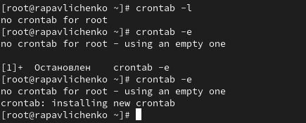
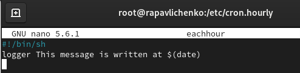
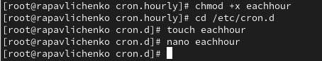

---
# Preamble

## Author
author:
  name: Павличенко Родион Андреевич
  degrees: DSc
  orcid: 0000-0002-0877-7063
  email: kulyabov-ds@rudn.ru
  affiliation:
    - name: Российский университет дружбы народов
      country: Российская Федерация
      postal-code: 117198
      city: Москва
      address: ул. Миклухо-Маклая, д. 623456789
## Title
title: "Лабораторная работа № 8"
subtitle: "Планировщики событий"
license: "CC BY"
## Generic options
lang: ru-RU
number-sections: true
toc: true
toc-title: "Содержание"
toc-depth: 2
## Crossref customization
crossref:
  lof-title: "Список иллюстраций"
  lot-title: "Список таблиц"
  lol-title: "Листинги"
## Bibliography
bibliography:
  - bib/cite.bib
csl: _resources/csl/gost-r-7-0-5-2008-numeric.csl
## Formats
format:
### Pdf output format
  pdf:
    toc: true
    number-sections: true
    colorlinks: false
    toc-depth: 2
    lof: true # List of figures
    lot: true # List of tables
#### Document
    documentclass: scrreprt
    papersize: a4
    fontsize: 12pt
    linestretch: 1.5
#### Language
    babel-lang: russian
    babel-otherlangs: english
#### Biblatex
    cite-method: biblatex
    biblio-style: gost-numeric
    biblatexoptions:
      - backend=biber
      - langhook=extras
      - autolang=other*
#### Misc options
    csquotes: true
    indent: true
    header-includes: |
      \usepackage{indentfirst}
      \usepackage{float}
      \floatplacement{figure}{H}
      \usepackage[math,RM={Scale=0.94},SS={Scale=0.94},SScon={Scale=0.94},TT={Scale=MatchLowercase,FakeStretch=0.9},DefaultFeatures={Ligatures=Common}]{plex-otf}
### Docx output format
  docx:
    toc: true
    number-sections: true
    toc-depth: 2
---

# Цель работы

Получение навыков работы с планировщиками событий cron и at.

# Выполнение лабораторной работы

Запустили терминал и получили полномочия администратора. Посмотрели статус демона crond. Посмотрели содержимое файла конфигурации /etc/crontab

{#fig-001 width=70%}

Посмотрели список заданий в расписании. Ничего не отобразилось, так как расписание ещё не было задано. Открыли файл расписания на редактирование. Добавили следующую строку в файл расписания (запись сообщения в системный журнал), используя Ins для перехода в vi в режим ввода: */1 * * * * logger This message is written from root cron

{#fig-001 width=70%}

Посмотрели список заданий в расписании. В расписании появилась запись о запланированном событии. Не выключая систему, через некоторое время (2–3 минуты) просмотрели журнал системных событий. Заметили, что раз в минуту приходило сообщение

{#fig-001 width=70%}

Изменили запись в расписании crontab на следующую: 0 */1 * * 1-5 logger This message is written from root cron. Посмотрели список заданий в расписании. Перешли в каталог /etc/cron.hourly и создали в нём файл сценария с именем eachhour

{#fig-001 width=70%}

Открыли файл eachhour для редактирования и прописали в нём следующий скрипт

{#fig-001 width=70%}

Сделали файл сценария eachhour исполняемым. Затем перешли в каталог /etc/crond.d и создали в нём файл с расписанием eachhour. Открыли этот файл для редактирования и поместили в него следующее содержимое: 11 * * * * root logger This message is written from /etc/cron.d

{#fig-001 width=70%}

Сохранили изменения. Не выключая систему, через некоторое время просмотрели журнал системных событий

{#fig-001 width=70%}

Запустили терминал и получили полномочия администратора. Проверили, что служба atd загружена и включена. Задали выполнение команды logger message from at в 19:18 . Убедились, что задание действительно запланировано

{#fig-001 width=70%}

# Контрольные вопросы

Чтобы выполнять задание раз в 2 недели, можно использовать указание дня недели с шагом. Например, для выполнения по понедельникам каждые две недели: 0 0 * * 1 expr \$(date +\%W) \% 2 == 0 && [команда]

Чтобы выполнять задание 1-го и 15-го числа каждого месяца в 2 часа ночи: 0 2 1,15 * * [команда]
 
Чтобы выполнять задание каждые 2 минуты каждый день:*/2 * * * * [команда]
 
Чтобы выполнять задание ежегодно 19 сентября: 0 0 19 9 * [команда]
 
Чтобы выполнять задание каждый четверг сентября ежегодно: 0 0 * 9 4 [команда]
 
Чтобы назначить задание cron для пользователя alice, используйте команду:crontab -u alice -e. Пример: после выполнения команды откроется редактор для добавления строки cron, например: 30 14 * * * /home/alice/script.sh
 
Чтобы запретить пользователю bob использовать cron, добавьте его имя в файл /etc/cron.deny. Пример:echo "bob" | sudo tee -a /etc/cron.deny
 
Чтобы гарантировать выполнение задания даже при временной недоступности сервера, используйте anacron (для периодических задач) или настройте повторение в самом скрипте (с проверкой условий). Для cron это сложно, так как он пропускает задания при неработающей системе.
 
Чтобы проверить задания, запланированные в atd, используйте команду:atq Эта команда покажет все ожидающие задания в очереди at.

# Выводы

Получили навыки работы с планировщиками событий cron и at.

# Список литературы{.unnumbered}

::: {#refs}
:::
