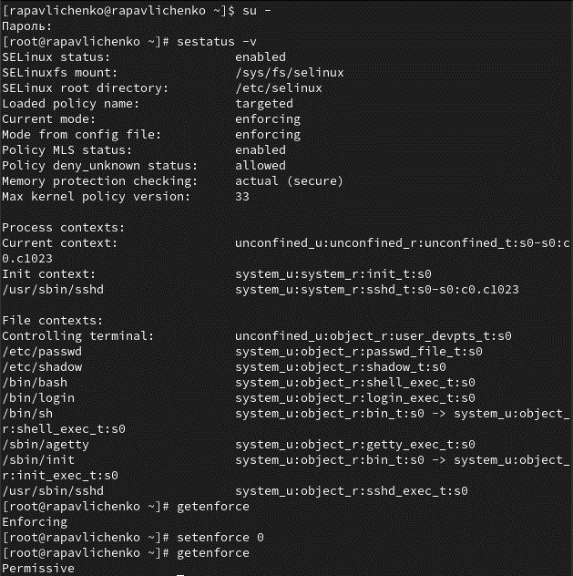
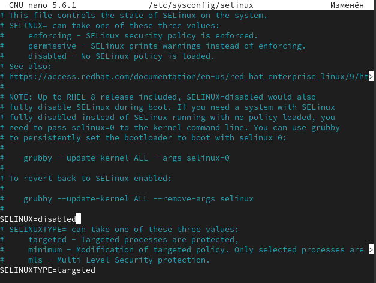
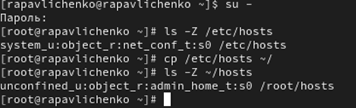
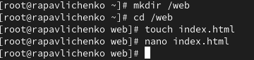
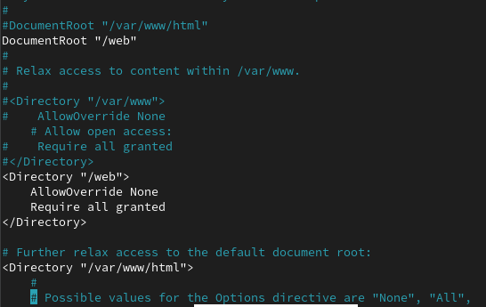
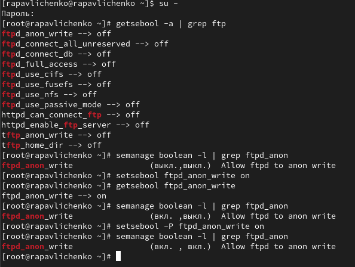

---
# Preamble

author:
  name: Павличенко Родион Андреевич
  degrees: DSc
  orcid: 0000-0002-0877-7063
  email: 1132246838@pfur.ru
  affiliation:
    - name: Российский университет дружбы народов
      country: Российская Федерация
      postal-code: 117198
      city: Москва
      address: ул. Миклухо-Маклая, д. 6

title: Лабораторная работа № 9
subtitle: Управление SELinux
license: CC BY
date: 21.10.2025

lang: ru-RU
crossref:
  lof-title: Список иллюстраций
  lot-title: Список таблиц
  lol-title: Листинги

format:
  beamer:
    pdf-engine: xelatex
    classoption: "6pt"
    mainfont: "DejaVu Serif"
    sansfont: "DejaVu Sans"
    monofont: "DejaVu Sans Mono"
    toc: true
    toc-title: Содержание
    number-sections: true
    colorlinks: false
    toc-depth: 2
    slide_level: 2
    aspectratio: 169
    section-titles: true
    theme: metropolis
    themeoptions: progressbar=frametitle,sectionpage=progressbar,numbering=fraction
    babel-lang: russian
    babel-otherlangs: english
  revealjs:
    transition: slide
    margin: 0.2
    smaller: false
    output-ext: html
    theme: beige
    logo: _resources/image/logo_rudn.png
---

# Информация

## Докладчик

:::::::::::::: {.columns align=center}
::: {.column width="70%"}

  * Павличенко Родион Андреевич
  * Cтудент
  * Группа НПИбд-02-24
  * Российский университет дружбы народов им. П. Лумумбы
  * [1132246838@pfur.ru](mailto:1132246838@pfur.ru)

:::
::: {.column width="30%"}

:::
::::::::::::::

# Выполнение лабораторной работы

## Запустили терминал и получили полномочия администратора.Просмотели текущую информацию о состоянии SELinux. В строке SELinux status увидели, что он включен, в строке current mode поняли, что он стоит в режиме  enforcing. Посмотрели, в каком режиме работает SELinux командой getenforce. Изменили режим работы SELinux на разрешающий (Permissive) и снова ввели getenforce

{width=100%}

## В файле /etc/sysconfig/selinux с помощью редактора nano установили SELINUX=disabled. Перезагрузили систему.

{width=100%}

## После перезагрузки запустили терминал и получили полномочия администратора. Посмотрели статус SELinux, увидили, что SELinux теперь отключён. Попробовали переключить режим работы SELinux командой setenforce 1. Переключить не получилось, так как SELinux недоступен.

{width=100%}

## Открыли файл /etc/sysconfig/selinux с помощью редактора и установили: SELINUX=enforcing. Перезагрузили систему

{width=100%}

## После перезагрузки в терминале с полномочиями администратора просмотрели текущую информацию о состоянии SELinux командой sestatus -v. Убедились, что система работает в принудительном режиме (enforcing) использования SELinux.

{width=100%}

## Запустили терминал и получили полномочия администратора. Посмотрели контекст безопасности файла /etc/hosts, увидили, что у файла есть метка контекста net_conf_t. Скопировали файл /etc/hosts в домашний каталог. Проверили контекст файла ~/hosts, поскольку копирование считается созданием нового файла, то параметр контекста в файле ~/hosts, расположенном в домашнем каталоге, стал admin_home_t.

{width=100%}

## Попытались перезаписать существующий файл hosts из домашнего каталога в каталог /etc и подтвердили, что мы хотим сделать это. Убедились, что тип контекста по-прежнему установлен на admin_home_t. Исправили контекст безопасности командой restorecon -v /etc/hosts . Убедились, что тип контекста изменился. Для массового исправления контекста безопасности на файловой системе ввели touch /.autorelabel и перезагрузили систему

{width=100%}

## Запустили терминал и получили полномочия администратора. Установили необходимое программное обеспечение командами dnf -y install httpd dnf -y install lynx

{width=100%}

## Создали новое хранилище для файлов web-сервера. Создали файл index.html в каталоге с контентом веб-сервера и поместили в файл следующий текст: Welcome to my web-server

{width=100%}

## В файле /etc/httpd/conf/httpd.conf закомментировали строку DocumentRoot "/var/www/html" и ниже добавили строку DocumentRoot "/web". Затем в этом же файле ниже закомментировали раздел AllowOverride None Require all granted и добавили следующий раздел, определяющий правила доступа: AllowOverride None Require all granted

{width=100%}

## Запустили веб-сервер и службу httpd: systemctl start httpd и systemctl enable httpd. В терминале под учётной записью своего пользователя при обращении к веб-серверу в текстовом браузере lynx: lynx http://localhost мы увидели веб-страницу Red Hat по умолчанию, а не содержимое только что созданного файла index.html

{width=100%}

## В терминале с полномочиями администратора применили новую метку контекста к /web. Восстановили контекст безопасности командой restorecon -R -v /web. В терминале под учётной записью своего пользователя снова обратились к веб-серверу: lynx http://localhost .Теперь мы получили доступ к своей пользовательской веб-странице

{width=100%}

## Запустили терминал и получили полномочия администратора. Посмотрели список переключателей SELinux для службы ftp. Для службы ftpd_anon посмотрели список переключателей с пояснением. Изменили текущее значение переключателя для службы ftpd_anon_write с off на on. Повторно посмотрели список переключателей SELinux для службы ftpd_anon_write. Посмотрели список переключателей с пояснением. Обратили внимание, что настройка времени выполнения включена, но постоянная настройка по-прежнему отключена. Изменили постоянное значение переключателя для службы ftpd_anon_write с off на on. Посмотрели список переключателей: semanage boolean -l | grep ftpd_anon. У нас переключатель имеет состояние on on (вкл. , вкл.)

{width=100%} 

