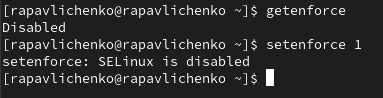
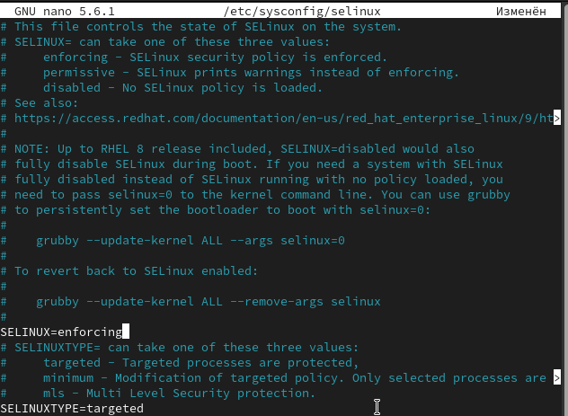
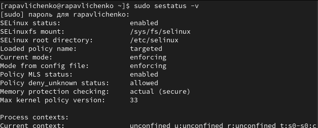
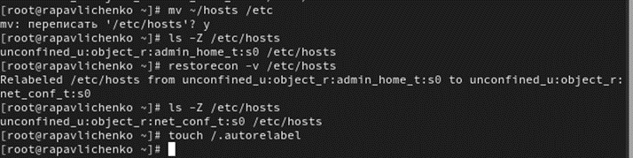
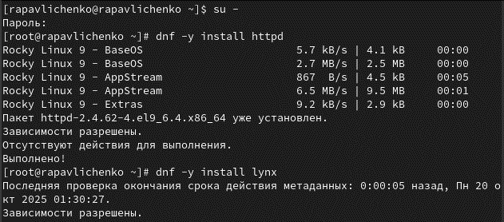
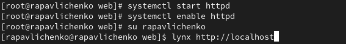
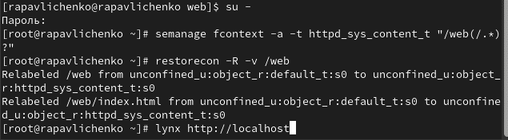

---
# Preamble

## Author
author:
  name: Павличенко Родион Андреевич
  degrees: DSc
  orcid: 0000-0002-0877-7063
  email: kulyabov-ds@rudn.ru
  affiliation:
    - name: Российский университет дружбы народов
      country: Российская Федерация
      postal-code: 117198
      city: Москва
      address: ул. Миклухо-Маклая, д. 623456789
## Title
title: "Лабораторная работа № 9"
subtitle: "Управление SELinux"
license: "CC BY"
## Generic options
lang: ru-RU
number-sections: true
toc: true
toc-title: "Содержание"
toc-depth: 2
## Crossref customization
crossref:
  lof-title: "Список иллюстраций"
  lot-title: "Список таблиц"
  lol-title: "Листинги"
## Bibliography
bibliography:
  - bib/cite.bib
csl: _resources/csl/gost-r-7-0-5-2008-numeric.csl
## Formats
format:
### Pdf output format
  pdf:
    toc: true
    number-sections: true
    colorlinks: false
    toc-depth: 2
    lof: true # List of figures
    lot: true # List of tables
#### Document
    documentclass: scrreprt
    papersize: a4
    fontsize: 12pt
    linestretch: 1.5
#### Language
    babel-lang: russian
    babel-otherlangs: english
#### Biblatex
    cite-method: biblatex
    biblio-style: gost-numeric
    biblatexoptions:
      - backend=biber
      - langhook=extras
      - autolang=other*
#### Misc options
    csquotes: true
    indent: true
    header-includes: |
      \usepackage{indentfirst}
      \usepackage{float}
      \floatplacement{figure}{H}
      \usepackage[math,RM={Scale=0.94},SS={Scale=0.94},SScon={Scale=0.94},TT={Scale=MatchLowercase,FakeStretch=0.9},DefaultFeatures={Ligatures=Common}]{plex-otf}
### Docx output format
  docx:
    toc: true
    number-sections: true
    toc-depth: 2
---

# Цель работы

Получить навыки работы с контекстом безопасности и политиками SELinux.

# Выполнение лабораторной работы

Запустили терминал и получили полномочия администратора.Просмотели текущую информацию о состоянии SELinux. В строке SELinux status увидели, что он включен, в строке current mode поняли, что он стоит в режиме  enforcing. Посмотрели, в каком режиме работает SELinux командой getenforce. Изменили режим работы SELinux на разрешающий (Permissive) и снова ввели getenforce

{#fig-001 width=70%}

В файле /etc/sysconfig/selinux с помощью редактора nano установили SELINUX=disabled. Перезагрузили систему.

{#fig-001 width=70%}

После перезагрузки запустили терминал и получили полномочия администратора. Посмотрели статус SELinux, увидили, что SELinux теперь отключён. Попробовали переключить режим работы SELinux командой setenforce 1. Переключить не получилось, так как SELinux недоступен.

{#fig-001 width=70%}

Открыли файл /etc/sysconfig/selinux с помощью редактора и установили: SELINUX=enforcing. Перезагрузили систему

{#fig-001 width=70%}

После перезагрузки в терминале с полномочиями администратора просмотрели текущую информацию о состоянии SELinux командой sestatus -v. Убедились, что система работает в принудительном режиме (enforcing) использования SELinux.

{#fig-001 width=70%}

Запустили терминал и получили полномочия администратора. Посмотрели контекст безопасности файла /etc/hosts, увидили, что у файла есть метка контекста net_conf_t. Скопировали файл /etc/hosts в домашний каталог. Проверили контекст файла ~/hosts, поскольку копирование считается созданием нового файла, то параметр контекста в файле ~/hosts, расположенном в домашнем каталоге, стал admin_home_t.

{#fig-001 width=70%}

Попытались перезаписать существующий файл hosts из домашнего каталога в каталог /etc и подтвердили, что мы хотим сделать это. Убедились, что тип контекста по-прежнему установлен на admin_home_t. Исправили контекст безопасности командой restorecon -v /etc/hosts . Убедились, что тип контекста изменился. Для массового исправления контекста безопасности на файловой системе ввели touch /.autorelabel и перезагрузили систему

{#fig-001 width=70%}

Запустили терминал и получили полномочия администратора. Установили необходимое программное обеспечение командами dnf -y install httpd dnf -y install lynx

{#fig-001 width=70%}

Создали новое хранилище для файлов web-сервера. Создали файл index.html в каталоге с контентом веб-сервера и поместили в файл следующий текст: Welcome to my web-server

{#fig-001 width=70%}

В файле /etc/httpd/conf/httpd.conf закомментировали строку DocumentRoot "/var/www/html" и ниже добавили строку DocumentRoot "/web". Затем в этом же файле ниже закомментировали раздел AllowOverride None Require all granted и добавили следующий раздел, определяющий правила доступа: AllowOverride None Require all granted

{#fig-001 width=70%}

Запустили веб-сервер и службу httpd: systemctl start httpd и systemctl enable httpd. В терминале под учётной записью своего пользователя при обращении к веб-серверу в текстовом браузере lynx: lynx http://localhost мы увидели веб-страницу Red Hat по умолчанию, а не содержимое только что созданного файла index.html

{#fig-001 width=70%}

В терминале с полномочиями администратора применили новую метку контекста к /web. Восстановили контекст безопасности командой restorecon -R -v /web. В терминале под учётной записью своего пользователя снова обратились к веб-серверу: lynx http://localhost .Теперь мы получили доступ к своей пользовательской веб-странице

{#fig-001 width=70%}

Запустили терминал и получили полномочия администратора. Посмотрели список переключателей SELinux для службы ftp. Для службы ftpd_anon посмотрели список переключателей с пояснением. Изменили текущее значение переключателя для службы ftpd_anon_write с off на on. Повторно посмотрели список переключателей SELinux для службы ftpd_anon_write. Посмотрели список переключателей с пояснением. Обратили внимание, что настройка времени выполнения включена, но постоянная настройка по-прежнему отключена. Изменили постоянное значение переключателя для службы ftpd_anon_write с off на on. Посмотрели список переключателей: semanage boolean -l | grep ftpd_anon. У нас переключатель имеет состояние on on (вкл. , вкл.)

{#fig-001 width=70%}

# Контрольные вопросы

1) setenforce 0

2) getsebool -a

3) setroubleshoot

4)semanage fcontext -a -t httpd_sys_content_t "/web(/.*)?" ; restorecon -Rv /web

5) /etc/selinux/config

6) /var/log/audit/audit.log

7) seinfo -t | grep ftp

8) setenforce 0

# Выводы

Получили навыки работы с контекстом безопасности и политиками SELinux.

# Список литературы{.unnumbered}

::: {#refs}
:::
