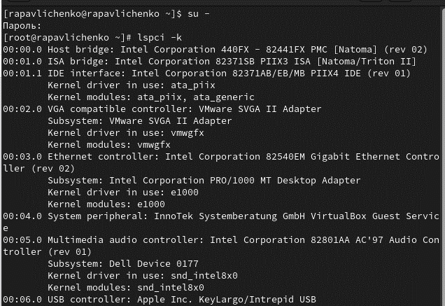
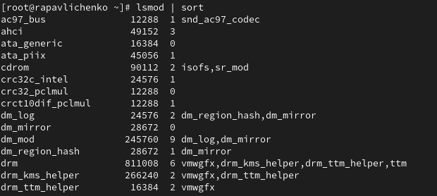
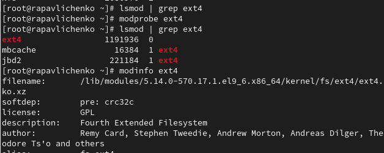
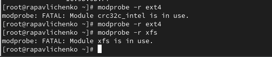
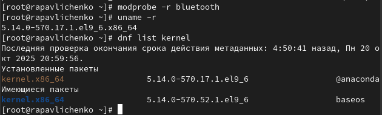
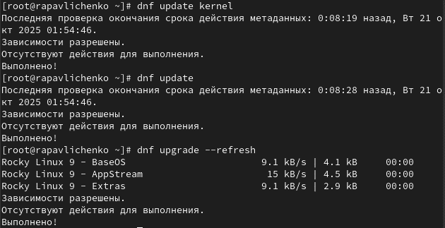

---
# Preamble

author:
  name: Павличенко Родион Андреевич
  degrees: DSc
  orcid: 0000-0002-0877-7063
  email: 1132246838@pfur.ru
  affiliation:
    - name: Российский университет дружбы народов
      country: Российская Федерация
      postal-code: 117198
      city: Москва
      address: ул. Миклухо-Маклая, д. 6

title: Лабораторная работа № 10
subtitle: Основы работы с модулями ядра операционной системы
license: CC BY
date: 06.09.2025

lang: ru-RU
crossref:
  lof-title: Список иллюстраций
  lot-title: Список таблиц
  lol-title: Листинги

format:
  beamer:
    pdf-engine: xelatex
    mainfont: "DejaVu Serif"
    sansfont: "DejaVu Sans"
    monofont: "DejaVu Sans Mono"
    toc: true
    toc-title: Содержание
    number-sections: true
    colorlinks: false
    toc-depth: 2
    slide_level: 2
    aspectratio: 169
    section-titles: true
    theme: metropolis
    themeoptions: progressbar=frametitle,sectionpage=progressbar,numbering=fraction
    babel-lang: russian
    babel-otherlangs: english
  revealjs:
    transition: slide
    margin: 0.2
    smaller: false
    output-ext: html
    theme: beige
    logo: _resources/image/logo_rudn.png
---

# Информация

## Докладчик

:::::::::::::: {.columns align=center}
::: {.column width="70%"}

  * Павличенко Родион Андреевич
  * Cтудент
  * Группа НПИбд-02-24
  * Российский университет дружбы народов им. П. Лумумбы
  * [1132246838@pfur.ru](mailto:1132246838@pfur.ru)

:::
::: {.column width="30%"}

:::
::::::::::::::

# Выполнение лабораторной работы

## Запустили терминал и получили полномочия администратора. Посмотрели, какие устройства имеются в вашей системе и какие модули ядра с ними связаны. 

{width=100%}

## Посмотрели, какие модули ядра загружены командой lsmod | sort

{width=100%}

## Посмотрели, загружен ли модуль ext4 командой lsmod | grep ext4. Загрузили модуль ядра ext4. Убедились, что модуль загружен, посмотрев список загруженных модулей. Посмотрели информацию о модуле ядра ext4. Обратили внимание, что у этого модуля нет параметров. 

{width=100%}

## Попробовали выгрузить модуль ядра ext4, потребовалось команду ввести несколько раз, так как при первой попытке вывело, что модуль ядра используется. Попробовали выгрузить модуль ядра xfs, обратили внимание, что мы получили сообщение об ошибке, поскольку модуль ядра в данный момент использовался

{width=100%}

## Запустили терминал и получили полномочия администратора. Посмотрели, загружен ли модуль bluetooth. Загрузили модуль ядра bluetooth. Посмотрели список модулей ядра, отвечающих за работу с Bluetooth. Посмотрели информацию о модуле bluetooth. 

{width=100%}

## Выгрузили модуль ядра bluetooth. Посмотрели версию ядра, используемую в операционной системе. Вывели на экран список пакетов, относящихся к ядру операционной системы

{width=100%}

## Обновили систему, чтобы убедиться, что все существующие пакеты обновлены, так как это важно при установке/обновлении ядер Linux и избежания конфликтов

{width=100%}

## Обновили ядро операционной системы, а затем саму операционную систему. Перезагрузили систему. При загрузке выбрали новое ядро

{width=100%}

## Посмотрели версию ядра, используемую в операционной системы

{width=100%} 

