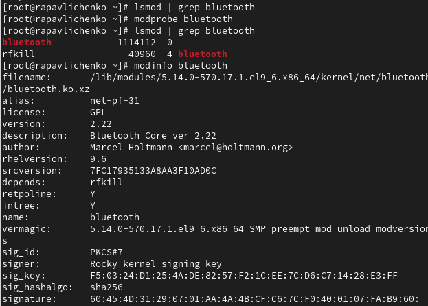
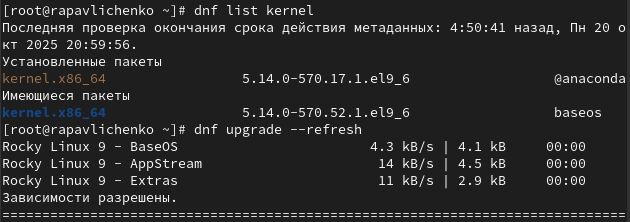

---
# Preamble

## Author
author:
  name: Павличенко Родион Андреевич
  degrees: DSc
  orcid: 0000-0002-0877-7063
  email: kulyabov-ds@rudn.ru
  affiliation:
    - name: Российский университет дружбы народов
      country: Российская Федерация
      postal-code: 117198
      city: Москва
      address: ул. Миклухо-Маклая, д. 623456789
## Title
title: "Лабораторная работа № 10"
subtitle: "Основы работы с модулями ядра операционной системы"
license: "CC BY"
## Generic options
lang: ru-RU
number-sections: true
toc: true
toc-title: "Содержание"
toc-depth: 2
## Crossref customization
crossref:
  lof-title: "Список иллюстраций"
  lot-title: "Список таблиц"
  lol-title: "Листинги"
## Bibliography
bibliography:
  - bib/cite.bib
csl: _resources/csl/gost-r-7-0-5-2008-numeric.csl
## Formats
format:
### Pdf output format
  pdf:
    toc: true
    number-sections: true
    colorlinks: false
    toc-depth: 2
    lof: true # List of figures
    lot: true # List of tables
#### Document
    documentclass: scrreprt
    papersize: a4
    fontsize: 12pt
    linestretch: 1.5
#### Language
    babel-lang: russian
    babel-otherlangs: english
#### Biblatex
    cite-method: biblatex
    biblio-style: gost-numeric
    biblatexoptions:
      - backend=biber
      - langhook=extras
      - autolang=other*
#### Misc options
    csquotes: true
    indent: true
    header-includes: |
      \usepackage{indentfirst}
      \usepackage{float}
      \floatplacement{figure}{H}
      \usepackage[math,RM={Scale=0.94},SS={Scale=0.94},SScon={Scale=0.94},TT={Scale=MatchLowercase,FakeStretch=0.9},DefaultFeatures={Ligatures=Common}]{plex-otf}
### Docx output format
  docx:
    toc: true
    number-sections: true
    toc-depth: 2
---

# Цель работы

Получить навыки работы с утилитами управления модулями ядра операционной системы.

# Выполнение лабораторной работы

Запустили терминал и получили полномочия администратора. Посмотрели, какие устройства имеются в вашей системе и какие модули ядра с ними связаны. В системе обнаружены следующие устройства и связанные с ними модули ядра. Контроллер IDE использует драйвер ata_piix и модули ata_piix, ata_generic. Видеоадаптер VMware SVGA II управляется драйвером vmwgfx и одноимённым модулем. Сетевой интерфейс на базе Intel 82540EM работает на драйвере e1000 (модуль e1000). Звуковой контроллер Intel AC'97 использует драйвер snd_intel8x0 и его модуль. В системе присутствуют два USB-контроллера: первый от Apple использует драйвер ohci-pci, а второй от Intel (EHCI) — ehci-pci. SATA-контроллер работает на драйвере ahci (модуль ahci). Также задействован системный мост PIIX4 SMBus с драйвером piix4_smbus и модулем i2c_piix4. Наличие устройств VMware и VirtualBox Guest Service указывает на виртуальную среду выполнения.

{#fig-001 width=70%}

Посмотрели, какие модули ядра загружены командой lsmod | sort

{#fig-001 width=70%}

Посмотрели, загружен ли модуль ext4 командой lsmod | grep ext4. Загрузили модуль ядра ext4. Убедились, что модуль загружен, посмотрев список загруженных модулей. Посмотрели информацию о модуле ядра ext4. Обратили внимание, что у этого модуля нет параметров. Модуль имеет версию 9.6, собран для ядра 5.14.0-570.17.1.e19_6.x86_64 и распространяется под лицензией GPL. Он зависит от других модулей (jbd2, mbcache) и имеет мягкую зависимость (softdep) от модуля crc32c, который должен быть загружен до него. Модуль предоставляет функциональность для работы с файловыми системами ext4, ext3 и ext2 (через псевдонимы alias). Важной особенностью является то, что модуль подписан цифровой подписью (PKCS#7) с использованием ключа Rocky kernel signing key и алгоритма хеширования sha256, что обеспечивает его целостность и аутентичность. Параметр retpoline: Y указывает на включение защиты от уязвимостей Spectre. Модуль собран в рамках основного дерева исходного кода ядра (intree: Y).

{#fig-001 width=70%}

Попробовали выгрузить модуль ядра ext4, потребовалось команду ввести несколько раз, так как при первой попытке вывело, что модуль ядра используется. Попробовали выгрузить модуль ядра xfs, обратили внимание, что мы получили сообщение об ошибке, поскольку модуль ядра в данный момент использовался

{#fig-001 width=70%}

Запустили терминал и получили полномочия администратора. Посмотрели, загружен ли модуль bluetooth. Загрузили модуль ядра bluetooth. Посмотрели список модулей ядра, отвечающих за работу с Bluetooth. Посмотрели информацию о модуле bluetooth. Модуль bluetooth поддерживает три параметра: disable_esco для отключения создания eSCO-соединений (например, для аудио), disable_ertm для отключения расширенного режима повторной передачи данных (может помочь с совместимостью) и enable_egred для включения улучшенного управления потоком данных, что может повысить производительность

{#fig-001 width=70%}

Выгрузили модуль ядра bluetooth. Посмотрели версию ядра, используемую в операционной системе. Вывели на экран список пакетов, относящихся к ядру операционной системы

{#fig-001 width=70%}

Обновили систему, чтобы убедиться, что все существующие пакеты обновлены, так как это важно при установке/обновлении ядер Linux и избежания конфликтов

{#fig-001 width=70%}

Обновили ядро операционной системы, а затем саму операционную систему. Перезагрузили систему. При загрузке выбрали новое ядро

{#fig-001 width=70%}

Посмотрели версию ядра, используемую в операционной системы

{#fig-001 width=70%}

# Контрольные вопросы

1) uname -r

2) uname -a или посмотреть содержимое файла /proc/version

3) lsmod

4) modinfo <имя_модуля>

5) rmmod <имя_модуля> или modprobe -r <имя_модуля> (второй способ учитывает зависимости).

6) Проверить, используется ли модуль другим модулем или процессом: lsof | grep <имя_модуля> или lsmod | grep <имя_модуля> (столбец "Used by"). Завершить процессы, которые используют модуль, и повторить попытку выгрузки.

7) Использовать команду modinfo <имя_модуля>, которая покажет список всех поддерживаемых параметров.

8) Использовать менеджер пакетов dnf. Команда: sudo dnf install kernel — установит последнюю стабильную версию из репозиториев. После установки необходимо перезагрузить систему (sudo reboot), чтобы загрузиться в новое ядро.

# Выводы

Получили навыки работы с утилитами управления модулями ядра операционной системы.

# Список литературы{.unnumbered}

::: {#refs}
:::
