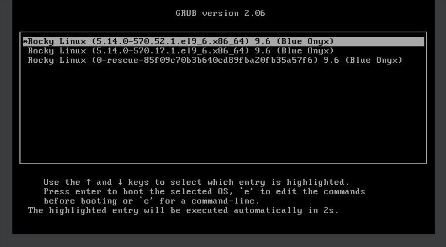
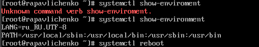
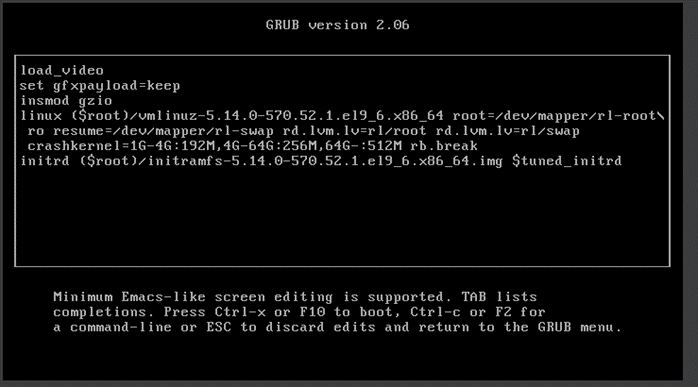
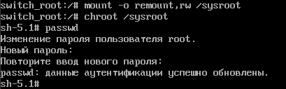
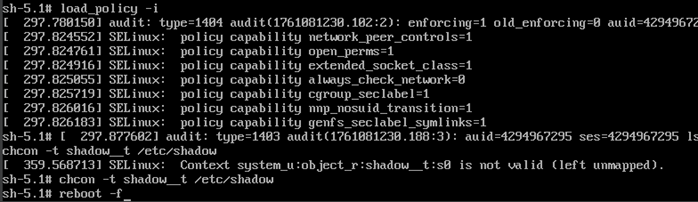

---
# Preamble

author:
  name: Павличенко Родион Андреевич
  degrees: DSc
  orcid: 0000-0002-0877-7063
  email: 1132246838@pfur.ru
  affiliation:
    - name: Российский университет дружбы народов
      country: Российская Федерация
      postal-code: 117198
      city: Москва
      address: ул. Миклухо-Маклая, д. 6

title: Лабораторная работа № 11
subtitle: Управление загрузкой системы
license: CC BY
date: 06.09.2025

lang: ru-RU
crossref:
  lof-title: Список иллюстраций
  lot-title: Список таблиц
  lol-title: Листинги

format:
  beamer:
    pdf-engine: xelatex
    mainfont: "DejaVu Serif"
    sansfont: "DejaVu Sans"
    monofont: "DejaVu Sans Mono"
    toc: true
    toc-title: Содержание
    number-sections: true
    colorlinks: false
    toc-depth: 2
    slide_level: 2
    aspectratio: 169
    section-titles: true
    theme: metropolis
    themeoptions: progressbar=frametitle,sectionpage=progressbar,numbering=fraction
    babel-lang: russian
    babel-otherlangs: english
  revealjs:
    transition: slide
    margin: 0.2
    smaller: false
    output-ext: html
    theme: beige
    logo: _resources/image/logo_rudn.png
---

# Информация

## Докладчик

:::::::::::::: {.columns align=center}
::: {.column width="70%"}

  * Павличенко Родион Андреевич
  * Cтудент
  * Группа НПИбд-02-24
  * Российский университет дружбы народов им. П. Лумумбы
  * [1132246838@pfur.ru](mailto:1132246838@pfur.ru)

:::
::: {.column width="30%"}

:::
::::::::::::::

# Выполнение лабораторной работы

## Запустили терминал и получили полномочия администратора. В файле /etc/default/grub установили параметр отображения меню загрузки в течение 10 секунд.

{width=100%}

## Записали изменения в GRUB2, введя в командной строке grub2-mkconfig > /boot/grub2/grub.cfg.

{width=100%}

## Перезагрузили систему и убедились, что при загрузке мы видим прокрутку загрузочных сообщений..

{width=100%}

## Перегрузили систему. Как только появится меню GRUB, выбрали строку с текущей версией ядра в меню и нажали e для редактирования. Прокрутили вниз до строки, начинающейся с linux ($root)/vmlinuz- и в конце этой строки ввели systemd.unit=rescue.target и удалили опции rhgb и quit. Нажали Ctrl + x для продолжения процесса загрузки. Ввели пароль пользователя root.

{width=100%}

## Посмотрели список всех файлов модулей, которые загружены в настоящее время командой systemctl list-units

{width=100%}

## Посмотрели задействованные переменные среды оболочки командой systemctl show-environment. Перезагрузили систему.

{width=100%}

## Как только отобразится меню GRUB, ещё раз нажали e на строке с текущей версией ядра, чтобы войти в режим редактора. В конце строки, загружающей ядро, ввели systemd.unit=emergency.target и удалили опции rhgb и quit. Нажали Ctrl + x для продолжения процесса загрузки. Ввели пароль пользователя root.

{width=100%}

## После успешного входа в систему посмотрели список всех загруженных файлов модулей командой systemctl list-units. Обратили внимание, что количество загружаемых файлов модулей уменьшилось до минимума

{width=100%}

## Перезагрузили компьютер. Когда отобразилось меню GRUB, выбрали в меню строку с текущей версией ядра системы и нажали e , чтобы войти в режим редактора. В конце строки, загружающей ядро, ввели rd.break и удалили опции rhgb и quit. Нажали Ctrl + x для продолжения процесса загрузки.

{width=100%}

## Чтобы получить доступ к системному образу для чтения и записи, набрали mount -o remount,rw /sysroot. Сделали содержимое каталога /sysimage новым корневым каталогом, набрав chroot /sysroot. Ввели команду задания пароля: passwd и установили новый пароль для пользователя root

{width=100%}

## Загрузили политику SELinux с помощью команды load_policy -i. Вручную установили правильный тип контекста для /etc/shadow. Перезагрузили систему с помощью команды reboot -f и вошли в систему с изменённым паролем для пользователя root.

{width=100%}
