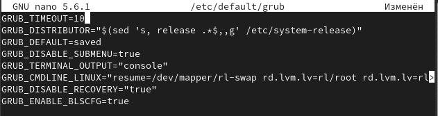
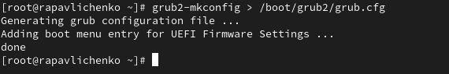
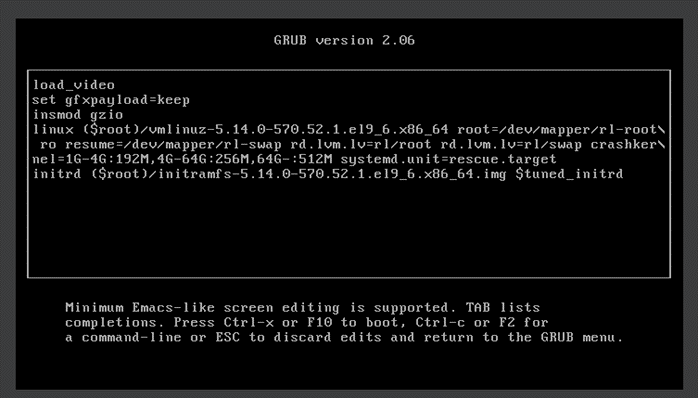
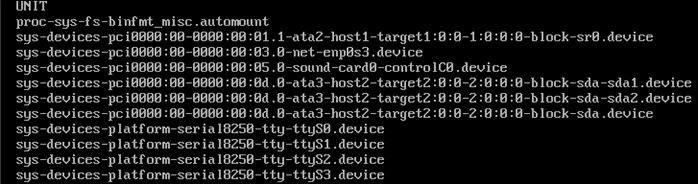
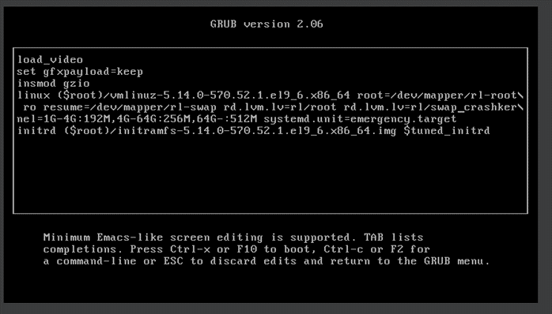
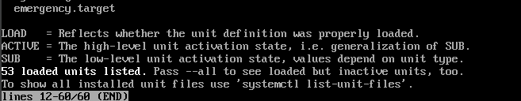

---
# Preamble

## Author
author:
  name: Павличенко Родион Андреевич
  degrees: DSc
  orcid: 0000-0002-0877-7063
  email: kulyabov-ds@rudn.ru
  affiliation:
    - name: Российский университет дружбы народов
      country: Российская Федерация
      postal-code: 117198
      city: Москва
      address: ул. Миклухо-Маклая, д. 623456789
## Title
title: "Лабораторная работа № 11"
subtitle: "Управление загрузкой системы"
license: "CC BY"
## Generic options
lang: ru-RU
number-sections: true
toc: true
toc-title: "Содержание"
toc-depth: 2
## Crossref customization
crossref:
  lof-title: "Список иллюстраций"
  lot-title: "Список таблиц"
  lol-title: "Листинги"
## Bibliography
bibliography:
  - bib/cite.bib
csl: _resources/csl/gost-r-7-0-5-2008-numeric.csl
## Formats
format:
### Pdf output format
  pdf:
    toc: true
    number-sections: true
    colorlinks: false
    toc-depth: 2
    lof: true # List of figures
    lot: true # List of tables
#### Document
    documentclass: scrreprt
    papersize: a4
    fontsize: 12pt
    linestretch: 1.5
#### Language
    babel-lang: russian
    babel-otherlangs: english
#### Biblatex
    cite-method: biblatex
    biblio-style: gost-numeric
    biblatexoptions:
      - backend=biber
      - langhook=extras
      - autolang=other*
#### Misc options
    csquotes: true
    indent: true
    header-includes: |
      \usepackage{indentfirst}
      \usepackage{float}
      \floatplacement{figure}{H}
      \usepackage[math,RM={Scale=0.94},SS={Scale=0.94},SScon={Scale=0.94},TT={Scale=MatchLowercase,FakeStretch=0.9},DefaultFeatures={Ligatures=Common}]{plex-otf}
### Docx output format
  docx:
    toc: true
    number-sections: true
    toc-depth: 2
---

# Цель работы

Получить навыки работы с загрузчиком системы GRUB2

# Выполнение лабораторной работы

Запустили терминал и получили полномочия администратора. В файле /etc/default/grub установили параметр отображения меню загрузки в течение 10 секунд.

{#fig-001 width=70%}

Записали изменения в GRUB2, введя в командной строке grub2-mkconfig > /boot/grub2/grub.cfg.

{#fig-001 width=70%}

Перезагрузили систему и убедились, что при загрузке мы видим прокрутку загрузочных сообщений..

{#fig-001 width=70%}

Перегрузили систему. Как только появится меню GRUB, выбрали строку с текущей версией ядра в меню и нажали e для редактирования. Прокрутили вниз до строки, начинающейся с linux ($root)/vmlinuz- и в конце этой строки ввели systemd.unit=rescue.target и удалили опции rhgb и quit. Нажали Ctrl + x для продолжения процесса загрузки. Ввели пароль пользователя root.

{#fig-001 width=70%}

Посмотрели список всех файлов модулей, которые загружены в настоящее время командой systemctl list-units

{#fig-001 width=70%}

Посмотрели задействованные переменные среды оболочки командой systemctl show-environment. Перезагрузили систему.

{#fig-001 width=70%}

Как только отобразится меню GRUB, ещё раз нажали e на строке с текущей версией ядра, чтобы войти в режим редактора. В конце строки, загружающей ядро, ввели systemd.unit=emergency.target и удалили опции rhgb и quit. Нажали Ctrl + x для продолжения процесса загрузки. Ввели пароль пользователя root.

{#fig-001 width=70%}

После успешного входа в систему посмотрели список всех загруженных файлов модулей командой systemctl list-units. Обратили внимание, что количество загружаемых файлов модулей уменьшилось до минимума

{#fig-001 width=70%}

Перезагрузили компьютер. Когда отобразилось меню GRUB, выбрали в меню строку с текущей версией ядра системы и нажали e , чтобы войти в режим редактора. В конце строки, загружающей ядро, ввели rd.break и удалили опции rhgb и quit. Нажали Ctrl + x для продолжения процесса загрузки.

{#fig-001 width=70%}

Чтобы получить доступ к системному образу для чтения и записи, набрали mount -o remount,rw /sysroot. Сделали содержимое каталога /sysimage новым корневым каталогом, набрав chroot /sysroot. Ввели команду задания пароля: passwd и установили новый пароль для пользователя root

{#fig-001 width=70%}

Загрузили политику SELinux с помощью команды load_policy -i. Вручную установили правильный тип контекста для /etc/shadow. Перезагрузили систему с помощью команды reboot -f и вошли в систему с изменённым паролем для пользователя root.

{#fig-001 width=70%}

# Контрольные вопросы

1) Для применения общих изменений в GRUB2 в Rocky Linux следует изменить файл /etc/default/grub.

2) Конфигурационный файл GRUB2, в который мы применяем изменения, называется /etc/default/grub.

3) После внесения изменений в конфигурацию GRUB2, чтобы изменения сохранились и воспринялись при загрузке системы, мы должны выполнить команду grub2-mkconfig -o /boot/grub2/grub.cfg.

# Выводы

Получили навыки работы с загрузчиком системы GRUB2.

# Список литературы{.unnumbered}

::: {#refs}
:::
