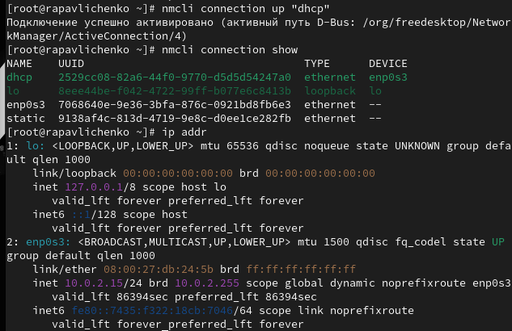
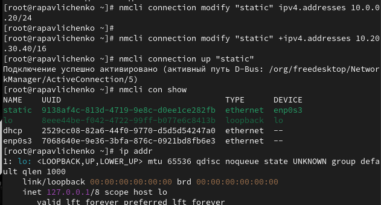
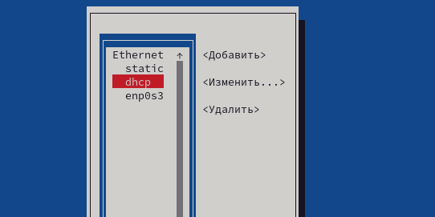
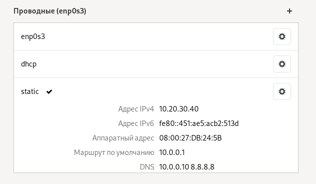

---
# Preamble

author:
  name: Павличенко Родион Андреевич
  degrees: DSc
  orcid: 0000-0002-0877-7063
  email: 1132246838@pfur.ru
  affiliation:
    - name: Российский университет дружбы народов
      country: Российская Федерация
      postal-code: 117198
      city: Москва
      address: ул. Миклухо-Маклая, д. 6

title: Лабораторная работа № 12
subtitle: Настройки сети в Linux
license: CC BY
date: 06.09.2025

lang: ru-RU
crossref:
  lof-title: Список иллюстраций
  lot-title: Список таблиц
  lol-title: Листинги

format:
  beamer:
    pdf-engine: xelatex
    mainfont: "DejaVu Serif"
    sansfont: "DejaVu Sans"
    monofont: "DejaVu Sans Mono"
    toc: true
    toc-title: Содержание
    number-sections: true
    colorlinks: false
    toc-depth: 2
    slide_level: 2
    aspectratio: 169
    section-titles: true
    theme: metropolis
    themeoptions: progressbar=frametitle,sectionpage=progressbar,numbering=fraction
    babel-lang: russian
    babel-otherlangs: english
  revealjs:
    transition: slide
    margin: 0.2
    smaller: false
    output-ext: html
    theme: beige
    logo: _resources/image/logo_rudn.png
---

# Информация

## Докладчик

:::::::::::::: {.columns align=center}
::: {.column width="70%"}

  * Павличенко Родион Андреевич
  * Cтудент
  * Группа НПИбд-02-24
  * Российский университет дружбы народов им. П. Лумумбы
  * [1132246838@pfur.ru](mailto:1132246838@pfur.ru)

:::
::: {.column width="30%"}

:::
::::::::::::::

# Выполнение лабораторной работы

## Получили полномочия администратора. Вывели на экран информацию о существующих сетевых подключениях, а также статистику о количестве отправленных пакетов и связанных с ними сообщениях об ошибках.

{width=100%}

## Вывели на экран информацию о текущих назначениях адресов для сетевых интерфейсов на устройстве. Для отправки четырёх пакетов на IP-адрес 8.8.8.8 ввели ping -c 4 8.8.8.8

{width=100%}

## Добавили дополнительный адрес к нашему интерфейсу. Проверили, что адрес добавился командой ip addr show. Сравнили вывод информации от утилиты ip и от команды ifconfig. Вывели на экран список всех прослушиваемых системой портов UDP и TCP.

{width=100%}

## Получили полномочия администратора. Вывели на экран информацию о текущих соединениях. Добавили Ethernet-соединение с именем dhcp к интерфейсу. Добавили к этому же интерфейсу Ethernet-соединение с именем static, статическим IPv4-адресом адаптера и статическим адресом шлюза.

{width=100%}

## Вывели информацию о текущих соединениях. Переключились на статическое соединение. Проверили успешность переключения при помощи nmcli connection show и ip addr

{width=100%}

## Вернулись к соединению dhcp. Проверили успешность переключения при помощи nmcli connection show и ip addr

{width=100%}

## Отключили автоподключение статического соединения. Добавили DNS-сервер в статическое соединение. Обратили внимание, что при добавлении сетевого подключения используется ip4, а при изменении параметров для существующего соединения используется ipv4. Добавили второй DNS-сервер

{width=100%}

## Изменили IP-адрес статического соединения. Добавили другой IP-адрес для статического соединения. После изменения свойств соединения активировали его. Проверили успешность переключения при помощи nmcli con show и ip addr

{width=100%}

## Используя nmtui, посмотрели настройки сети на устройстве.

{width=100%}

## Посмотрели настройки сетевых соединений в графическом интерфейсе операционной системы.

{width=100%}

## Переключились на первоначальное сетевое соединение

{width=100%}
 

