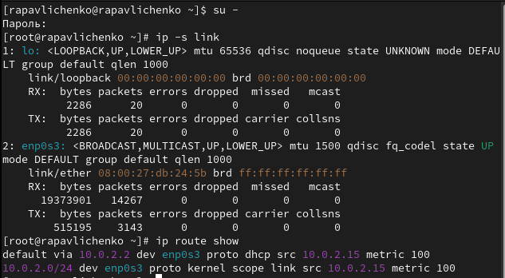
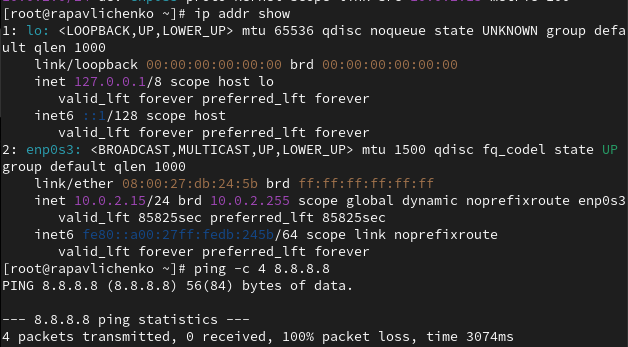
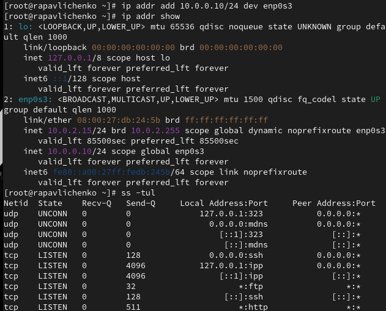
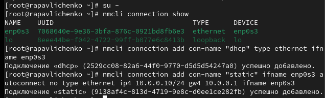
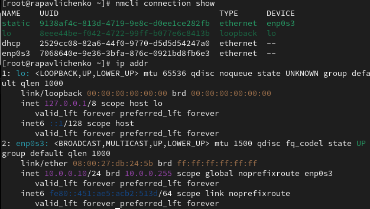
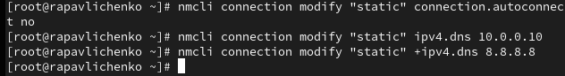
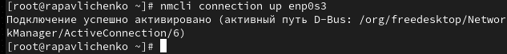

---
# Preamble

## Author
author:
  name: Павличенко Родион Андреевич
  degrees: DSc
  orcid: 0000-0002-0877-7063
  email: kulyabov-ds@rudn.ru
  affiliation:
    - name: Российский университет дружбы народов
      country: Российская Федерация
      postal-code: 117198
      city: Москва
      address: ул. Миклухо-Маклая, д. 623456789
## Title
title: "Лабораторная работа № 12"
subtitle: "Настройки сети в Linux"
license: "CC BY"
## Generic options
lang: ru-RU
number-sections: true
toc: true
toc-title: "Содержание"
toc-depth: 2
## Crossref customization
crossref:
  lof-title: "Список иллюстраций"
  lot-title: "Список таблиц"
  lol-title: "Листинги"
## Bibliography
bibliography:
  - bib/cite.bib
csl: _resources/csl/gost-r-7-0-5-2008-numeric.csl
## Formats
format:
### Pdf output format
  pdf:
    toc: true
    number-sections: true
    colorlinks: false
    toc-depth: 2
    lof: true # List of figures
    lot: true # List of tables
#### Document
    documentclass: scrreprt
    papersize: a4
    fontsize: 12pt
    linestretch: 1.5
#### Language
    babel-lang: russian
    babel-otherlangs: english
#### Biblatex
    cite-method: biblatex
    biblio-style: gost-numeric
    biblatexoptions:
      - backend=biber
      - langhook=extras
      - autolang=other*
#### Misc options
    csquotes: true
    indent: true
    header-includes: |
      \usepackage{indentfirst}
      \usepackage{float}
      \floatplacement{figure}{H}
      \usepackage[math,RM={Scale=0.94},SS={Scale=0.94},SScon={Scale=0.94},TT={Scale=MatchLowercase,FakeStretch=0.9},DefaultFeatures={Ligatures=Common}]{plex-otf}
### Docx output format
  docx:
    toc: true
    number-sections: true
    toc-depth: 2
---

# Цель работы

Получить навыки настройки сетевых параметров системы.

# Выполнение лабораторной работы

Получили полномочия администратора. Вывели на экран информацию о существующих сетевых подключениях, а также статистику о количестве отправленных пакетов и связанных с ними сообщениях об ошибках. Lo - виртуальный интерфейс, используемый для внутренней коммуникации в пределах самого компьютера. Адрес 127.0.0.1 (или ::1 для IPv6) всегда указывает на этот интерфейс. Используется для тестирования сетевых приложений, обслуживания локальных сервисов и системных процессов. Статистика (RX/TX) показывает небольшой трафик, что нормально для фоновой системной активности. Вывели на экран информацию о текущих маршрутах, маршрут по умолчанию: default via 10.0.2.2 dev emp0s3. Весь внешний трафик направляется через шлюз 10.0.2.2 на интерфейсе emp0s3. Локальная сеть: 10.0.2.0/24 dev emp0s3. Указывает, что сеть 10.0.2.0/24 доступна напрямую через интерфейс emp0s3 (локальная подсеть).

{#fig-001 width=70%}

Вывели на экран информацию о текущих назначениях адресов для сетевых интерфейсов на устройстве. Проанализировав вывод команды ip addr show, можно охарактеризовать основной сетевой интерфейс emp0s3. Данный интерфейс является сетевым адаптером, через который осуществляется сетевое подключение устройства к локальной сети. Он находится в состоянии UP, что означает его активность и готовность к передаче данных. Физический (MAC) адрес этого адаптера — 08:00:27:db:24:5b. Что касается сетевой конфигурации, основным IPv4-адресом устройства, назначенным на этот интерфейс, является 10.0.2.15 с маской подсети /24. Это указывает на то, что устройство находится в сети 10.0.2.0/24. Важно отметить, что адрес был получен динамически, о чём говорит пометка dynamic, что типично для настроек, получаемых от DHCP-сервера. Также у интерфейса присутствует IPv6-адрес локальной связи (link-local) fe80::a00:27ff:fedb:245b/64Использовали команду ping для проверки правильности подключения к Интернету. Для отправки четырёх пакетов на IP-адрес 8.8.8.8 ввели ping -c 4 8.8.8.8

{#fig-001 width=70%}

Добавили дополнительный адрес к нашему интерфейсу. Проверили, что адрес добавился командой ip addr show. Сравнили вывод информации от утилиты ip и от команды ifconfig. Вывели на экран список всех прослушиваемых системой портов UDP и TCP.

{#fig-001 width=70%}

Получили полномочия администратора. Вывели на экран информацию о текущих соединениях. Добавили Ethernet-соединение с именем dhcp к интерфейсу. Добавили к этому же интерфейсу Ethernet-соединение с именем static, статическим IPv4-адресом адаптера и статическим адресом шлюза.

{#fig-001 width=70%}

Вывели информацию о текущих соединениях. Переключились на статическое соединение. Проверили успешность переключения при помощи nmcli connection show и ip addr

{#fig-001 width=70%}

Вернулись к соединению dhcp. Проверили успешность переключения при помощи nmcli connection show и ip addr

{#fig-001 width=70%}

Отключили автоподключение статического соединения. Добавили DNS-сервер в статическое соединение. Обратили внимание, что при добавлении сетевого подключения используется ip4, а при изменении параметров для существующего соединения используется ipv4. Добавили второй DNS-сервер

{#fig-001 width=70%}

Изменили IP-адрес статического соединения. Добавили другой IP-адрес для статического соединения. После изменения свойств соединения активировали его. Проверили успешность переключения при помощи nmcli con show и ip addr

{#fig-001 width=70%}

Используя nmtui, посмотрели настройки сети на устройстве.Настройки сетевого подключения устройства используют профиль «static» для интерфейса enpos3 (MAC: 08:00:27:DB:24:5B) с типом Ethernet и защитой 802.1X. IPv4 настроен вручную: адреса 10.0.0.20/24 и 10.20.30.40/16, шлюз 10.0.0.1, DNS-серверы 10.0.0.10 и 8.8.8.8. Маршруты и DNS не игнорируются. IPv6 настроен автоматически. Подключение устанавливается автоматически и доступно всем пользователям. В других конфигурациях используется автоматическое получение параметров IPv4 и IPv6.

{#fig-001 width=70%}

Посмотрели настройки сетевых соединений в графическом интерфейсе операционной системы.

{#fig-001 width=70%}

Переключились на первоначальное сетевое соединение

{#fig-001 width=70%}

# Контрольные вопросы

1) ss -tuln — состояние сетевых портов

2) NetworkManager — основной менеджер сетей

3) /etc/hostname — статический файл имени

4) hostnamectl set-hostname — утилита изменения имени

5) /etc/hosts — локальная таблица имён

6) ip route — таблица маршрутизации

7) systemctl status NetworkManager — статус службы

8) nmcli connection modify — изменение параметров подключения

# Выводы

Получили навыки настройки сетевых параметров системы.

# Список литературы{.unnumbered}

::: {#refs}
:::
