---
# Preamble

author:
  name: Павличенко Родион Андреевич
  degrees: DSc
  orcid: 0000-0002-0877-7063
  email: 1132246838@pfur.ru
  affiliation:
    - name: Российский университет дружбы народов
      country: Российская Федерация
      postal-code: 117198
      city: Москва
      address: ул. Миклухо-Маклая, д. 6

title: Лабораторная работа № 13
subtitle: Фильтр пакетов
license: CC BY
date: 06.09.2025

lang: ru-RU
crossref:
  lof-title: Список иллюстраций
  lot-title: Список таблиц
  lol-title: Листинги

format:
  beamer:
    pdf-engine: xelatex
    mainfont: "DejaVu Serif"
    sansfont: "DejaVu Sans"
    monofont: "DejaVu Sans Mono"
    toc: true
    toc-title: Содержание
    number-sections: true
    colorlinks: false
    toc-depth: 2
    slide_level: 2
    aspectratio: 169
    section-titles: true
    theme: metropolis
    themeoptions: progressbar=frametitle,sectionpage=progressbar,numbering=fraction
    babel-lang: russian
    babel-otherlangs: english
  revealjs:
    transition: slide
    margin: 0.2
    smaller: false
    output-ext: html
    theme: beige
    logo: _resources/image/logo_rudn.png
---

# Информация

## Докладчик

:::::::::::::: {.columns align=center}
::: {.column width="70%"}

  * Павличенко Родион Андреевич
  * Cтудент
  * Группа НПИбд-02-24
  * Российский университет дружбы народов им. П. Лумумбы
  * [1132246838@pfur.ru](mailto:1132246838@pfur.ru)

:::
::: {.column width="30%"}

:::
::::::::::::::

# Выполнение лабораторной работы

## Получили полномочия администратора. Определили текущую зону по умолчанию и доступные зоны.

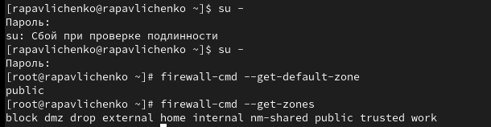{width=100%}

## Посмотрели службы, доступные на нашем компьютере и определили доступные службы в текущей зоне

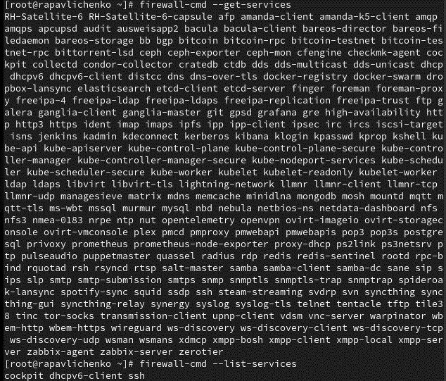{width=70%}

## Сравнили результаты вывода информации при использовании команды firewall-cmd --list-all и команды firewall-cmd --list-all --zone=public.

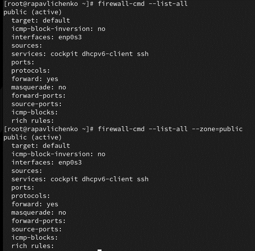{width=70%}

## Добавили сервер VNC в конфигурацию брандмауэра, проверили, что vnc-server добавился  в конфигурацию.

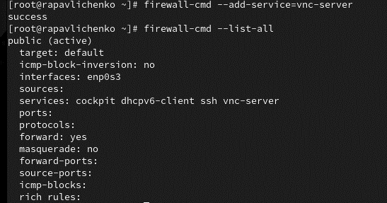{width=70%}

## Перезапустили службу firewalld и проверили, есть ли vnc-server в конфигурации. Обратили внимание, что служба vnc-server больше не указана, так как мы ранее добавили ее, как запущенный сервис и при перезапуске автоматически не включалась.

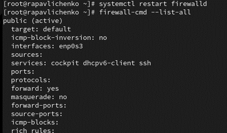{width=70%}

## Добавили службу vnc-server ещё раз, но на этот раз сделали её постоянной. Проверили наличие vnc-server в конфигурации и увидили, что VNC-сервер не указан. Службы, которые были добавлены в конфигурацию на диске, автоматически не добавляются в конфигурацию времени выполнения.

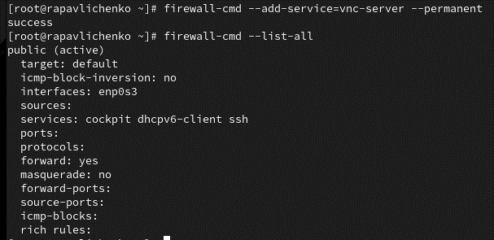{width=70%}

## Перезагрузили конфигурацию firewalld и просмотрели конфигурацию времени выполнения, заметили, что служба vnc=server появилась

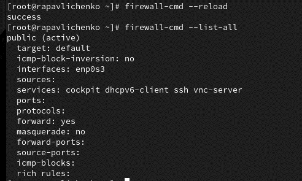{width=70%}

## Добавили в конфигурацию межсетевого экрана порт 2022 протокола TCP. Затем перезагрузили конфигурацию firewalld. Проверили, что порт был добавлен в конфигурацию.

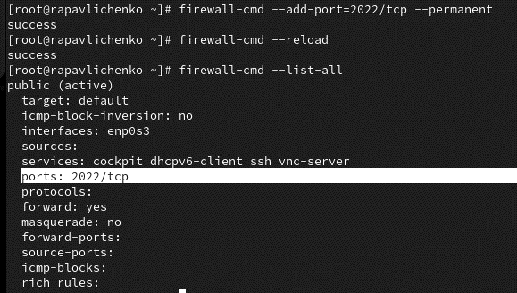{width=70%}

## Открыли терминал и под учётной записью своего пользователя запустили интерфейс GUI firewall-config. Так как служба отсутствовала, то мы ее установили

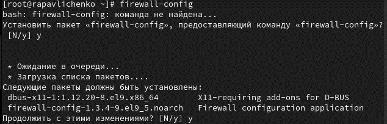{width=70%}

## Нажали выпадающее меню рядом с параметром Configuration . Открыли раскрывающийся список и выбрали Permanent . Это позволило сделать постоянными все изменения, которые мы вносили при конфигурировании. Выбрали зону public и отметили службы http, https и ftp, чтобы включить их

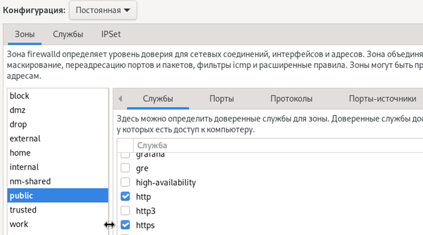{width=70%}

## Выбрали вкладку Ports и на этой вкладке нажали Add . Ввели порт 2022 и протокол udp, нажали ОК , чтобы добавить их в список. Закрыли утилиту firewall-config.

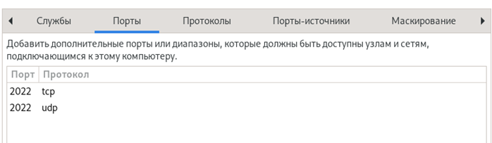{width=70%}

## В окне терминала ввели firewall-cmd --list-all. Обратили внимание, что изменения, которые мы только что внесли, ещё не вступили в силу. Перегрузили конфигурацию firewall-cmd и список доступных сервисов, увидили, что изменения были применены

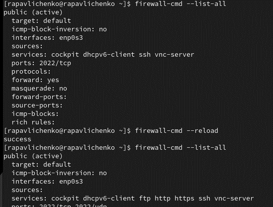{width=70%}

# Самостоятельная работа

## Создали конфигурацию межсетевого экрана, которая позволяет получить доступ к следующим службам: – telnet; – imap; – pop3; – smtp. Для службы telnet сделали это в командной строке.

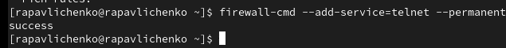{width=70%}

## Для служб imap, pop3, smtp сделали это в графическом интерфейсе

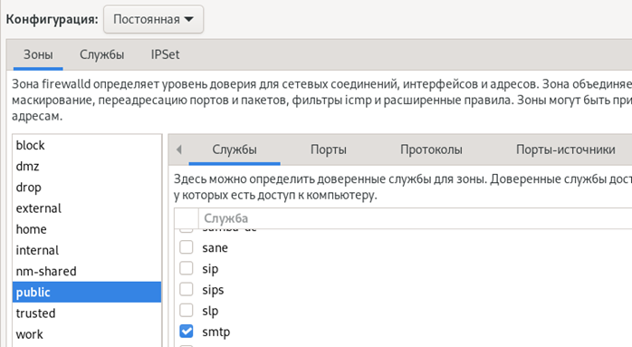{width=70%}

## Убедились, что конфигурация является постоянной и будет активирована после перезагрузки компьютера. Сделали это, перезагрузив и проверив их наличие в списках.

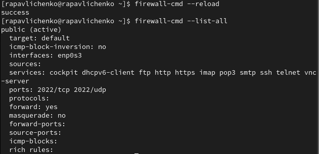{width=70%}
