---
# Preamble
 
author:
  name: Павличенко Родион Андреевич
  degrees: DSc
  orcid: 0000-0002-0877-7063
  email: 1132246838@pfur.ru
  affiliation:
    - name: Российский университет дружбы народов
      country: Российская Федерация
      postal-code: 117198
      city: Москва
      address: ул. Миклухо-Маклая, д. 6
 
title: Лабораторная работа № 14
subtitle: Партиции, файловые системы, монтирование
license: CC BY
date: 22.11.2025
 
lang: ru-RU
crossref:
  lof-title: Список иллюстраций
  lot-title: Список таблиц
  lol-title: Листинги
 
format:
  beamer:
    pdf-engine: xelatex
    mainfont: "DejaVu Serif"
    sansfont: "DejaVu Sans"
    monofont: "DejaVu Sans Mono"
    toc: true
    toc-title: Содержание
    number-sections: true
    colorlinks: false
    toc-depth: 2
    slide_level: 2
    aspectratio: 169
    section-titles: true
    theme: metropolis
    themeoptions: progressbar=frametitle,sectionpage=progressbar,numbering=fraction
    babel-lang: russian
    babel-otherlangs: english
  revealjs:
    transition: slide
    margin: 0.2
    smaller: false
    output-ext: html
    theme: beige
    logo: _resources/image/logo_rudn.png
---
 
# Информация
 
## Докладчик
 
:::::::::::::: {.columns align=center}
::: {.column width="70%"}
 
  * Павличенко Родион Андреевич
  * Cтудент
  * Группа НПИбд-02-24
  * Российский университет дружбы народов им. П. Лумумбы
  * [1132246838@pfur.ru](mailto:1132246838@pfur.ru)
 
:::
::: {.column width="30%"}
 
:::
::::::::::::::
 
# Цель работы
 
## Цель лабораторной работы
 
* Получить навыки создания разделов на диске и файловых систем
* Получить навыки монтирования файловых систем
 
# Выполнение лабораторной работы
 
## Добавление дисков
 
Добавили к виртуальной машине два диска размером 512 МБ
 
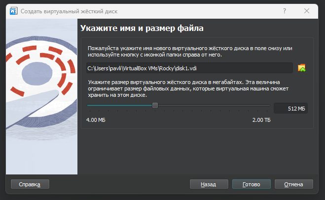{width=80%}
 
## Просмотр разделов
 
Запустили виртуальную машину и просмотрели перечень разделов с помощью fdisk
 
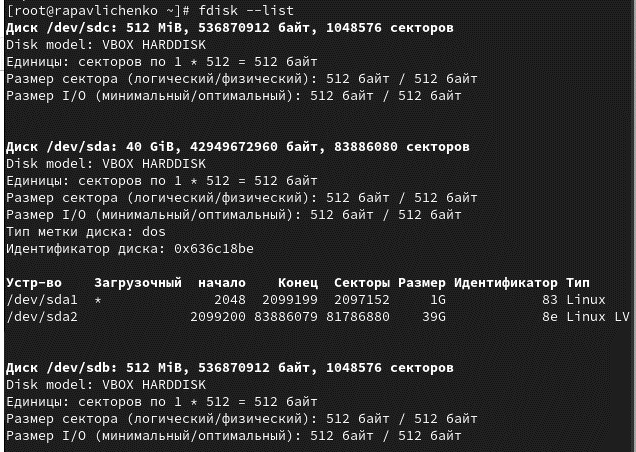{width=80%}
 
## Справка по командам fdisk
 
Запустили fdisk /dev/sdb и получили справку по командам
 
{width=80%}
 
## Создание основного раздела
 
Создали основной раздел с помощью команды n и настроили параметры
 
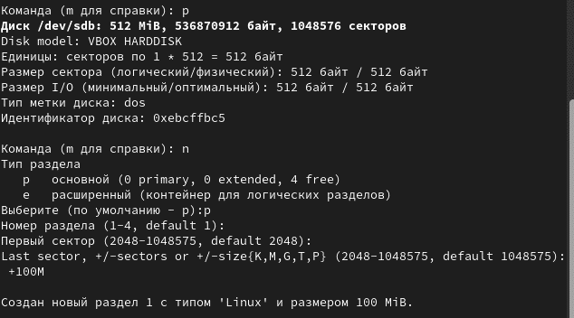{width=80%}
 
## Изменение типа раздела
 
Изменили тип раздела командой t и записали изменения
 
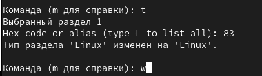{width=80%}
 
## Сравнение информации о разделах
 
Сравнили вывод fdisk -l /dev/sdb с cat /proc/partitions
 
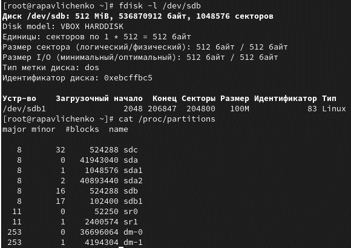{width=80%}
 
## Обновление таблицы разделов
 
Записали изменения в таблицу разделов ядра
 
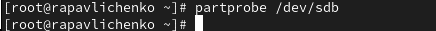{width=80%}
 
## Создание расширенного раздела
 
Создали расширенный раздел с помощью команды e
 
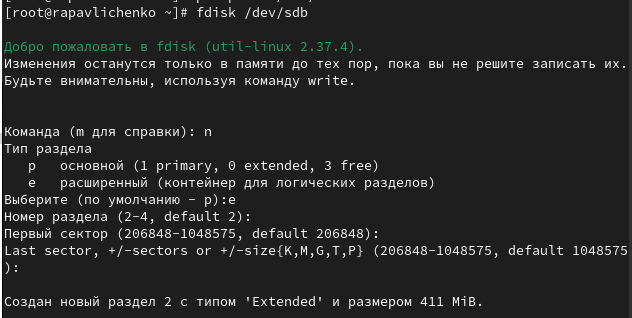{width=80%}
 
## Создание логического раздела
 
Создали логический раздел с номером 5 размером 101M
 
{width=80%}
 
## Обновление таблицы разделов
 
Обновили таблицу разделов командой partprobe
 
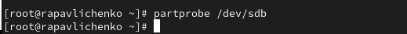{width=80%}
 
## Просмотр информации о разделах
 
Просмотрели информацию о добавленных разделах
 
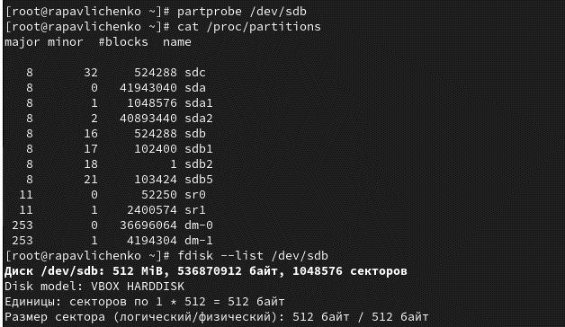{width=80%}
 
## Создание логического раздела 6
 
Создали второй логический раздел размером 100M
 
{width=80%}
 
## Изменение типа раздела 6
 
Изменили тип раздела для раздела с номером 6
 
{width=80%}
 
## Обновление таблицы разделов
 
Обновили таблицу разделов ядра
 
{width=80%}
 
## Просмотр информации о разделах
 
Проверили информацию о всех созданных разделах
 
{width=80%}
 
## Форматирование раздела подкачки
 
Отформатировали раздел подкачки и активировали его
 
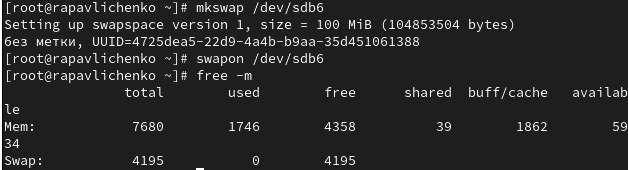{width=80%}
 
## Работа с GPT разделами
 
Просмотрели таблицы разделов GPT на диске /dev/sdc
 
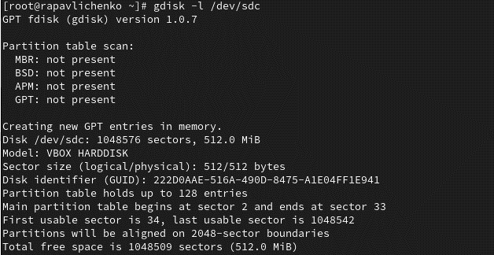{width=80%}
 
## Создание GPT раздела
 
Создали раздел с помощью gdisk размером 100 MiB
 
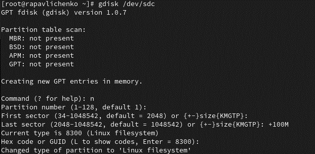{width=80%}
 
## Просмотр разбиения диска
 
Просмотрели планируемую таблицу разделов
 
{width=80%}
 
## Обновление таблицы разделов
 
Обновили таблицу разделов для диска /dev/sdc
 
{width=80%}
 
## Просмотр информации о GPT разделах
 
Проверили информацию о созданных GPT разделах
 
{width=80%}
 
## Создание файловой системы XFS
 
Создали файловую систему XFS на /dev/sdb1
 
{width=80%}
 
## Создание файловой системы EXT4
 
Создали файловую систему EXT4 на /dev/sdb5
 
{width=80%}
 
## Монтирование файловой системы
 
Создали точку монтирования и смонтировали файловую систему
 
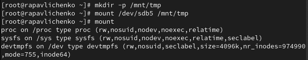{width=80%}
 
## Отмонтирование раздела
 
Отмонтировали раздел с помощью команды umount
 
{width=80%}
 
## Работа с UUID
 
Создали точку монтирования для XFS и посмотрели UUID
 
{width=80%}
 
## Копирование UUID
 
Скопировали UUID устройства /dev/sdb1
 
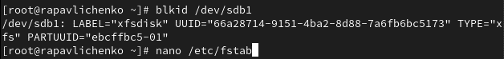{width=80%}
 
## Редактирование fstab
 
Отредактировали файл /etc/fstab для автоматического монтирования
 
{width=80%}
 
## Проверка монтирования
 
Проверили корректность монтирования командой df -h
 
{width=80%}
 
# Самостоятельная работа
 
## Создание разделов с помощью gdisk
 
Создали разделы на диске /dev/sdc с помощью gdisk
 
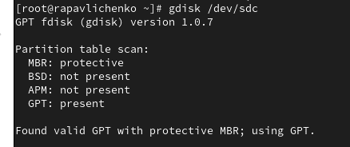{width=80%}
 
## Создание первого раздела
 
Создали первый раздел размером 100 MiB
 
{width=80%}
 
## Создание раздела подкачки
 
Создали второй раздел с типом Linux Swap
 
{width=80%}
 
## Просмотр таблицы разделов
 
Просмотрели планируемую таблицу разделов
 
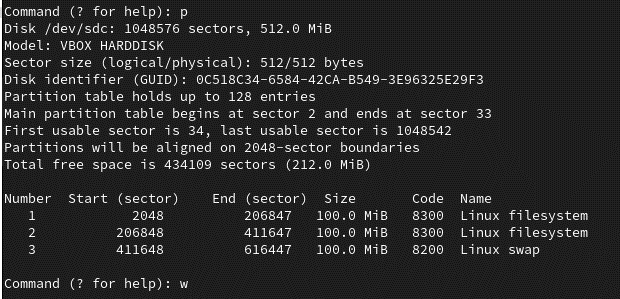{width=80%}
 
## Обновление таблицы разделов
 
Обновили таблицу разделов в ядре
 
{width=80%}
 
## Форматирование разделов
 
Отформатировали разделы подкачки и ext4
 
{width=80%}
 
## Создание точки монтирования и определение UUID
 
Создали точку монтирования и определили UUID разделов
 
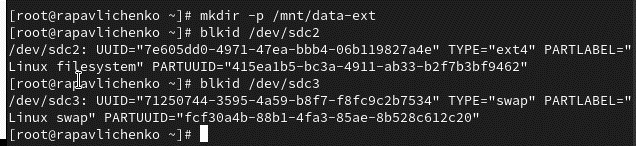{width=80%}
 
## Редактирование fstab
 
Настроили автоматическое монтирование в /etc/fstab
 
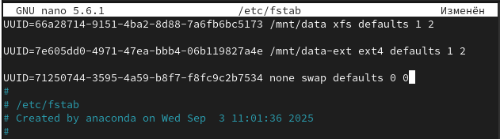{width=80%}
 
## Проверка монтирования и активации swap
 
Проверили монтирование ext4 и активировали swap
 
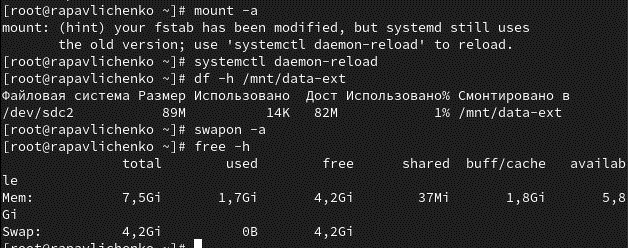{width=80%}
 
## Перезагрузка системы
 
Перезагрузили систему для проверки настроек
 
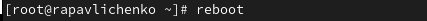{width=80%}
 
## Проверка после перезагрузки
 
Убедились, что разделы монтируются автоматически
 
{width=80%}
 
# Выводы
 
## Итоги работы
 
* Получены практические навыки работы с разделами диска
* Освоены инструменты fdisk и gdisk для MBR и GPT
* Приобретены навыки создания файловых систем XFS и EXT4
* Изучены методы монтирования и автоматического монтирования
* Получен опыт работы с разделами подкачки
