---
# Preamble
 
## Author
author:
  name: Павличенко Родион Андреевич
  degrees: DSc
  orcid: 0000-0002-0877-7063
  email: 1132246838@pfur.ru
  affiliation:
    - name: Российский университет дружбы народов
      country: Российская Федерация
      postal-code: 117198
      city: Москва
      address: ул. Миклухо-Маклая, д. 623456789
## Title
title: "Лабораторная работа № 14"
subtitle: "Партиции, файловые системы, монтирование"
license: "CC BY"
## Generic options
lang: ru-RU
number-sections: true
toc: true
toc-title: "Содержание"
toc-depth: 2
## Crossref customization
crossref:
  lof-title: "Список иллюстраций"
  lot-title: "Список таблиц"
  lol-title: "Листинги"
## Bibliography
bibliography:
  - bib/cite.bib
csl: _resources/csl/gost-r-7-0-5-2008-numeric.csl
## Formats
format:
### Pdf output format
  pdf:
    toc: true
    number-sections: true
    colorlinks: false
    toc-depth: 2
    lof: true # List of figures
    lot: true # List of tables
#### Document
    documentclass: scrreprt
    papersize: a4
    fontsize: 12pt
    linestretch: 1.5
#### Language
    babel-lang: russian
    babel-otherlangs: english
#### Biblatex
    cite-method: biblatex
    biblio-style: gost-numeric
    biblatexoptions:
      - backend=biber
      - langhook=extras
      - autolang=other*
#### Misc options
    csquotes: true
    indent: true
    header-includes: |
      \usepackage{indentfirst}
      \usepackage{float}
      \floatplacement{figure}{H}
      \usepackage[math,RM={Scale=0.94},SS={Scale=0.94},SScon={Scale=0.94},TT={Scale=MatchLowercase,FakeStretch=0.9},DefaultFeatures={Ligatures=Common}]{plex-otf}
### Docx output format
  docx:
    toc: true
    number-sections: true
    toc-depth: 2
---
 
# Цель работы
 
Получить навыки создания разделов на диске и файловых систем. Получить навыки монтирования файловых систем.
 
# Выполнение лабораторной работы
 
1) Добавили к нашей виртуальной машине два диска размером 512 МБ.
 
{#fig-001 width=70%}
 
2) Запустили нашу виртуальную машину с добавленными дополнительными дисками disk1 и disk2. В командной строке с полномочиями администратора с помощью fdisk посмотрели перечень разделов на всех имеющихся в системе устройств жёстких дисков.
 
{#fig-002 width=70%}
 
3) Запустили команды fdisk /dev/sdb для изменения разметки диска, ввели m , чтобы получить справку по командам.
 
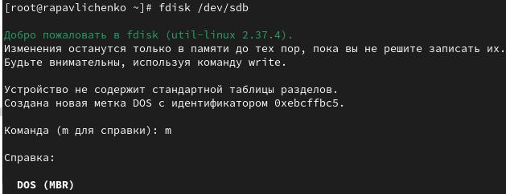{#fig-003 width=70%}
 
4) Проверили, сколько дискового пространства у нас есть. Нажали p , чтобы просмотреть текущее распределение пространства диска. Обратили внимание на общее количество секторов и последний сектор, который в настоящее время используется. Введили n , чтобы добавить новый раздел. Выбрали p , чтобы создать основной раздел. Приняли номер раздела, который предлагается. Указали первый сектор на диске, с которого начнётся новый раздел. Нажали Enter для подтверждения выбора. Указали последний сектор, которым будет завершён раздел.
 
{#fig-004 width=70%}
 
5) Использовали для изменения типа раздела команду t . Нажали Enter , чтобы принять тип раздела по умолчанию 83. Нажали w , чтобы записать изменения на диск и выйти из fdisk.
 
{#fig-005 width=70%}
 
6) Сравнили вывод команды fdisk -l /dev/sdb с выводом команды cat /proc/partitions.
 
{#fig-006 width=70%}
 
7) Запишите изменения в таблицу разделов ядра.
 
{#fig-007 width=70%}
 
8) В терминале с полномочиями администратора запустили fdisk /dev/sdb. Ввели n , чтобы добавить новый раздел. Ввели e , чтобы создать расширенный раздел. Нажали Enter , чтобы принять первый сектор по умолчанию и снова нажали Enter , когда fdisk запросил последний сектор.
 
{#fig-008 width=70%}
 
9) Из интерфейса fdisk снова нажали n . Утилита сообщила, что нет свободных первичных разделов и по умолчанию предложила добавить логический раздел с номером 5. Нажали Enter , чтобы принять выбор первого сектора в качестве сектора по умолчанию. На вопрос о последнем секторе ввели +101M. После создания логического раздела ввели w , чтобы записать изменения на диск и выйти из fdisk.
 
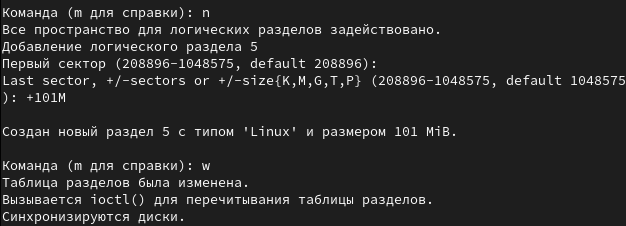{#fig-009 width=70%}
 
10) Чтобы завершить процедуру и обновить таблицу разделов, ввели partprobe /dev/sdb.
 
{#fig-010 width=70%}
 
11) Просмотрели информацию о добавленных разделах: cat /proc/partitions fdisk --list /dev/sdb.
 
{#fig-011 width=70%}
 
12) Получили полномочия администратора. Запустили fdisk: fdisk /dev/sdb 2. Нажали n , чтобы добавить новый раздел. Утилита сообщила, что нет свободных первичных разделов и по умолчанию предложила добавить логический раздел с номером раздела 6. Нажали Enter , чтобы принять первый сектор по умолчанию. На вопрос о последнем секторе ввели +100M.
 
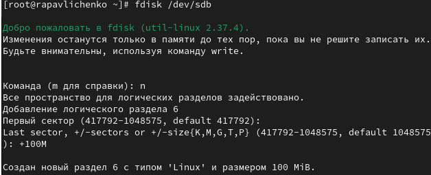{#fig-012 width=70%}
 
13) Далее изменили тип раздела. Для этого нажали t , затем указали номер партиции, для которой хотите изменить тип (в данном случае это номер 6). Затем ввели код типа раздела. После создания логического раздела ввели w , чтобы записать изменения на диск и выйти из fdisk.
 
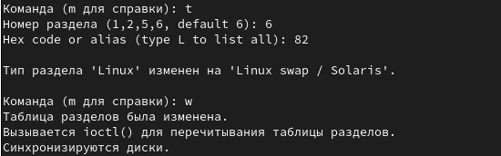{#fig-013 width=70%}
 
14) Чтобы завершить процедуру и обновить таблицу разделов ядра, ввели partprobe /dev/sdb.
 
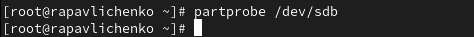{#fig-014 width=70%}
 
15) Просмотрите информацию о добавленных разделах командами cat /proc/partitions и fdisk --list /dev/sdb.
 
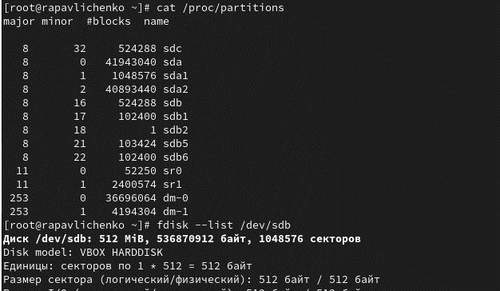{#fig-015 width=70%}
 
16) Отформатировали раздел подкачки, используя команду mkswap /dev/sdb6 Для включения вновь выделенного пространства подкачки использовали swapon /dev/sdb6 Для просмотра размера пространства подкачки, которое в настоящее время выделено, ввели free -m.
 
{#fig-016 width=70%}
 
17) В терминале с полномочиями администратора с помощью gdisk посмотрели таблицы разделов и разделы на втором добавленном нами ранее диске /dev/sdc.
 
{#fig-017 width=70%}
 
18) Создали раздел с помощью gdisk: gdisk /dev/sdc. Ввели n , чтобы добавить новый раздел. Приняли номер раздела по умолчанию. Нажали Enter , чтобы принять предлагаемый по умолчанию первый сектор. При запросе последнего сектора создали раздел диска размером 100 MiB, используйте +100M. Нажали Enter , чтобы принять тип раздела 8300 по умолчанию.
 
{#fig-018 width=70%}
 
19) Нажали p , чтобы отобразить разбиение диска. Нажали w , чтобы записать изменения на диск.
 
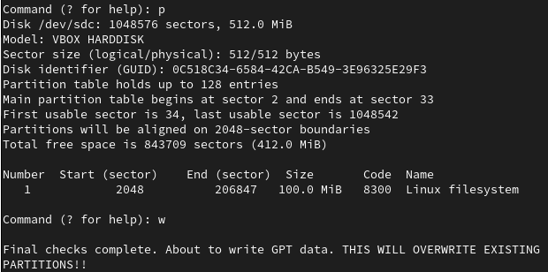{#fig-019 width=70%}
 
20) Обновите таблицу разделов командой partprobe /dev/sdc.
 
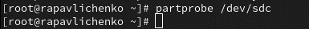{#fig-020 width=70%}
 
21) Просмотрели информацию о добавленных разделакомандами cat /proc/partitions и gdisk -l /dev/sdc.
 
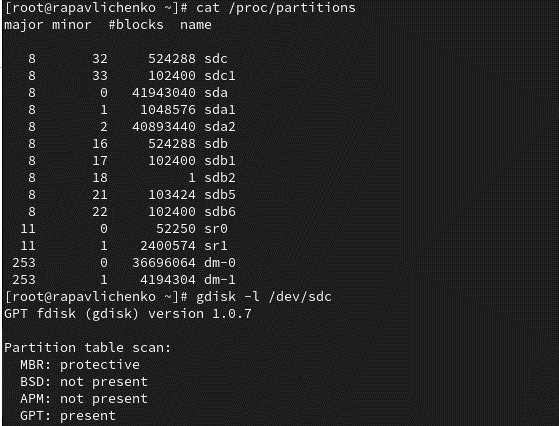{#fig-021 width=70%}
 
22) В терминале с полномочиями администратора для диска dev/sdb1 создали файловую систему XFS. Для установки метки файловой системы в xfsdisk использовали команду xfs_admin -L xfsdisk /dev/sdb1.
 
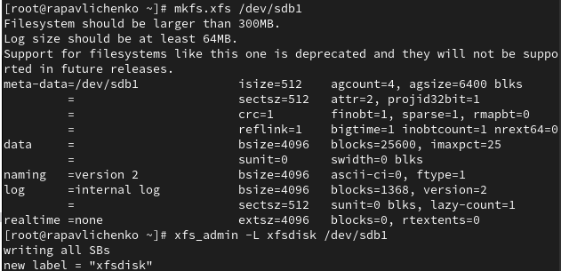{#fig-022 width=70%}
 
23) В терминале с полномочиями администратора для диска dev/sdb5 создали файловую систему EXT4. Для установки метки файловой системы в ext4disk использовали команду tune2fs -L ext4disk /dev/sdb5. Для установки параметров монтирования по умолчанию для файловой системы использовали команду tune2fs -o acl,user_xattr /dev/sdb5.
 
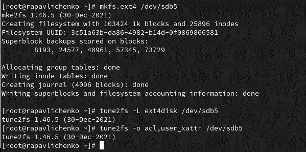{#fig-023 width=70%}
 
24) Получили полномочия администратора. Для создания точки монтирования для раздела ввели mkdir -p /mnt/tmp 2. Чтобы смонтировать файловую систему, использовали команду mount /dev/sdb5 /mnt/tmp. Для проверки корректности монтирования раздела ввели mount.
 
{#fig-024 width=70%}
 
25) Чтобы отмонтировать раздел, использовали umount либо с именем устройства. Проверили, что раздел отмонтирован.
 
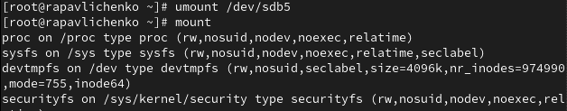{#fig-025 width=70%}
 
26) Получили полномочия администратора. Создали точку монтирования для раздела XFS /dev/sdb1. Посмотрели информацию об идентификаторах блочных устройств (UUID).
 
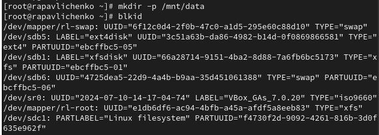{#fig-026 width=70%}
 
27) Ввели blkid /dev/sdb1 и затем использовали мышь, чтобы скопировать значение идентификатора UUID для устройства /dev/sdb1. Открыли файл /etc/fstab на редактирование с помощью nano.
 
{#fig-027 width=70%}
 
28) Отредактировали файл и ввели значение идентификатора.
 
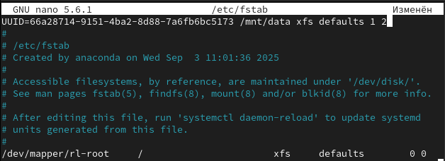{#fig-028 width=70%}
 
29) Смонтировали всё, что указано в mount -a. Проверили, что раздел примонтирован правильно командой df -h.
 
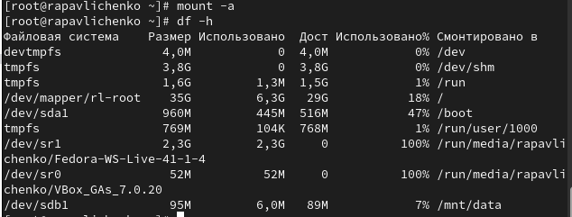{#fig-029 width=70%}
 
# Самостоятельная работа
 
30) Создали раздел с помощью gdisk.
 
{#fig-030 width=70%}
 
31) Нажали n для создания нового раздела, нажали Enter, чтобы принять номер раздела, предложенный по умолчанию. Использовали первый доступный сектор, для последнего сектора задали раздел 100 MiB. Нажали Enter, чтобы принять тип раздела по умолчанию (8300).
 
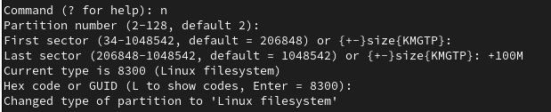{#fig-031 width=70%}
 
32) Нажали n для создания второго раздела. Приняли номер раздела по умолчанию (3). Использовали первый доступный сектор, для последнего сектора задали раздел 100 MiB. Задали код для Linux Swap (8200).
 
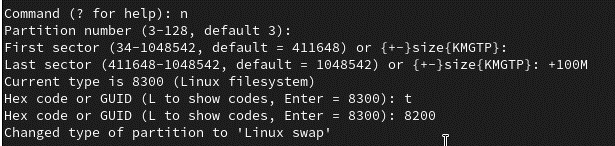{#fig-032 width=70%}
 
33) Нажали p, чтобы просмотреть планируемую таблицу разделов. Нажали w, чтобы записать новую таблицу разделов на диск.
 
{#fig-033 width=70%}
 
34) Обновили таблицу разделов в ядре командой partprobe /dev/sdc, проверили результат.
 
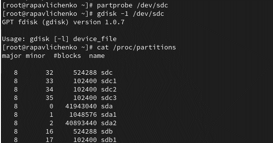{#fig-034 width=70%}
 
35) Отформатировали раздел подкачки командой mkswap /dev/sdc3 и отформатировали раздел в файловую систему ext4 командой mkfs.ext4 /dev/sdc2.
 
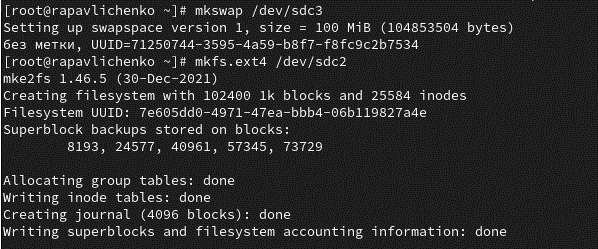{#fig-035 width=70%}
 
36) Создали точку монтирования для раздела ext4, определили UUID наших разделов.
 
{#fig-036 width=70%}
 
37) Отредактировали файл /etc/fstab при помощи nano.
 
{#fig-037 width=70%}
 
38) Смонтировали все файловые системы из fstab, проверили, что ext4 примонтирован, активировали swap раздел и проверили, что он активен.
 
{#fig-038 width=70%}
 
39) Перезагрузили систему командой reboot.
 
{#fig-039 width=70%}
 
40) Проверили монтирование раздела ext4 и то, что swap активен.
 
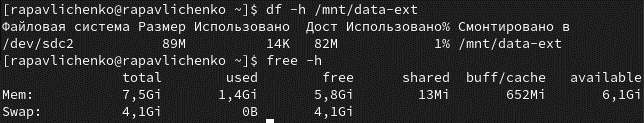{#fig-040 width=70%}
 
# Контрольные вопросы
 
1) Для создания разделов GUID используется инструмент gdisk. Это основная утилита для работы с таблицей разделов GPT в Linux.
 
2) Для создания разделов MBR применяется классическая утилита fdisk. Она предназначена для работы с основными загрузочными записями и поддерживает создание первичных, расширенных и логических разделов.
 
3) Автоматическое монтирование разделов во время загрузки настраивается через файл /etc/fstab. В этом файле указываются все файловые системы, которые должны быть смонтированы при старте системы, а также параметры их монтирования.
 
4) Если необходимо чтобы файловая система не монтировалась автоматически при загрузке следует в файле /etc/fstab в колонке параметров указать опцию noauto. Это позволяет вручную монтировать раздел когда это потребуется.
 
5) Для форматирования раздела с типом 82 который предназначен для пространства подкачки используется команда mkswap. Эта команда инициализирует раздел как область подкачки и подготавливает его для использования системой.
 
6) Безопасно проверить корректность настроек автоматического монтирования без перезагрузки можно с помощью команды mount -a. Она монтирует все файловые системы указанные в /etc/fstab что позволяет сразу выявить ошибки в конфигурации.
 
7) При использовании команды mkfs без указания конкретной файловой системы в большинстве дистрибутивов создается файловая система ext2. Это поведение по умолчанию когда тип ФС не указан явно.
 
8) Форматирование раздела в файловую систему EXT4 выполняется командой mkfs.ext4. Альтернативно можно использовать команду mkfs с параметром -t ext4 для явного указания типа файловой системы.
 
9) Найти UUID для всех устройств на компьютере позволяет команда blkid. Она отображает UUID всех подключенных блочных устройств включая информацию о типе файловой системы и метках томов.
 
# Выводы
 
В ходе лабораторной работы были получены практические навыки работы с разделами диска и файловыми системами в Linux. Освоены инструменты fdisk и gdisk для создания разделов MBR и GPT соответственно. Приобретены навыки форматирования разделов в различные файловые системы (XFS, EXT4), создания и активации разделов подкачки. Изучены методы монтирования файловых систем, включая автоматическое монтирование через файл /etc/fstab. Получен опыт работы с UUID устройств и настройки параметров монтирования.
 
# Список литературы{.unnumbered}
 
::: {#refs}
:::
