---
# Preamble
 
author:
  name: Павличенко Родион Андреевич
  degrees: DSc
  orcid: 0000-0002-0877-7063
  email: 1132246838@pfur.ru
  affiliation:
    - name: Российский университет дружбы народов
      country: Российская Федерация
      postal-code: 117198
      city: Москва
      address: ул. Миклухо-Маклая, д. 6
 
title: Лабораторная работа № 15
subtitle: Управление логическими томами
license: CC BY
date: 22.11.2025
 
lang: ru-RU
crossref:
  lof-title: Список иллюстраций
  lot-title: Список таблиц
  lol-title: Листинги
 
format:
  beamer:
    pdf-engine: xelatex
    mainfont: "DejaVu Serif"
    sansfont: "DejaVu Sans"
    monofont: "DejaVu Sans Mono"
    toc: true
    toc-title: Содержание
    number-sections: true
    colorlinks: false
    toc-depth: 2
    slide_level: 2
    aspectratio: 169
    section-titles: true
    theme: metropolis
    themeoptions: progressbar=frametitle,sectionpage=progressbar,numbering=fraction
    babel-lang: russian
    babel-otherlangs: english
  revealjs:
    transition: slide
    margin: 0.2
    smaller: false
    output-ext: html
    theme: beige
    logo: _resources/image/logo_rudn.png
---
 
# Информация
 
## Докладчик
 
:::::::::::::: {.columns align=center}
::: {.column width="70%"}
 
  * Павличенко Родион Андреевич
  * Cтудент
  * Группа НПИбд-02-24
  * Российский университет дружбы народов им. П. Лумумбы
  * [1132246838@pfur.ru](mailto:1132246838@pfur.ru)
 
:::
::: {.column width="30%"}
 
:::
::::::::::::::
 
# Цель работы
 
## Цель лабораторной работы
 
* Получить навыки управления логическими томами (LVM)
* Освоить создание и управление физическими томами, группами томов и логическими томами
* Изучить операции расширения и уменьшения томов
 
# Выполнение лабораторной работы
 
## Подготовка к работе с LVM
 
Удаление строк автомонтирования из /etc/fstab для подготовки дисков к работе с LVM
 
{width=80%}
 
## Редактирование файла fstab
 
Удаление записей о монтировании /mnt/data и /mnt/data-ext для освобождения дисков
 
{width=80%}
 
## Отмонтирование разделов
 
Проверка отмонтирования дисков /dev/sdb и /dev/sdc перед созданием LVM
 
{width=80%}
 
## Очистка существующей разметки
 
Удаление всех существующих разделов на диске /dev/sdb с помощью fdisk
 
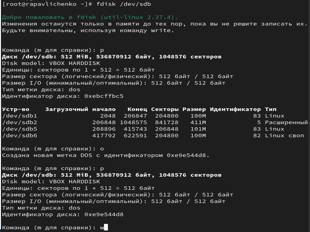{width=80%}
 
## Обновление таблицы разделов
 
Применение изменений разметки с помощью partprobe и проверка результата
 
{width=80%}
 
## Создание раздела для LVM
 
Создание основного раздела размером 100 МБ для использования в LVM
 
{width=80%}
 
## Изменение типа раздела на LVM
 
Установка типа раздела 8e (Linux LVM) для подготовки к работе с логическими томами
 
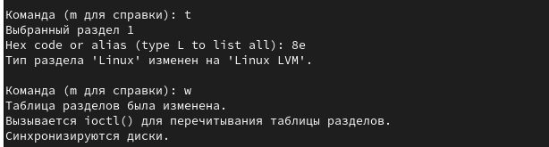{width=80%}
 
## Создание физического тома
 
Инициализация раздела как физического тома LVM и проверка создания
 
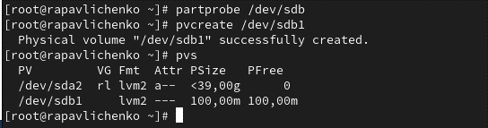{width=80%}
 
## Создание группы томов
 
Объединение физических томов в группу томов vgdata и проверка результата
 
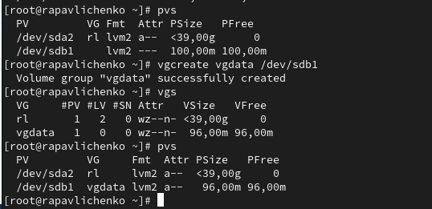{width=80%}
 
## Создание логического тома
 
Создание логического тома lvdata размером 50% от доступного пространства
 
{width=80%}
 
## Форматирование логического тома
 
Создание файловой системы ext4 на логическом томе и точки монтирования
 
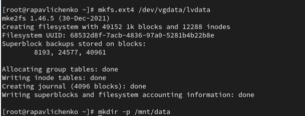{width=80%}
 
## Настройка автоматического монтирования
 
Добавление записи в /etc/fstab для автоматического монтирования при загрузке
 
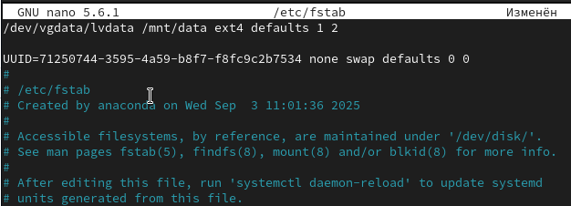{width=80%}
 
## Проверка монтирования
 
Тестирование автоматического монтирования с помощью mount -a
 
{width=80%}
 
## Добавление второго раздела LVM
 
Создание дополнительного раздела на диске для расширения LVM
 
{width=80%}
 
## Расширение группы томов
 
Добавление нового физического тома в существующую группу томов vgdata
 
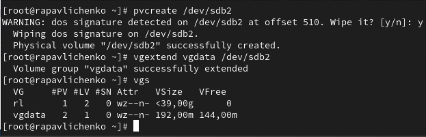{width=80%}
 
## Проверка текущих размеров
 
Анализ размеров логического тома и файловой системы перед расширением
 
{width=80%}
 
## Расширение логического тома
 
Увеличение размера lvdata на 50% от свободного пространства с resize файловой системы
 
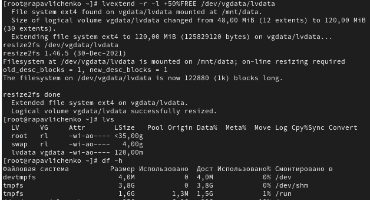{width=80%}
 
## Уменьшение логического тома
 
Сокращение размера логического тома на 50 МБ для демонстрации гибкости LVM
 
{width=80%}
 
## Проверка изменения размера
 
Подтверждение успешного изменения размера логического тома
 
{width=80%}
 
# Самостоятельная работа
 
## Создание раздела LVM на другом диске
 
Подготовка диска /dev/sdc для работы с LVM - создание раздела с типом 8e
 
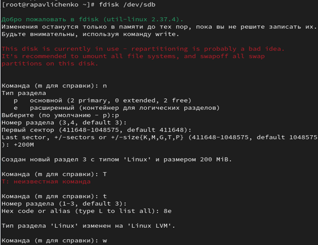{width=80%}
 
## Обновление разметки диска
 
Применение изменений разметки и проверка созданных разделов
 
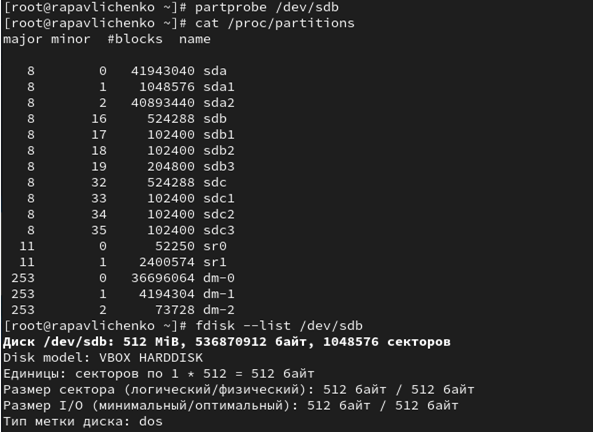{width=80%}
 
## Создание физического тома и группы томов
 
Инициализация физического тома и создание группы томов vggroups
 
{width=80%}
 
## Создание логического тома lvgroup
 
Формирование логического тома в группе vggroups и проверка его создания
 
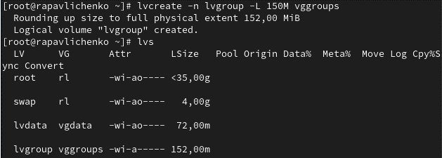{width=80%}
 
## Форматирование в XFS и создание точки монтирования
 
Создание файловой системы XFS на логическом томе и подготовка точки монтирования
 
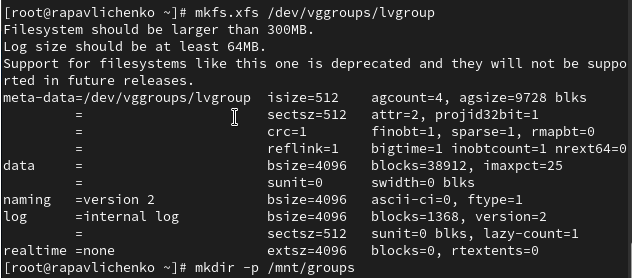{width=80%}
 
## Настройка автоматического монтирования
 
Добавление записи в fstab для постоянного монтирования /mnt/groups
 
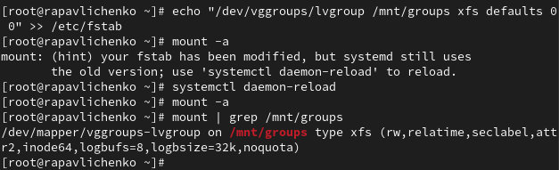{width=80%}
 
## Перезагрузка системы
 
Проверка устойчивости конфигурации после перезагрузки
 
{width=80%}
 
## Проверка после перезагрузки
 
Убеждение в корректном монтировании логических томов после перезагрузки
 
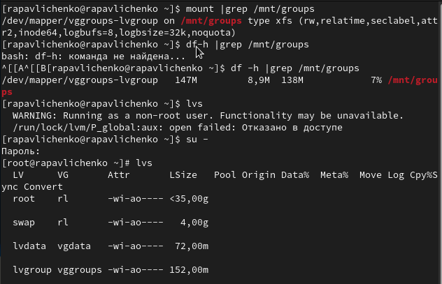{width=80%}
 
## Расширение LVM-инфраструктуры
 
Создание дополнительного раздела LVM на том же диске для расширения возможностей
 
{width=80%}
 
## Расширение группы томов
 
Добавление нового физического тома в существующую группу томов vggroups
 
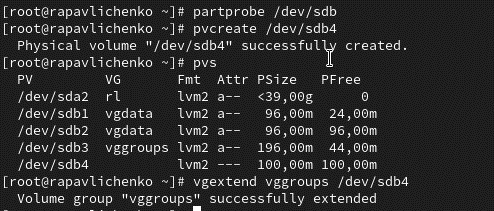{width=80%}
 
## Анализ доступного пространства
 
Проверка увеличения размера группы томов и текущих размеров логических томов
 
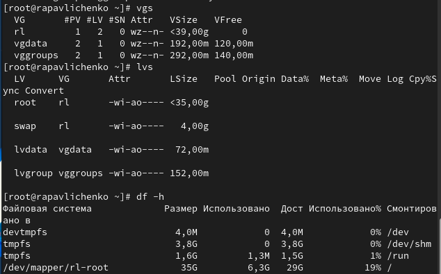{width=80%}
 
## Расширение логического тома lvgroup
 
Увеличение размера логического тома с использованием дополнительного пространства
 
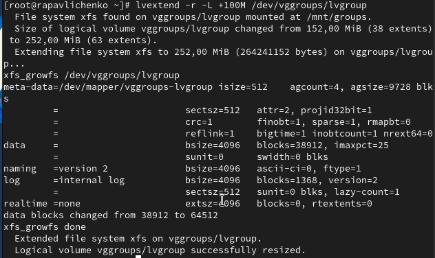{width=80%}
 
## Проверка расширения тома
 
Подтверждение успешного расширения логического тома и файловой системы
 
{width=80%}
 
## Итоговая проверка конфигурации
 
Комплексная проверка всей LVM-инфраструктуры и монтирования файловых систем
 
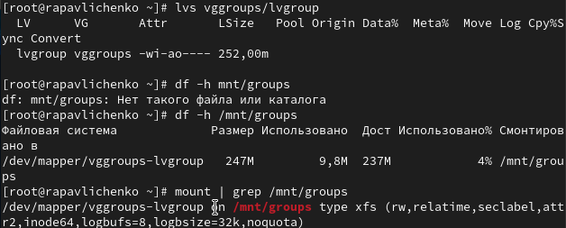{width=80%}
 
# Выводы
 
## Итоги работы
 
* Освоены основные принципы работы с Logical Volume Manager (LVM)
* Получены практические навыки создания и управления физическими томами, группами томов и логическими томами
* Изучены операции динамического расширения и уменьшения логических томов
* Приобретен опыт настройки автоматического монтирования LVM-томов
* Освоена работа с различными файловыми системами (ext4, XFS) на логических томах
* Получены навыки мониторинга и управления LVM-инфраструктурой
