---
# Preamble
 
## Author
author:
  name: Павличенко Родион Андреевич
  degrees: DSc
  orcid: 0000-0002-0877-7063
  email: kulyabov-ds@rudn.ru
  affiliation:
    - name: Российский университет дружбы народов
      country: Российская Федерация
      postal-code: 117198
      city: Москва
      address: ул. Миклухо-Маклая, д. 623456789
## Title
title: "Лабораторная работа № 15"
subtitle: "Управление логическими томами"
license: "CC BY"
## Generic options
lang: ru-RU
number-sections: true
toc: true
toc-title: "Содержание"
toc-depth: 2
## Crossref customization
crossref:
  lof-title: "Список иллюстраций"
  lot-title: "Список таблиц"
  lol-title: "Листинги"
## Bibliography
bibliography:
  - bib/cite.bib
csl: _resources/csl/gost-r-7-0-5-2008-numeric.csl
## Formats
format:
### Pdf output format
  pdf:
    toc: true
    number-sections: true
    colorlinks: false
    toc-depth: 2
    lof: true # List of figures
    lot: true # List of tables
#### Document
    documentclass: scrreprt
    papersize: a4
    fontsize: 12pt
    linestretch: 1.5
#### Language
    babel-lang: russian
    babel-otherlangs: english
#### Biblatex
    cite-method: biblatex
    biblio-style: gost-numeric
    biblatexoptions:
      - backend=biber
      - langhook=extras
      - autolang=other*
#### Misc options
    csquotes: true
    indent: true
    header-includes: |
      \usepackage{indentfirst}
      \usepackage{float}
      \floatplacement{figure}{H}
      \usepackage[math,RM={Scale=0.94},SS={Scale=0.94},SScon={Scale=0.94},TT={Scale=MatchLowercase,FakeStretch=0.9},DefaultFeatures={Ligatures=Common}]{plex-otf}
### Docx output format
  docx:
    toc: true
    number-sections: true
    toc-depth: 2
---
 
# Цель работы
 
Получить навыки управления логическими томами.
 
# Выполнение лабораторной работы
 
1) В терминале с полномочиями администратора открыли файл /etc/fstab, чтобы удалить строки автомонтирования /mnt/data и /mnt/data-ext.
 
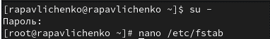{#fig-001 width=70%}
 
2) Удалили строчки из файла.
 
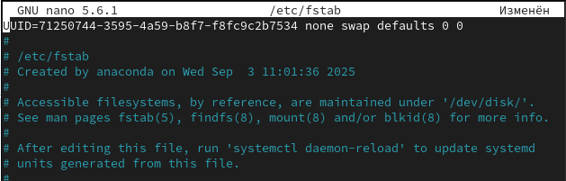{#fig-002 width=70%}
 
3) Отмонтировали /mnt/data и /mnt/data-ext. С помощью команды mount без параметров убедились, что диски /dev/sdb и /dev/sdc не подмонтированы.
 
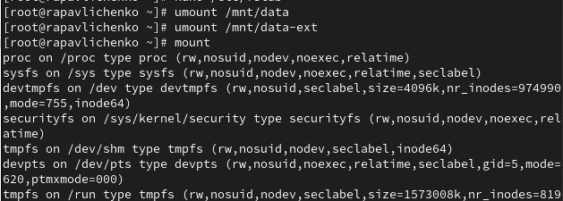{#fig-003 width=70%}
 
4) С помощью fdisk сделали новую разметку для /dev/sdb и /dev/sdc, удалив ранее созданные партиции. В терминале с полномочиями администратора ввели fdisk /dev/sdb. Ввели p для просмотра текущей разметки дискового пространства. Затем для удаления всех имеющихся партиций на диске создали новую пустую таблицу DOS-партиции, используя команду o. Убедились, что партиции удалены, введя p. Сохранили изменения, введя w.
 
{#fig-004 width=70%}
 
5) Записали изменения в таблицу разделов ядра командой partprobe /dev/sdb. Просмотрели информацию о разделах командами cat /proc/partitions и fdisk --list /dev/sdb.
 
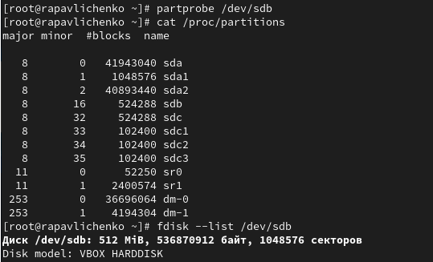{#fig-005 width=70%}
 
6) Создали основной раздел с типом LVM. Ввели fdisk /dev/sdb. Ввели n, чтобы создать новый раздел. Выбрали p, чтобы сделать его основным разделом, и использовали номер раздела, который предлагается по умолчанию. Нажали Enter при запросе для первого сектора и ввели +100M, чтобы выбрать последний сектор.
 
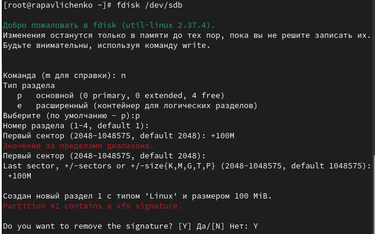{#fig-006 width=70%}
 
7) Вернувшись в приглашение fdisk, ввели t, чтобы изменить тип раздела. Выбрали 8е тип раздела. Затем нажали w, чтобы записать изменения на диск и выйти из fdisk.
 
{#fig-007 width=70%}
 
8) Чтобы обновить таблицу разделов, ввели partprobe /dev/sdb. Указали раздел как физический том LVM. Ввели pvs, чтобы убедиться, что физический том создан успешно.
 
{#fig-008 width=70%}
 
9) В терминале с полномочиями администратора проверили доступность физических томов в нашей системе. Создали группу томов с присвоенным ей физическим томом. Убедились, что группа томов была создана успешно командой vgs. Затем ввели pvs.
 
{#fig-009 width=70%}
 
10) Ввели lvcreate -n lvdata -l 50%FREE vgdata, чтобы создать логический том LVM с именем lvdata, который будет использовать 50% доступного дискового пространства в группе томов vgdata. Для проверки успешного добавления тома ввели lvs.
 
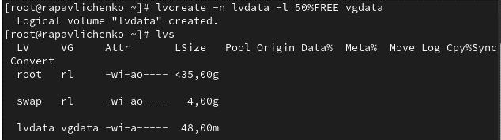{#fig-010 width=70%}
 
11) Для создания файловой системы поверх логического тома ввели mkfs.ext4 /dev/vgdata/lvdata. Чтобы создать папку, на которую можно смонтировать том, ввели mkdir -p /mnt/data.
 
{#fig-011 width=70%}
 
12) Отредактировали файл /etc/fstab с помощью nano.
 
{#fig-012 width=70%}
 
13) Проверили, монтируется ли файловая система командами mount -a и mount | grep /mnt.
 
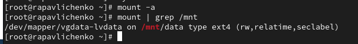{#fig-013 width=70%}
 
14) В терминале с полномочиями администратора ввели pvs и vgs, чтобы отобразить текущую конфигурацию физических томов и группы томов. С помощью fdisk добавили раздел /dev/sdb2 размером 100 М. Задали тип раздела 8e.
 
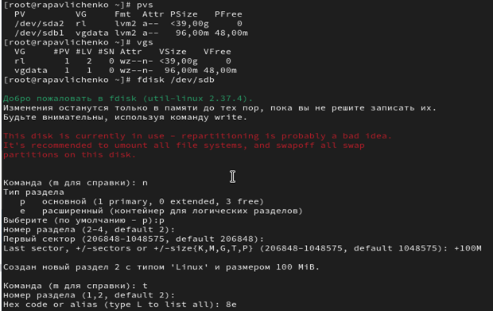{#fig-014 width=70%}
 
15) Создали физический том. Расширили vgdata. Проверили, что размер доступной группы томов увеличен командой vgs.
 
{#fig-015 width=70%}
 
16) Проверили текущий размер логического тома lvdata. Проверили текущий размер файловой системы на lvdata командой df -h.
 
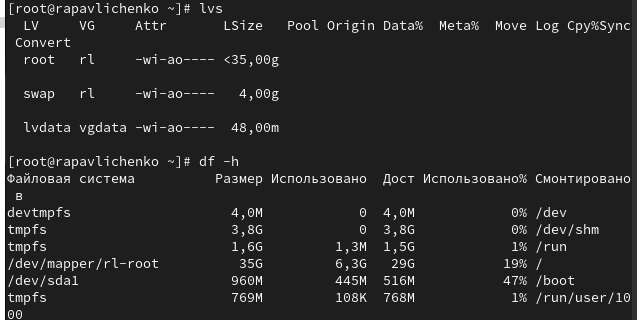{#fig-016 width=70%}
 
17) Увеличили lvdata на 50% оставшегося доступного дискового пространства в группе томов, используя команду lvextend -r -l +50%FREE /dev/vgdata/lvdata. Убедились, что добавленное дисковое пространство стало доступным командами lvs и df -h.
 
{#fig-017 width=70%}
 
18) Уменьшили размер lvdata на 50 МБ.
 
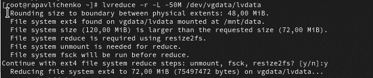{#fig-018 width=70%}
 
19) Убедились в успешном изменении дискового пространства.
 
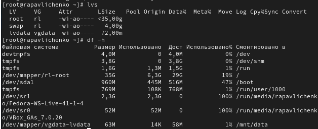{#fig-019 width=70%}
 
# Самостоятельная работа
 
20) Создали раздел с типом LVM с помощью fdisk.
 
{#fig-020 width=70%}
 
21) Обновили таблицу разделов. Просмотрели информацию о разделах.
 
{#fig-021 width=70%}
 
22) Создали физический том, проверили его создание командой pvs, создали группу томов, которую назвали vggroups.
 
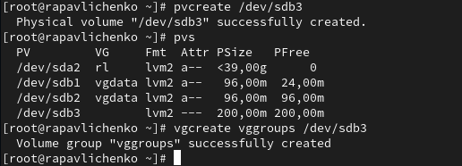{#fig-022 width=70%}
 
23) Создали логический том lvgroup и проверили его создание.
 
{#fig-023 width=70%}
 
24) Форматировали lvgroup в файловой системе XFS, создали папку для монтирования.
 
{#fig-024 width=70%}
 
25) Добавили в /etc/fstab строчку "/dev/vggroups/lvgroup /mnt/groups xfs defaults 0 0" для постоянного монтирования. Проверили монтирование.
 
{#fig-025 width=70%}
 
26) Перезагружаем систему.
 
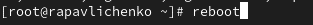{#fig-026 width=70%}
 
27) После перезагрузки опять сделали проверку.
 
{#fig-027 width=70%}
 
28) Создали второй раздел на том же диске с типом Linux LVM.
 
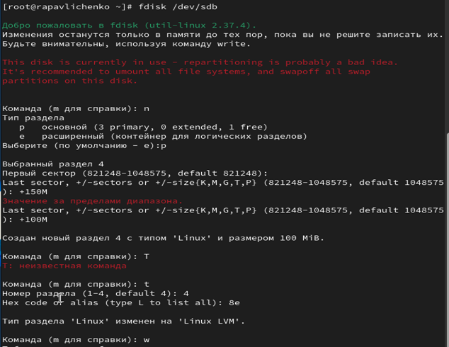{#fig-028 width=70%}
 
29) Обновили таблицу разделов, создали физический том, проверили все физические тома, расширили группу томов vggroups.
 
{#fig-029 width=70%}
 
30) Проверили, что размер группы томов увеличен, проверили текущий размер логического тома и файловой системы.
 
{#fig-030 width=70%}
 
31) Увеличили lvgroup.
 
{#fig-031 width=70%}
 
32) Проверили расширение тома.
 
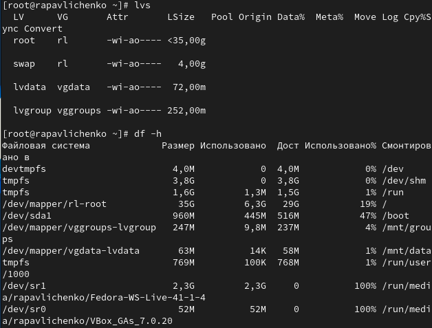{#fig-032 width=70%}
 
33) Сделали итоговую проверку логических томов и файловой системы, а также проверили, что все смонтировано.
 
{#fig-033 width=70%}
 
# Контрольные вопросы
 
1. Код типа раздела для LVM в fdisk: 8e
 
2. Команда для создания группы томов с размером физического экстента 4 МБ: vgcreate -s 4M vggroup /dev/sdb3
 
3. Команда для просмотра информации о физических томах: pvs
 
4. Процедура добавления нового диска /dev/sdd в группу томов vgdata: Сначала создать физический том с помощью pvcreate /dev/sdd, затем добавить в группу томов командой vgextend vgdata /dev/sdd
 
5. Команда для создания логического тома размером 6 МБ: lvcreate -n lvvol1 -L 6M vggroup
 
6. Команда для увеличения размера логического тома на 100 МБ: lvextend -L +100M /dev/vggroup/lvvol1
 
7. Процедура добавления нового физического тома в существующую группу томов: Добавить новый физический том в группу томов: создать раздел с помощью fdisk с типом 8e, выполнить partprobe, создать физический том pvcreate, расширить группу томов vgextend
 
8. Ключ команды lvextend для автоматического изменения размера файловой системы: -r
 
9. Команда для просмотра информации о логических томах: lvs
 
10. Команда для проверки файловой системы на логическом томе: fsck /dev/vgdata/lvdata
 
# Выводы
 
В ходе лабораторной работы были получены практические навыки работы с логическими томами (LVM) в Linux. Освоены основные операции управления LVM: создание физических томов, групп томов и логических томов. Приобретены навыки расширения и уменьшения логических томов, а также соответствующих файловых систем. Изучены методы настройки автоматического монтирования логических томов через файл /etc/fstab. Получен опыт работы с инструментами управления LVM: pvcreate, vgcreate, lvcreate, lvextend, lvreduce и другими.
 
# Список литературы{.unnumbered}
 
::: {#refs}
:::
