---
# Preamble
 
author:
  name: Павличенко Родион Андреевич
  degrees: DSc
  orcid: 0000-0002-0877-7063
  email: 1132246838@pfur.ru
  affiliation:
    - name: Российский университет дружбы народов
      country: Российская Федерация
      postal-code: 117198
      city: Москва
      address: ул. Миклухо-Маклая, д. 6
 
title: Лабораторная работа № 16
subtitle: Программный RAID
license: CC BY
date: 22.11.2025
 
lang: ru-RU
crossref:
  lof-title: Список иллюстраций
  lot-title: Список таблиц
  lol-title: Листинги
 
format:
  beamer:
    pdf-engine: xelatex
    mainfont: "DejaVu Serif"
    sansfont: "DejaVu Sans"
    monofont: "DejaVu Sans Mono"
    toc: true
    toc-title: Содержание
    number-sections: true
    colorlinks: false
    toc-depth: 2
    slide_level: 2
    aspectratio: 169
    section-titles: true
    theme: metropolis
    themeoptions: progressbar=frametitle,sectionpage=progressbar,numbering=fraction
    babel-lang: russian
    babel-otherlangs: english
  revealjs:
    transition: slide
    margin: 0.2
    smaller: false
    output-ext: html
    theme: beige
    logo: _resources/image/logo_rudn.png
---
 
# Информация
 
## Докладчик
 
:::::::::::::: {.columns align=center}
::: {.column width="70%"}
 
  * Павличенко Родион Андреевич
  * Cтудент
  * Группа НПИбд-02-24
  * Российский университет дружбы народов им. П. Лумумбы
  * [1132246838@pfur.ru](mailto:1132246838@pfur.ru)
 
:::
::: {.column width="30%"}
 
:::
::::::::::::::
 
# Цель работы
 
## Цель лабораторной работы
 
Освоить работу с RAID-массивами при помощи утилиты mdadm.
 
# Выполнение лабораторной работы
 
##  Создание дисков
 
Создали три диска размером 512 МБ для работы с RAID-массивами.
 
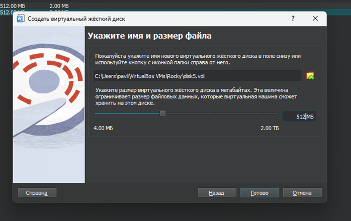{width=80%}
 
##  Проверка созданных дисков
 
Запустили виртуальную машину и проверили наличие созданных дисков командой fdisk -l | grep /dev/sd.
 
{width=80%}
 
##  Создание разделов на дисках
 
Создали на каждом из дисков (sdd, sde, sdf) раздел для подготовки к работе с RAID.
 
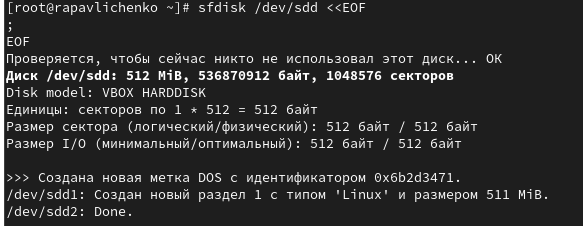{width=80%}
 
##  Проверка типа разделов
 
Проверили текущий тип созданных разделов. Все они имеют тип 83 (Linux Native).
 
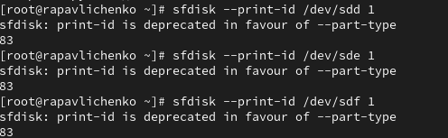{width=80%}
 
##  Просмотр типов RAID разделов
 
Просмотрели, какие типы партиций, относящиеся к RAID, можно задать в системе.
 
{width=80%}
 
##  Изменение типа разделов на RAID
 
Установили тип разделов в Linux raid autodetect (fd). Все три диска находятся в идентичном состоянии с разделами типа RAID по 512 МБ каждый.
 
{width=80%}
 
##  Создание массива RAID 1

При помощи утилиты mdadm создали массив RAID 1 из двух дисков /dev/sdd1 и /dev/sde1.
 
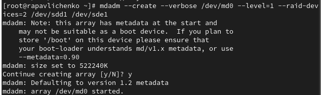{width=80%}
 
##  Проверка состояния RAID массива
 
Проверили состояние массива командами cat /proc/mdstat, mdadm --query /dev/md0 и mdadm --detail /dev/md0. RAID 1 состоит из двух устройств, оба активны и синхронизированы, размер 510 МБ.
 
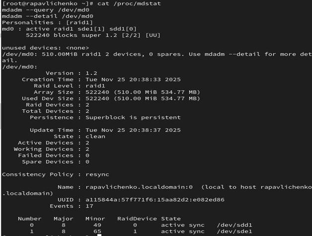{width=80%}
 
##  Создание файловой системы и монтирование
 
Создали файловую систему ext4 на RAID массиве и подмонтировали его для использования.
 
{width=80%}
 
##  Настройка автоматического монтирования
 
Добавили запись в /etc/fstab для автоматического монтирования массива при загрузке системы.
 
{width=80%}
 
##  Имитация сбоя диска и замена
 
Сымитировали сбой диска командой mdadm --fail, удалили сбойный диск и заменили его в массиве.
 
{width=80%}
 
##  Проверка восстановления массива
 
Проверили состояние массива после замены диска. Массив успешно перестроился и функционирует нормально.
 
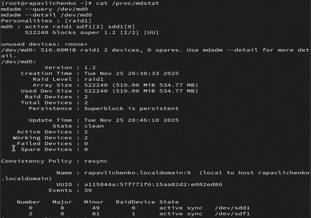{width=80%}
 
## Удаление массива
 
Удалили массив и очистили метаданные RAID для подготовки к следующим экспериментам.
 
{width=80%}
 
##  Создание RAID 1 с резервным диском
 
Создали массив RAID 1 из двух дисков и добавили третий диск в качестве резерва.
 
{width=80%}
 
##  Монтирование массива
 
Подмонтировали созданный RAID массив для дальнейшей работы.
 
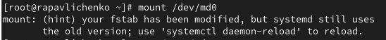{width=80%}
 
##  Проверка состояния с резервным диском
 
Проверили состояние массива - два активных диска и один запасной в режиме горячего резерва.
 
{width=80%}
 
##  Тестирование автоматического восстановления
 
Сымитировали сбой диска и убедились, что массив автоматически пересобирается с использованием резервного диска.
 
{width=80%}
 
##  Удаление массива
 
Удалили массив и очистили метаданные для создания новой конфигурации.
 
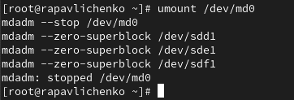{width=80%}
 
##  Создание нового RAID 1 массива
 
Создали массив RAID 1 из двух дисков для последующего преобразования.
 
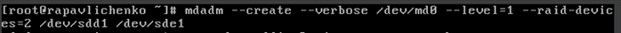{width=80%}
 
##  Добавление резервного диска
 
Добавили третий диск в массив в качестве резерва.
 
{width=80%}
 
##  Проверка состояния массива
 
Проверили состояние RAID 1 массива с резервным диском. Все диски функционируют нормально.
 
{width=80%}
 
{width=80%}
 
##  Изменение типа массива на RAID 5
 
Изменили тип массива с RAID 1 на RAID 5 для изучения другого уровня RAID.
 
{width=80%}
 
##  Проверка состояния RAID 5
 
Проверили состояние массива после преобразования в RAID 5. Активны 2 устройства, одно в режиме резерва.
 
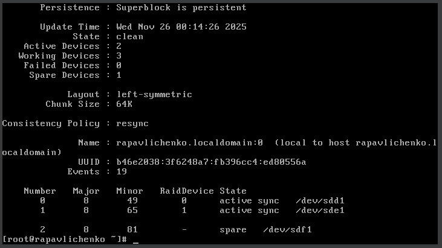{width=80%}
 
##  Расширение RAID 5 массива
 
Изменили количество дисков в массиве RAID 5 на 3 штуки, включив резервный диск в активную работу.
 
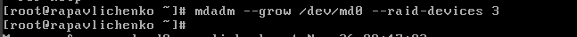{width=80%}
 
##  Финальная проверка RAID 5
 
Проверили окончательное состояние массива. Все три диска активны и синхронизированы.
 
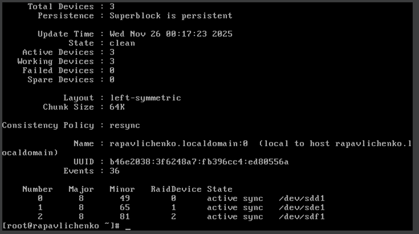{width=80%}
 
##  Удаление массива и очистка
 
Удалили массив и очистили метаданные RAID.
 
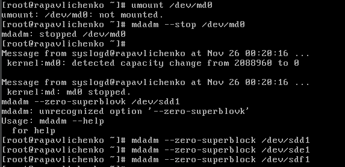{width=80%}
 
##  Настройка fstab
 
Закомментировали запись в /etc/fstab для отключения автоматического монтирования.
 
{width=80%}
 
# Выводы
 
## Итоги работы
 
* Освоены практические навыки работы с программными RAID-массивами через утилиту mdadm
* Изучены различные уровни RAID: RAID 1 (зеркалирование) и RAID 5 (чередование с контролем четности)
* Получен опыт создания, управления и мониторинга RAID-массивов
* Освоены операции замены отказавших дисков и расширения массивов
* Изучены методы автоматического восстановления после сбоев
* Приобретены навыки настройки автоматического монтирования RAID-массивов
