---
# Preamble
 
## Author
author:
  name: Павличенко Родион Андреевич
  degrees: DSc
  orcid: 0000-0002-0877-7063
  email: kulyabov-ds@rudn.ru
  affiliation:
    - name: Российский университет дружбы народов
      country: Российская Федерация
      postal-code: 117198
      city: Москва
      address: ул. Миклухо-Маклая, д. 623456789
## Title
title: "Лабораторная работа № 16"
subtitle: "Программный RAID"
license: "CC BY"
## Generic options
lang: ru-RU
number-sections: true
toc: true
toc-title: "Содержание"
toc-depth: 2
## Crossref customization
crossref:
  lof-title: "Список иллюстраций"
  lot-title: "Список таблиц"
  lol-title: "Листинги"
## Bibliography
bibliography:
  - bib/cite.bib
csl: _resources/csl/gost-r-7-0-5-2008-numeric.csl
## Formats
format:
### Pdf output format
  pdf:
    toc: true
    number-sections: true
    colorlinks: false
    toc-depth: 2
    lof: true # List of figures
    lot: true # List of tables
#### Document
    documentclass: scrreprt
    papersize: a4
    fontsize: 12pt
    linestretch: 1.5
#### Language
    babel-lang: russian
    babel-otherlangs: english
#### Biblatex
    cite-method: biblatex
    biblio-style: gost-numeric
    biblatexoptions:
      - backend=biber
      - langhook=extras
      - autolang=other*
#### Misc options
    csquotes: true
    indent: true
    header-includes: |
      \usepackage{indentfirst}
      \usepackage{float}
      \floatplacement{figure}{H}
      \usepackage[math,RM={Scale=0.94},SS={Scale=0.94},SScon={Scale=0.94},TT={Scale=MatchLowercase,FakeStretch=0.9},DefaultFeatures={Ligatures=Common}]{plex-otf}
### Docx output format
  docx:
    toc: true
    number-sections: true
    toc-depth: 2
---
 
# Цель работы
 
Освоить работу с RAID-массивами при помощи утилиты mdadm.
 
# Выполнение лабораторной работы
 
1) Создали три диска размером 512 МБ.
 
{#fig-001 width=70%}
 
2) Запустили виртуальную машину. Получили полномочия администратора. Проверили наличие созданных дисков командой fdisk -l | grep /dev/sd.
 
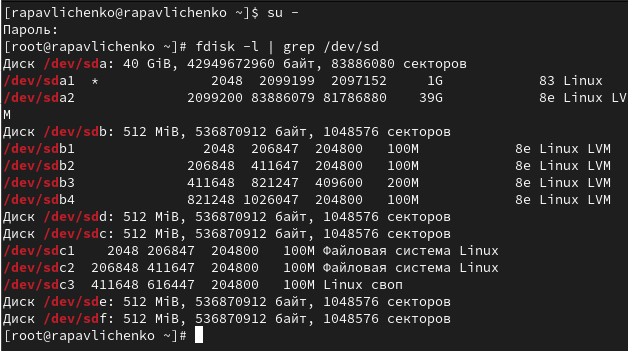{#fig-002 width=70%}
 
3) Создали на каждом из дисков (sdd, sde, sdf) раздел.
 
{#fig-003 width=70%}
 
4) Проверили текущий тип созданных разделов. Все они имеют тип 83 (Linux Native).
 
{#fig-004 width=70%}
 
5) Просмотрели, какие типы партиций, относящиеся к RAID, можно задать.
 
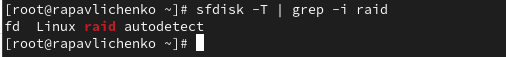{#fig-005 width=70%}
 
6) Установили тип разделов в Linux raid autodetect. Просмотрели состояние дисков. Все три диска находятся в идентичном состоянии. Каждый из них содержит по одному разделу, который занимает почти всё доступное пространство диска. Тип этих разделов (fd) -- RAID. Все они по 512 МБ.
 
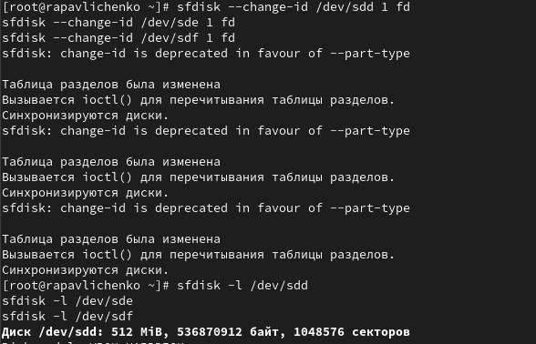{#fig-006 width=70%}
 
7) При помощи утилиты mdadm создали массив RAID 1 из двух дисков.
 
{#fig-007 width=70%}
 
8) Проверили состояние массива RAID, используя команды cat /proc/mdstat; mdadm --query /dev/md0; mdadm --detail /dev/md0. Мы увидели, что это RAID 1 (зеркало) уровня, состоящий из двух устройств: /dev/sdd1 и /dev/sde1. Оба устройства активны и синхронизированы, о чем свидетельствует состояние [UU] в выводе /proc/mdstat и статус active sync для каждого устройства в детальной информации. Размер массива составляет 510 МиБ. Состояние массива чистое (clean), что означает отсутствие текущих операций, таких как восстановление или перестройка. Неисправных устройств (Failed Devices) и резервных устройств (Spare Devices) нет. Массив использует версию метаданных 1.2 и был создан 25 ноября 2025 года. Политика согласованности установлена на resync. Массив привязан к хосту rapavlichenko.localdomain.
 
{#fig-008 width=70%}
 
9) Создали файловую систему на RAID. Подмонтировали RAID.
 
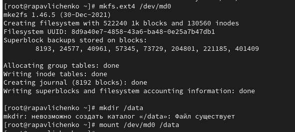{#fig-009 width=70%}
 
10) Для автомонтирования добавили запись в /etc/fstab - /dev/md0 /data ext4 defaults 1 2 с помощью nano.
 
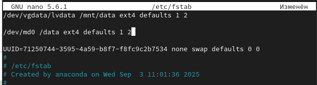{#fig-010 width=70%}
 
11) Сымитировали сбой одного из дисков командой mdadm /dev/md0 --fail /dev/sde1. Удалили сбойный диск командой mdadm /dev/md0 --remove /dev/sde1. Заменили диск в массиве.
 
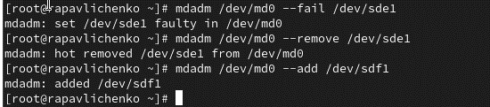{#fig-011 width=70%}
 
12) Посмотрели состояние массива. Заметили, что произошла замена одного из дисков в RAID 1 массиве (с sde1 на sdf1), массив успешно перестроился и в настоящее время функционирует нормально с полной зеркальной защитой данных на двух исправных дисках.
 
{#fig-012 width=70%}
 
13) Удалили массив и очистили метаданные.
 
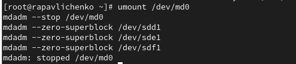{#fig-013 width=70%}
 
14) Получили полномочия администратора. Создали массив RAID 1 из двух дисков командой mdadm --create --verbose /dev/md0 --level=1 --raid-devices=2 /dev/sdd1 /dev/sde1. Добавили третий диск.
 
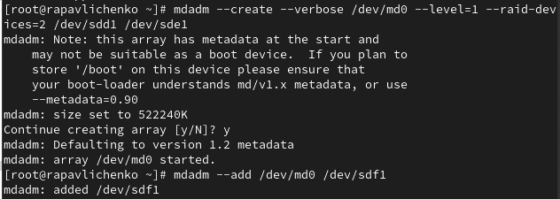{#fig-014 width=70%}
 
15) Подмонтировали /dev/md0.
 
{#fig-015 width=70%}
 
16) Проверили состояние массива. RAID-массив md0 находится в исправном и стабильном состоянии с конфигурацией RAID 1 (зеркало). В текущий момент массив состоит из трёх устройств: два активных диска (/dev/sdd1 и /dev/sde1), которые непосредственно участвуют в работе и хранят данные, и один запасной диск (/dev/sdf1), находящийся в режиме горячего резерва. Размер массива составляет 510 МБ.
 
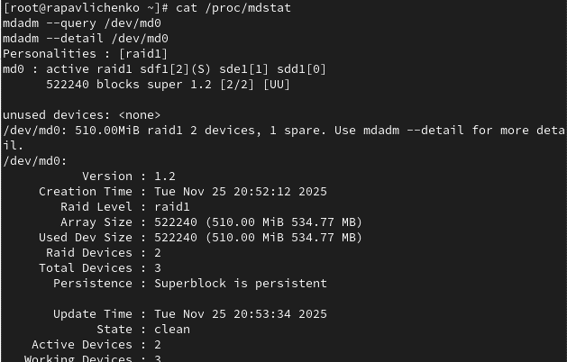{#fig-016 width=70%}
 
17) Сымитировали сбой одного из дисков командой mdadm /dev/md0 --fail /dev/sde1. Проверили состояние массива. Убедились, что массив автоматически пересобирается. Массив md0 продолжает функционировать в стабильном состоянии (clean). Произошла автоматическая реконфигурация: 2 диска - /dev/sdd1 и /dev/sdf1 находятся в состоянии active sync и продолжают обеспечивать полную работоспособность массива, 1 диск - /dev/sde1 помечен как faulty и исключен из рабочего состава. Запасных устройств 0 - ранее доступный резервный диск /dev/sdf1 был автоматически введен в работу для замены отказавшего диска.
 
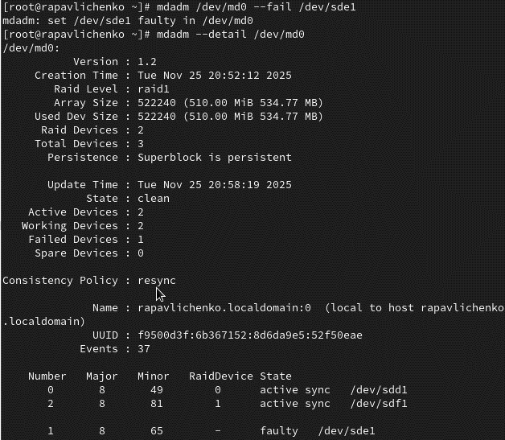{#fig-017 width=70%}
 
18) Удалили массив и очистили метаданные.
 
{#fig-018 width=70%}
 
19) Получили полномочия администратора. Создали массив RAID 1 из двух дисков.
 
{#fig-019 width=70%}
 
20) Добавили третий диск.
 
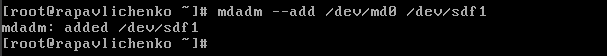{#fig-020 width=70%}
 
21) Проверили состояние массива. RAID-массив md0 работает в режиме RAID 1 (зеркало) и находится в исправном состоянии. Оба основных диска (/dev/sdd1 и /dev/sde1) активны и синхронизированы. Третий диск (/dev/sdf1) выполняет роль горячего резерва и готов заменить любой из основных дисков в случае сбоя. Массив полностью работоспособен, сбоев нет.
 
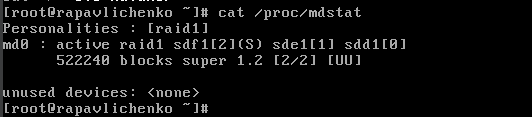{#fig-021 width=70%}
 
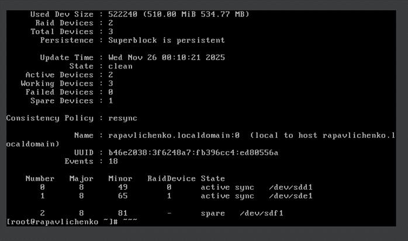{#fig-022 width=70%}
 
22) Изменили тип массива.
 
{#fig-023 width=70%}
 
23) Проверили состояние массива. RAID-массив переконфигурирован в RAID 5 и находится в исправном состоянии. Активны 2 устройства, при этом одно устройство работает в режиме горячего резерва. Все диски функционируют нормально, сбоев не зафиксировано.
 
{#fig-024 width=70%}
 
24) Изменили количество дисков в массиве RAID 5 на 3 штуки.
 
{#fig-025 width=70%}
 
25) Проверили состояние массива. RAID-массив полностью функционирует в штатном режиме. Все три диска (/dev/sdd1, /dev/sde1, /dev/sdf1) являются активными и синхронизированными участниками массива. Состояние массива чистое (clean), сбоев нет, запасные устройства отсутствуют, так как все диски уже задействованы.
 
{#fig-026 width=70%}
 
26) Удалили массив и очистили метаданные.
 
{#fig-027 width=70%}
 
27) Закомментировали запись "/dev/md0 /data ext4 defaults 1 2" в /etc/fstab с помощью nano.
 
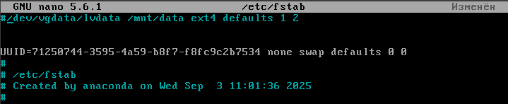{#fig-028 width=70%}
 
# Контрольные вопросы
 
1. RAID (Redundant Array of Independent Disks) — это технология виртуализации данных, которая объединяет несколько физических дисков в один логический модуль. Основные цели применения — повышение производительности операций чтения/записи, обеспечение отказоустойчивости или комбинация этих задач.
 
2. На сегодняшний день основными и наиболее распространёнными типами являются RAID 0, RAID 1, RAID 5, RAID 6, а также их комбинации, известные как вложенные массивы: RAID 10 (1+0), RAID 50 и RAID 60.
 
3. **RAID 0** (страйпинг) работает по принципу чередования данных: информация разбивается на блоки и записывается на все диски массива параллельно. Его прямое назначение — достижение максимальной скорости передачи данных, так как операции ввода-вывода распределяются между несколькими накопителями. Однако он не обеспечивает отказоустойчивости; выход из строя любого диска ведёт к полной потере данных. Типичный пример применения — рабочие станции для обработки видео или мощные игровые компьютеры, где важна высокая производительность, а резервирование не является критичным.
 
   **RAID 1** (зеркалирование) основан на полном дублировании информации. Каждый бит данных записывается на два или более диска одновременно, создавая их точные копии. Его ключевое назначение — обеспечение высокой надёжности и доступности данных. Если один диск выходит из строя, система продолжает работать на другом. Главный недостаток — низкая эффективность использования дискового пространства, так как полезный объём равен ёмкости одного диска. Он часто применяется для системных дисков серверов и хранения критически важных файлов.
 
   **RAID 5** сочетает в себе чередование данных (как в RAID 0) с распределённым хранением контрольных сумм (чётности) для обеспечения отказоустойчивости. Блоки данных и контрольные суммы циклически записываются на все диски массива. Назначение этого уровня — найти баланс между производительностью, надёжностью и экономией дискового пространства, поскольку для чётности используется объём лишь одного диска. Массив может пережить отказ одного диска без потери данных. Он широко используется в файловых и веб-серверах, где важны как скорость чтения, так и резервирование.
 
   **RAID 6** является развитием RAID 5 и использует схожий алгоритм циклического распределения данных, но для контроля чётности применяются две независимые схемы, что требует хранения информации, эквивалентной ёмкости двух дисков. Его прямое назначение — повышенная отказоустойчивость, так как массив остаётся работоспособным даже при одновременном отказе двух дисков. Это делает его особенно востребованным для систем хранения критически важных данных, в крупных массивах, где время восстановления после сбоя велико, и для создания долговременных архивов.
 
# Выводы
 
В ходе лабораторной работы были получены практические навыки работы с программными RAID-массивами при помощи утилиты mdadm. Освоены основные операции по созданию, управлению и мониторингу RAID-массивов различных уровней. Приобретен опыт настройки RAID 1 (зеркалирование) и RAID 5 (чередование с контролем четности), а также выполнения операций по замене отказавших дисков и расширению массивов. Изучены методы автоматического восстановления массивов после сбоев и настройки автоматического монтирования. Получены навыки работы с метаданными RAID и управления состоянием массивов через /proc/mdstat.
 
# Список литературы{.unnumbered}
 
::: {#refs}
:::
