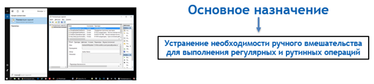
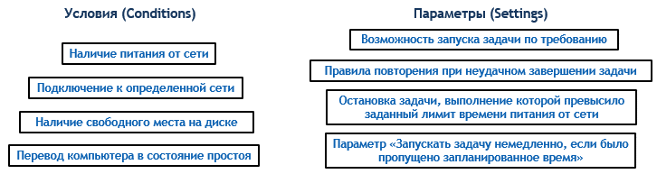
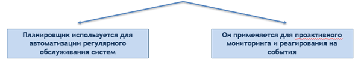

---
# Preamble

author:
  name: Павличенко Родион Андреевич
  degrees: DSc
  orcid: 0000-0002-0877-7063
  email: 1132246838@pfur.ru
  affiliation:
    - name: Российский университет дружбы народов
      country: Российская Федерация
      postal-code: 117198
      city: Москва
      address: ул. Миклухо-Маклая, д. 6

title: Доклад по дисциплине основы администрирования ОС
subtitle: Планировщик заданий Windows
license: CC BY
date: 05.10.2025

lang: ru-RU
crossref:
  lof-title: Список иллюстраций
  lot-title: Список таблиц
  lol-title: Листинги

format:
  beamer:
    pdf-engine: xelatex
    mainfont: "DejaVu Serif"
    sansfont: "DejaVu Sans"
    monofont: "DejaVu Sans Mono"
    toc: true
    toc-title: Содержание
    number-sections: true
    colorlinks: false
    toc-depth: 2
    slide_level: 2
    aspectratio: 169
    section-titles: true
    theme: metropolis
    themeoptions: progressbar=frametitle,sectionpage=progressbar,numbering=fraction
    babel-lang: russian
    babel-otherlangs: english
  revealjs:
    transition: slide
    margin: 0.2
    smaller: false
    output-ext: html
    theme: beige
    logo: _resources/image/logo_rudn.png
---

# Информация

## Докладчик

:::::::::::::: {.columns align=center}
::: {.column width="70%"}

  * Павличенко Родион Андреевич
  * Cтудент
  * Группа НПИбд-02-24
  * Российский университет дружбы народов им. П. Лумумбы
  * [1132246838@pfur.ru](mailto:1132246838@pfur.ru)

:::
::: {.column width="30%"}

:::
::::::::::::::

# Теоретическая часть

## Цель
 
Провести комплексный анализ Планировщика заданий Windows как ключевого системного компонента для автоматизации административных задач, с фокусом на его архитектуре, функциональных возможностях и управлении

## Задачи
 
1)Определить роль и назначение Планировщика заданий в ОС Windows.

2)Проследить эволюцию инструментов планирования от ранних версий ОС к современной реализации.

3)Детально проанализировать архитектурные компоненты Планировщика: задачи, триггеры, действия, условия и параметры.

4)Рассмотреть ключевые сценарии использования в контексте системного администрирования.

5) Исследовать механизмы обеспечения безопасности и методы диагностики функционирования Планировщика заданий.
 
## Назначение и место в архитектуре операционной системы

{width=100%}
 
## Эволюция инструментов автоматизации в Windows

{width=100%}

## Задачи, триггеры и действия

Основной единицей планирования является задача (Task). Это контейнер, который объединяет все параметры выполнения определенной операции

Действие (Action) определяет, какая операция будет выполнена.

Триггер (Trigger) — это условие, которое инициирует выполнение задачи.

## Для обеспечения гибкости и надежности помимо основных компонентов задача включает в себя два дополнительных раздела:

{width=100%}
 
## Ключевые сценарии применения Планировщика заданий в профессиональной деятельности системного администратора

{width=100%}

## Безопасность является неотъемлемой частью работы Планировщика заданий, поскольку задачи часто выполняются с повышенными привилегиями

{width=100%}

## Да что там Windows! Самая неотлаженная и глючная система это жизнь. ©Стас Янковский

{width=100%}
 

